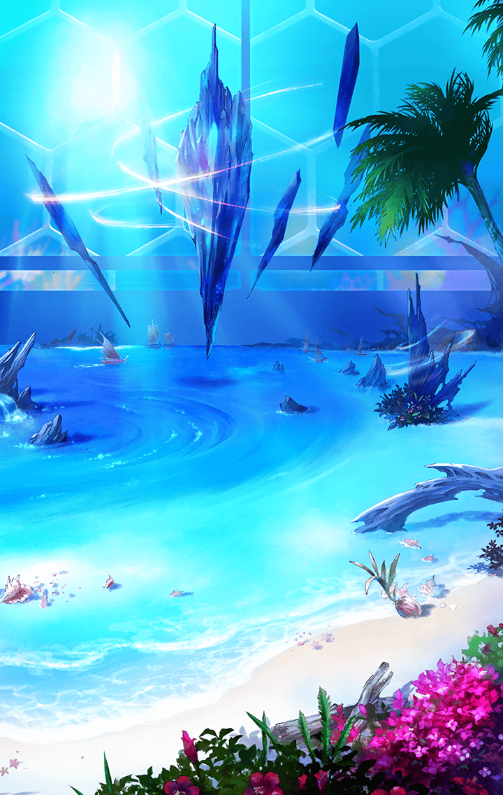

[View script in lisp](../scripts/277000553.txt)

[View source in markdown](277000553.md)

**【如意金箍棒】**
ふぅ…ちょっと数が多かったかな？
あれ？ソロモンちゃんたちは？

**【フォルカス】**
まさか、異族に…

**【如意金箍棒】**
あのふたりは大丈夫だと思うけど、
ちょっと辺りを探してみよう？

**【如意金箍棒】**
フォルカスちゃん、いたよ！
ふたりとも、無事だよね？

**【ティルフィング】**
あ、ニョイ子さん…

**【如意金箍棒】**
ソロモンちゃん、
ティルフィングちゃん…
どうして待っててくれなかったの？

**【フォルカス】**
はぁ…無事でよかった…
団体行動を乱す行為はだめですよ！

**【ティルフィング】**
フォルカスさん…
すみません、
私も止めたのですが…

**【ソロモン】**
グラウが、ひとのけはいを
かんちしたの

**【ソロモン】**
…ていさつに出したわけじゃないわ
グラウは、こうせいのうなの
こうはんいをたんちできるだけ

**【ソロモン】**
それでね、
このさきに、だれかいるみたいよ？

**【如意金箍棒】**
ワタシたちの仲間かな？
フフッ、だれだろう？

**【フォルカス】**
何度も同じことをいうようですが、
相手が味方とは限りません
警戒をゆるめずに…

**【ビコウ】**
キキッ！

**【如意金箍棒】**
キャッ！
もう、ビコウったら、どうしたの？
うん？あっちは土煙の方向…

**【如意金箍棒】**
…フォルカスちゃん！ あれ！

**【フォルカス】**
あっ！

**【ソロモン】**
えっ！

**【ティルフィング】**
あっ！
