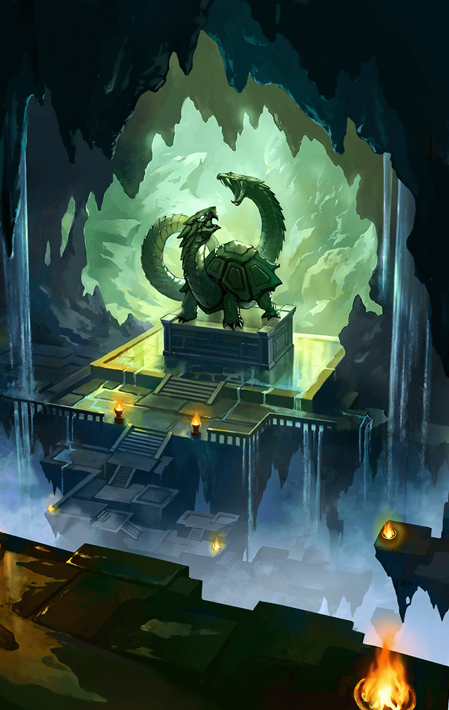

277000631 海上編 ストーリー2020年7月 アトランティデ・ノア篇Ⅱ 第3幕「けもののめはかたる」 第3幕「けもののめはかたる」 第3幕「けもののめはかたる」戦闘前

[View script in lisp](../scripts/277000631.txt)

【如意金箍棒】
ふたりとも、
足元に気をつけてね？

【レーヴァテイン】
…うん

【ティルフィング】
ありがとうございます
どうくつは、
ここでおわりでしょうか？

【如意金箍棒】
そうだねぇ…

【如意金箍棒】
まさか、洞窟の奥に
こんな大きな部屋があるなんて…ね
どう見ても、人工的な建造物よね？

【ティルフィング】
はい…
しんでんのようにも、みえますね
これは、なんでしょうか？

【如意金箍棒】
ずいぶん、大きな亀の石像ね
この亀を祀っているのかな？

【？？？】
げんぶ…

【如意金箍棒】
げんぶ…？
ああ、玄武ね！
そんな難しい言葉、よく知ってるね？

【？？？】
げんぶは、かめとへび…
へび…
うろぼろす…

【？？？】
…このよのすべては、
えんかんのいんし

【如意金箍棒】
わわっ！
あなた、いつからそこに！？

【レーヴァテイン】
…カシウス

【如意金箍棒】
あら！
レーヴァテインちゃんのお友だち？
会えてよかったわね！

【レーヴァテイン】
うん…

【如意金箍棒】
えっと
カシウスちゃんでいいのよね？

【カシウス】
うん

【如意金箍棒】
はじめまして、ワタシは如意金箍棒
ニョイ子って呼んでね
ワタシたち、あなたを探しに来たの

【カシウス】
…わたし？

【如意金箍棒】
うん
あなたが、なにかを追いかけて
いなくなったって聞いて…

【カシウス】
りんねにみちびかれ、
わたしはここへ…

【如意金箍棒】
その、手に持っているのが
レーヴァテインちゃんがいってた玉ね
それを追いかけて、ここに着いたの？

【カシウス】
…そう

【如意金箍棒】
とっても綺麗ね

【カシウス】
ふふっ…
このよのすべては、
えんかんのいんし…

【カシウス】
おわりのない、えいえんのりんね…
れんぞくする、せいとし

【カシウス】
りんねのえんきゅうは、
さまようわたしの、
いくさきをしめす

【如意金箍棒】
う～ん…
つまり、どういうこと…かな？

【カシウス】
えんきゅうは、
わたしにへいおんをもたらす…
とても、きょうみぶかいわ

【ティルフィング】
おそらくですが…
まるいものがあるとあんしんする…
そういうことでしょうか？

【カシウス】
…そう

【レーヴァテイン】
カシウスは、まるいものがすきなの

【レーヴァテイン】
そういえば…
カシウスがそれをひろったときに、
なんかおっきなおとがしたんだった

【如意金箍棒】
そうなの！？
…因果関係はわからないけど、
念のために広い場所に移動するべきね

【如意金箍棒】
カシウスちゃん、一緒に外に出よう？
さ、歩けるかな？

【カシウス】
…いや

【如意金箍棒】
どうしたの、どこか痛い？

【カシウス】
はだをやくしゃくねつは…
えんかんのいんしに
ふさわしくない

【ティルフィング】
そとはあついから、
ここにいたい、ということでしょうか？

【レーヴァテイン】
たしかに、ここはすずしくて
おひるねにちょうどいいかも…
…ふわぁ

【ティルフィング】
ですが、またじしんがおきたら、
くずれるかもしれません

【如意金箍棒】
そうそう、早く出た方がいいと
思うんだけど…どうしよう？

【ビコウ】
ウキッ！キキッ！

【如意金箍棒】
ビコウ？なに？

【ビコウ】
キキキッ！

【カシウス】
さる…

【如意金箍棒】
あら！ビコウったら…
カシウスちゃんの
気を引こうとしてるのね？

【カシウス】
…ながいしっぽ
…へびみたい
ふれても、いいの？

【ビコウ】
キッ！キャキャッ！

【カシウス】
あっ…
まって…

【ビコウ】
ウキキッ！

【如意金箍棒】
きゃっ！
ビコウったら、
急に飛びつくんだから…

【カシウス】
んっ…

【如意金箍棒】
あらあら、カシウスちゃんは
ビコウに触りたいのね？
それなら、お外でゆっくり遊ぼうか？

【如意金箍棒】
そうだ、カシウスちゃんも、
ビコウと一緒にワタシに乗っていく？
よいしょっと…

【カシウス】
…！

【如意金箍棒】
えっ！？
な、なに！？

【異族】
グゥ…グギャギャギャギャギャ！

【ティルフィング】
ニョイ子さん、いぞくです！

【如意金箍棒】
ええ、ワタシに任せて！

【カシウス】
…わたしも、やる

【如意金箍棒】
カシウスちゃんも？
…じゃ、お願いしようかな？
無理はしないでね？

【カシウス】
…わかった

Next: [277000633](277000633.md)

[Back to index](index.md)
