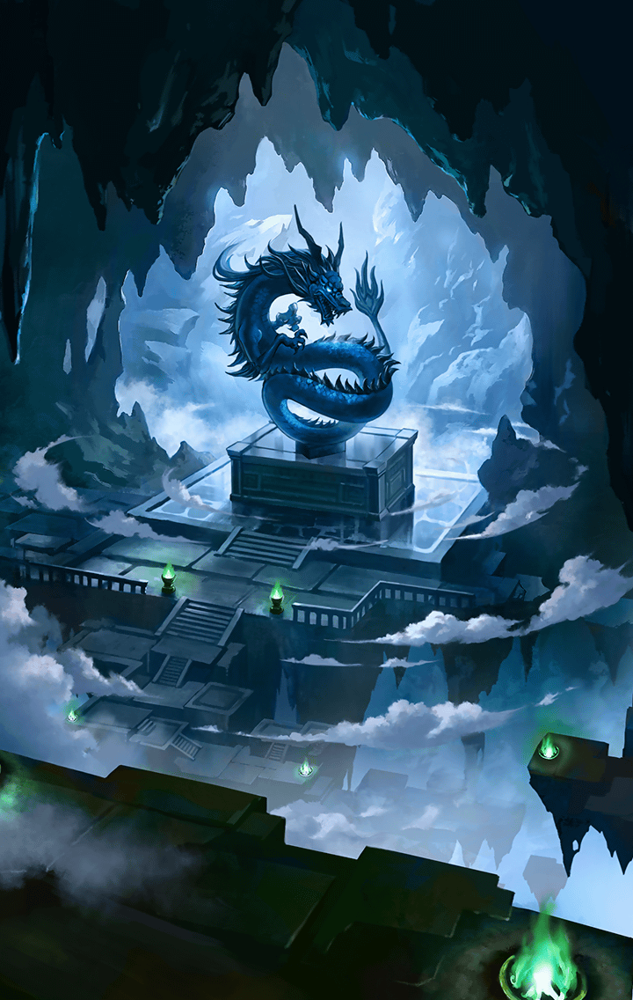

[View script in lisp](../scripts/277000841.txt)

♪ギュイィィィィィン！

**【オルフェウス】**
…くぅ～！
これはガチでヤバいっしょ！
マジで神曲できちゃったし！

**【オルフェウス】**
なんか、この島に来てから
超神曲がバンバンできるって感覚が
ビシビシきてるんだよねぇ！

**【オルフェウス】**
この島とフィーリングが
合ってんのかも

**【リサナウト】**
……

**【ロンギヌス】**
……

**【オルフェウス】**
…って、あれ？
リサっちもロンギヌスもどうしたの？
なんかバテてない？

**【リサナウト】**
あなたねぇ…
かなり危ないところだったのよ？
間に合ったからよかったけど…

**【ロンギヌス】**
オルフェウスさん
ぶじでよかったです…

**【リサナウト】**
…まぁ、いいわ
その神曲、
あとでゆっくり聴かせてもらうからね

**【ロンギヌス】**
えへへっ…
私も、リサナウトさんと
いっしょにききたいです！

**【オルフェウス】**
あれ～？
リサっちとロンギヌス、
なんか仲よさげじゃん！

**【リサナウト】**
ふふっ
わかっちゃった？

**【ロンギヌス】**
えへへっ…

**【オルフェウス】**
なんか、あたしだけハブられてない？
面白くなさげ～

**【オルフェウス】**
あ、それで、現状どうなってんの？
例のコイン、もう見つかった？

**【リサナウト】**
台座は調べてあるわ、あの場所よ
あとはそこに玉を置いて、
守護神的存在を倒すだけなんだけど…

**【リサナウト】**
誰でもいいってわけじゃないの
きっと、なにか法則があるはず…

**【リサナウト】**
玄武はニョイ子、
白虎はミュルグレスで
玉と像が反応したのよね…

**【リサナウト】**
二人と像の関連性は何かしら…
オルフェウス、
何か気がついたことはない？

**【オルフェウス】**
いやいや！
そういう難し系のやつ、
あたしには難易度高めっしょ！

**【リサナウト】**
直感でいいのよ、
あなた、自分で直感系だって
言ってたでしょ？

**【リサナウト】**
ニョイ子とミュルグレスの
共通点は何だと思う？

**【オルフェウス】**
え～と…

**【オルフェウス】**
…やっぱ、共通点ゼロじゃね？
背の高さも属性も違うし、
ノリも合ってないしさ…

**【オルフェウス】**
あ！
どっちもいい性格してる、とか？

**【リサナウト】**
うーん…
ダメね、分析するには
情報も時間も足りないわ

**【オルフェウス】**
あー、もう！
ごちゃごちゃ考えても
仕方ないっしょ！

**【オルフェウス】**
さっきは助けてもらった
みたいだから、今度は
あたしがバシッと決めるし！

**【ロンギヌス】**
オルフェウスさん、
がんばってください！

**【オルフェウス】**
サンキュー！
今日のあたしは神がかってるし、
一発でイケちゃうかもよ～？

**【リサナウト】**
願わくば、そうあってほしいわね
残りの時間がどれだけあるのか
わからないけど…

**【リサナウト】**
とにかく早く終わらせるに
越したことはないわ
オルフェウス、頼むわよ

**【オルフェウス】**
おっけー
行っくよー！

**【ロンギヌス】**
わっ…
ほ、ほんとうに、
ひかりました！

**【オルフェウス】**
こマ？
やっぱり、あたしってば
神ってない？

**【リサナウト】**
やったわ！
集まる異族を倒してから、
台座に玉を置けば、コインが…

**【オルフェウス】**
はぁ？
このままノリノリで
いくしかないっしょ！

**【リサナウト】**
え？
オルフェウス、まさか…

**【オルフェウス】**
玉を置いてっと…
やあっ！

**【石のゴーレム】**
グオオッ！

**【リサナウト】**
えええっ！

**【リサナウト】**
どういうつもり！？
異族と守護神を、
同時に相手にするなんて無謀だわ！

**【異族】**
グギャギャギャアア！！

**【ロンギヌス】**
ひゃあっ！
たくさんあつまってきましたぁ！

**【オルフェウス】**
全部まとめてボコった方が、
簡単じゃね？
あたしらなら、マジよゆーっしょ！

**【リサナウト】**
はあ…
こうなったら、仕方ないわ…
ロンギヌス、大丈夫？

**【ロンギヌス】**
うん、がんばります！
やるしか、ないですもんね！

**【オルフェウス】**
あははっ！
ロンギヌスも最高にテンアゲじゃん！
それじゃ、セッション開始！

Next: [277000851](277000851.md)

[Back to index](index.md)
