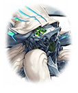

[View script in lisp](../scripts/277001053.txt)

【リサナウト】
やったわ！
クラーケンのマナが、
島に還っていく…

【リサナウト】
やっぱり…
あなただったのね

【リサナウト】
こんな風に…
手のひらに乗る大きさだったのに
ずいぶん無茶をしたわね

【レーヴァテイン】
リサナウト…
その子はひとりで、
さびしかったって

【ティルフィング】
リサナウトさん…
おこらないであげてください、
おねがいします

【リサナウト】
うん、わかってる…
2人とも、ありがとう

【クラーケン】
……（プルプル…）

【リサナウト】
あなたも、私と一緒に帰ろうね

【リサナウト】
…最初は、ほんの軽い気持ちだった
私の時間軸の世界で不足するマナを、
この島から分けてもらおうとしたの

【リサナウト】
それが、まさか
こんなことになるなんて…

【イチイバル】
世界を想うキミの気持ちは
間違っていないし、
素晴らしいことだと思う

【イチイバル】
やり方が…少し雑だっただけだよ
もう同じ失敗はしないよね

【リサナウト】
もちろんよ！
私を誰だと思っているの？

【リサナウト】
うん…これでよし！
すべての時間軸を調整できたわよ
これで、すべてが元通りになる

【リサナウト】
あなた達のおかげよ、
本当にありがとう…
みんな、元気でね

【オルフェウス】
リサっち、これでお別れなの？
マジで？
てか、神曲まだ聴かせてないし！

【リサナウト】
オルフェウス…本当に残念よ
でも、曲作りに熱中するのも、
ほどほどにね

【ヒョウハ】
あたしは最初っから
あんたのこと、仲間だと思ってたぞ！
一度、手合わせしたかったなぁ

【リサナウト】
いいけど、私が勝つわよ

【ヒョウハ】
ははっ！
そんなのわからないだろ？
いまここで、やってみるか？

【ミュルグレス】
ヒョウハったら、子供なんだから…

【ミュルグレス】
てか、ミュルはニョイ子に騙されたの
リサナウトがお金持ちだって…
違うんでしょ？

【リサナウト】
残念だけど…ごめんなさい

【ミュルグレス】
アンタが謝ることじゃないわよ
別の時間軸でも、元気でね

【リサナウト】
ありがとう、あなたも…
糖分の取りすぎには、気をつけて

【ミュルグレス】
えっ？

【如意金箍棒】
リサナウトちゃん…
もっと、お話したかったよ

【リサナウト】
私もよ、ニョイ子…

【ビコウ】
ウキッ！

【リサナウト】
うん、ビコウも元気でね
布を引っ張りすぎたらダメよ

【フォルカス】
リサナウト…

【リサナウト】
フォルカス…
私の提案を受けてくれて、
ありがとう

【フォルカス】
ふふっ…
あの時は、ここまで壮大な話だとは
思ってませんでした

【リサナウト】
この先に、どんな困難が
待ち受けているとしても、
あなた達なら、きっと超えていけるわ

【フォルカス】
どうしたんですか？
まるで、予言のような…

【リサナウト】
いいえ、これは予言ではない
確定事象の報告に過ぎないの

【イチイバル】
そうだよ、予言や予知なんて
無意味だよね

【イチイバル】
どんなに離れていても、
仲間は仲間だ
そうだよね、フォルカス？

【フォルカス】
ええ、そう思います

【イチイバル】
じゃ、そういうことだから
悲しいお別れは苦手なんだ
テヘッ☆

【リサナウト】
イチイバル…

【ロジェスティラ】
あのあのっ
リサナウトさん…

【リサナウト】
ロジェスティラ、
あなたには頼りきりだったわね

【ロジェスティラ】
いえ、そんなっ…
えと、その…
わたしのことは、ロジェ、と…

【リサナウト】
そうなの？
じゃあ、ロジェ…
ありがとう

【ロジェスティラ】
えへえへっ…
ありがとうございますっ

【ロジェスティラ】
リサナウトさんは美人で、
すごい力を持ってて…素敵…

【ソロモン】
リサナウト…
ほんとうにいっちゃうの？

【ティルフィング】
おわかれは、さびしいです…
もっと、いっしょに
あそびたかったです…

【リサナウト】
ソロモン、ティルフィング…
私もよ

【カシウス】
このよのすべては、
えんかんのいんし…

【レーヴァテイン】
…うん、またあえるよね？

【リサナウト】
カシウス、レーヴァテイン…
ええ、きっと会えるわよ！

【ロンギヌス】
リサナウトさん…
ふぇっ…ひっく…
うぇぇぇぇんっ…！

【リサナウト】
ロンギヌス…

【オルフェウス】
ロンギヌス…
お別れは笑顔でって…
うぅ…うわーん！

【リサナウト】
オルフェウスまで…

【ロンギヌス】
ひっく…
えがおで、おわかれ…
がんばらなくちゃ…

【ロンギヌス】
うぅぅ…
うぇぇぇぇんっ…！

【リサナウト】
いいのよ、ロンギヌス
悲しい時は、泣いていいの

【リサナウト】
また、きっと会えるわ
その時まで、元気でね

【ロンギヌス】
うん…
リサナウト、さん、も…
げ、げんき、で…

【リサナウト】
うん…

【如意金箍棒】
…………

【イチイバル】
…………

【ソロモン】
…………

【カシウス】
…………

【ミュルグレス】
…しみじみしてるとこ悪いけど、
この後ってどうなるの？

【ミュルグレス】
今のところ、
なんの変化もないんだけど？ 

【リサナウト】
おかしいわね？
じきに元に戻るはずなんだけど…

【ヒョウハ】
…って、おかしいだろ！
けっこう時間経ったよな！？
なーんにも変わってないぞ？

【リサナウト】
うーん…
もしかしたら、長い間、
違う時間軸と干渉したせいかも

【リサナウト】
正常に戻るまで、
時間がかかるのかもしれないわ

【ヒョウハ】
いつになったら元に戻るんだ？

【リサナウト】
とにかく、時間がたてば、
ちゃんと戻ると思うよ
…多分

【フォルカス】
でしたら、みんなで一緒に
この島が元に戻るのを見届けません？

【リサナウト】
えっ？
でも、私は…

【オルフェウス】
それ、名案っしょ！

【イチイバル】
はいはい
イチイバルさんから提案でーす

【イチイバル】
リサナウトには罰として、
この島で子供と遊ぶ係に任命します
キランッ☆

【ミュルグレス】
ミュルも同意するわ
無限の体力を持つ子供と遊ぶなんて、
罰ゲーム以外のなにものでもないわよ

【リサナウト】
ば、罰ゲームなら、仕方ないわね
それじゃ、なにして遊ぼうか？

【ロンギヌス】
わぁっ！
じゃあ、おんぶ！
おんぶしてください！

【レーヴァテイン】
くらーけんは、どこ？
いっしょに、あそぶ

【クラーケン】
（プルプルッ！）

【ティルフィング】
よろこんでますね！
さあ、うみであそびましょう！

【ソロモン】
ちょっと、あなたたち！
うみにはいるまえに、
じゅんびうんどうよ！

【カシウス】
ふーっ
ふー…っ

【如意金箍棒】
カシウスちゃん、貸してみて？
このボールに空気をいれるのね？
せーの…

【如意金箍棒】
ふーーーーーっ！

【カシウス】
わぁ…
まんまる…

【如意金箍棒】
これでいい？
それじゃ、泳ごうか？

青い海に沈む常夏の島、
ラグーナ島…

クラーケンによって
危機を迎えた海底のラグーナ島は
13人のキル姫によって救われた

リサナウトの出来心から端を発した
夏の事件も終幕を迎えようとしている

海で戯れるキル姫に囲まれ、
一匹の小さなイカは
人生最高の幸せな時間を味わっていた

…はずだった

【イチイバル】
リサっち…
リサリサ…
リサちー…

【イチイバル】
ふむ…
どれがいいかな

【リサナウト】
イチイバルったら、
まだ悩んでるの？
私は…どれでもいいわよ

【イチイバル】
キミの力は、謎が多いよね
複数の時間軸を行き来して、
失敗したら、巻き戻せる…

【イチイバル】
それなら、どうして最初に戻って
イカを処理しなかったのかな？

【レーヴァテイン】
…いかを、しょり？
どういうこと？

【イチイバル】
いや、たとえばの話だから
怒らないでよ、レーヴァテイン

【リサナウト】
問題を解決する時間軸に
たどり着くまで、
すでに複数の時間軸をつなげたし…

【リサナウト】
子供達と一緒に行動し始めたら、
可愛いくて、離れられなかったのよ

【リサナウト】
どうして、この島に
子供達がいるのか
私なりに考えてみたの

【イチイバル】
いいね、聞かせてよ

【リサナウト】
もしかしたら、島が海底に
沈んだせいで重力が変化したことが
原因なのかも

【イチイバル】
たしかに時間と重力には
密接な関係があると
言われているね

【リサナウト】
その重力の変化によって、
元々この島にいた彼女達の
時間が巻き戻った

【リサナウト】
どうしてそうなったのか、
という点については
私にもさっぱりね

【リサナウト】
弘法も筆の誤りというわ

【リサナウト】
いくら使いなれた能力でも
理解できないことは起きるものよ

【イチイバル】
なるほどね
ただ、その理論だと
ボク達や建物も変化がありそうだけど

【イチイバル】
なぜ、変化がないのかな？

【リサナウト】
それは簡単
建物に関しては、
巻き戻った期間の問題ね

【リサナウト】
ラグーナ島は古くからある島だから、
形に変化がなかったというだけ

【リサナウト】
私達に変化がないのは…

【イチイバル】
ボク達は沈んだ後に
この島へ来たから
縮んでないってわけだね

【リサナウト】
ま、まあ、そういうことよ
あくまで仮説だけどね

【イチイバル】
ふーん
だってさ、ティルフィング

【ティルフィング】
そ、そうなんですか？
じぶんでは、わからないですけど…

【リサナウト】
どちらにしても
そのうち元に戻るはずだから、
心配いらないわよ

【ティルフィング】
あの…
さっきのおはなしなんですけど

【ティルフィング】
もし、リサナウトさんが
じかんじくをもどして
イカさんを…しょりしていたら…

【ティルフィング】
私たちはあえなかったかも
しれないんですね？
よかったです、しょり、しなくて

【ロジェスティラ】
イチイバルさーん！
リサナウトさーん！
ほら、みんなで貝殻、拾ったんです

【イチイバル】
おお、これは色が鮮やかだね…

【ソロモン】
それは、わたしが見つけたのよ！
きれいでしょ？

【カシウス】
…これも

【イチイバル】
うん、素敵な巻貝だね
美しい螺旋だ…
キミらしいよ

【ロジェスティラ】
ロンギヌスちゃんも
たくさん拾ったんですよ！
ね？

【ロンギヌス】
いちばんきれいなの…
これ…リサナウトさんにあげます

【リサナウト】
わぁ…
とっても綺麗ね
ありがとう、ロンギヌス

【ロンギヌス】
えへへ…
どういたしまして！

【ロンギヌス】
もっといいの、さがしてきますね！
ロジェさん、いきましょう！

【ソロモン】
わたしも！
こんどはグラウの
センサーぜんかいでやるわよ！

【カシウス】
…レーヴァも、いく？

【レーヴァテイン】
じゃ、ティルも…

【ティルフィング】
あ、はい！
それじゃ、いってきます！

【イチイバル】
蟹とクラゲには
触っちゃダメだよ

【リサナウト】
みんな、気をつけてね

【リサナウト】
嘘みたいに、平穏な時間ね…
ずっとこのまま、
ここにいられたらいいのに…

【リサナウト】
ええ？
クラーケンがいなくなった？

【ティルフィング】
うきわにのせていたんですけど、
いつのまにか、いなくなってて…

【リサナウト】
波に流されたのかしら…

【クラーケン】
……（プルプルッ）

【ナレーション】
いつかの時間軸、どこかの世界線で…

【ナレーション】
いつかの時間軸、どこかの世界線で…

【クラーケン】
…………

【クラーケン】
…（ニュル）

【リサナウト】
ここが、ラグーナ島ね
…って、きゃあっ！
な、なに？

【クラーケン】
…（ニュル）

【リサナウト】
悪いけど、あなたに
かまっている時間はないの
早く目的を達成しなくちゃ…

Next: [277001121](277001121.md)

[Back to index](index.md)
