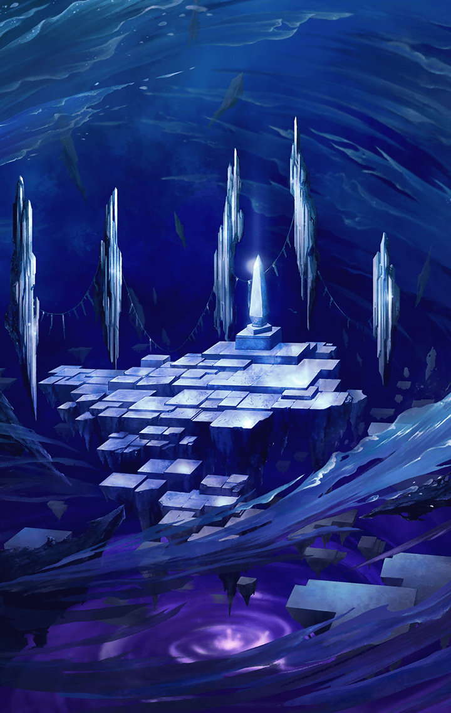

2770020

[View script in lisp](../scripts/2770020.txt)

レーヴァテイン達は異族を倒し、
アマテラスが追い詰められつつある
船の甲板へと向かった

【アマテラス】
はぁ…はぁ…

アマテラスも、物の怪に負けまいと
必死に立ち向かい、戦っていた

だが…その体には、
黒いオーラがまるで蛸の腕のように
まとわりつき、邪魔をしている

【アマテラス】
ち…力が…思うように……くっ！

【異族】
ぐおおおおおおっ！

膝を付く彼女に、異族が襲い掛かる

【アマテラス】
きゃあっ!!

【レーヴァテイン】
させない…っ！

【異族】
ぐあああああっ！

甲板に駆け登ったレーヴァテインは
アマテラスに迫る異族を退治した

周囲の異族達も
リズベットとユリが一掃する

【レーヴァテイン】
…大丈夫？
怪我はない？

【アマテラス】
う、うん…！
ここまで来てくれて…ありがとう!!

【アマテラス】
改めて、自己紹介しますね
私がアマテラスです
…みんな、来てくれてありがとう！

【リズベット】
わたし、リズベットです
ビーナス魔法学校に通う
魔法使い…

【リズベット】
…ねぇ、アマテラスさん
わたしが得意なのは
なにかちゃんとわかる？

【アマテラス】
ええ！
魔法使いだもの…
魔法が得意なんでしょう？

【リズベット】
あは、正解！
…でも、学校じゃ落ちこぼれだけどね

【レーヴァテイン】
それは得意って言わないんじゃ…

【ユリ】
ふふふっ…
わたくしは、ユリと申します
忍びの里で修行中のクノイチですわ

【レーヴァテイン】
さっきの戦いで、
身のこなしが常人の域をはるかに
超えてるのは、よくわかったよ

【レーヴァテイン】
修行中でこれだとすると、
クノイチって…なかなかすごいね

【ユリ】
うふふ、ありがとうございます

【レーヴァテイン】
私はレーヴァテイン
他の３人には言ったけど、
私はキラープリンセス…

【レーヴァテイン】
…って、その言葉で
私が何者かちゃんと通じてる？
…通じるわけないか

【リズベット】
実はよくわかってないかも…
…でも、プリンセスってことは、
お姫様なんでしょ？

【レーヴァテイン】
違うよ…どっちかというと、
『キラー』の部分の方が
私のことをよく表してるかな…

【リズベット】
…ええと、殺し屋さん？

【レーヴァテイン】
…それでいいよ
私は戦うためだけの存在だもの
その方がわかりやすい

【ユリ】
そんなことありませんわ
『誰かを助けたい』という思いは
ただの殺し屋にはありませんもの

【レーヴァテイン】
…なんでもいいけど

【アマテラス】
頼りになりそうな方が
来てくれて、とっても心強いわ！
…それで、あなたは？

自らの名を名乗ると同時に
なぜ自分がここにいるのかは
わからない、とアマテラスに告げる

【レーヴァテイン】
…戦う力がない？
大丈夫、あなたを守ること
くらいはできる

【リズベット】
あ、だったら…

【リズベット】
[ユーザー名]さんは
わたしの分まで“考える役”
っていうのはどうでしょう？

魔法使いは考えるのが
得意そうに思えるのだが
それは口に出さずにしっかりと頷く

【リズベット】
いつもは考えるのが得意な
親友がやっててくれるから…
じゃあ、よろしくおねがいします！

【ユリ】
これで全員の
自己紹介が終わりましたね

【アマテラス】
ええ、みんなのこと
よくわかったと思うわ
ありがとう！

【アマテラス】
…改めてみんなにお願いしたいの
…どうか、私と一緒に…
『太陽の鍵』を取り戻して…！

【レーヴァテイン】
…もちろん
太陽の光がなくなるだなんて
見過ごせない

顔を見合わせ、全員が
同じ気持ちであることを確認する
アマテラスにもそれは伝わったようだ

【アマテラス】
…それなら、改めて
私の役割について伝えておきます

黒い雲が覆う空の下、
アマテラスは改まった様子で
語り始める

【アマテラス】
私の役目は太陽を管理すること…

【アマテラス】
生きとし生けるもの、全てのために
必要なのが太陽…
どの世界にも存在する生命の源…

【アマテラス】
でも、太陽の光は強すぎるから…
管理しなければ、世界の全てを
燃やしてしまうぐらいに…

【アマテラス】
多すぎてもダメ、少なすぎてもダメ…
命ある者達が過ごしやすいように
私が管理しているんです

【リズベット】
…わたしの故郷のルストブルグって
ちょっと寒いんだけど…
もう少し強くしてもらえないかな？

【アマテラス】
ご、ごめんね…そうすると、
暑い地方の人が、それこそ
暮らせないぐらいになっちゃうから…

１つの世界にある太陽は１つだから
太陽の強さを変えた時の影響も、
世界全体にまとめて出るのだろうか

【レーヴァテイン】
…太陽の光をなくすっていうのは
具体的にどうやるの？

【アマテラス】
月を使って、
太陽を隠してしまえば…

【アマテラス】
更に、完全に太陽が隠れたところで
月を止めてしまえば、もうその世界に
太陽の光が降り注ぐことはありません

【リズベット】
…あれ？
『太陽の鍵』って、月も動かせるの？

【アマテラス】
太陽の管理には、太陽と月と世界の
位置関係が重要なんです

【アマテラス】
『太陽の鍵』を使って、引力で
太陽と月を動かして、世界にどの程度
光をあてるかを調整するんだけど…

【リズベット】
あ、なんか…
物理とか科学っぽい話になってる!?

【リズベット】
うう…わたし…
落ちこぼれだから…
理解できない…かも…

【アマテラス】
ええっ!?
えっと…簡単に言うと…

【アマテラス】
たとえば、リズベットから見て
ユリさんの前に
私が立ってるとするでしょ？

【アマテラス】
そうすると、
リズベットはユリさんの顔が
良く見えなくなっちゃう…よね？

【リズベット】
うん、アマテラスさんは
良く見えるけど

【アマテラス】
そうだよね
…だから、私が横にどけば…

【ユリ】
リズベットさん、はーい♪

【リズベット】
あは！
ユリさん見えた、はーい！

【アマテラス】
というように、見える範囲を
調節することで光の強さを
調節したりしているのです…

【リズベット】
なるほどー！

【レーヴァテイン】
…みんな、なに遊んでんの
世界が危ないって状況なのに
緊張感ないのね…

【レーヴァテイン】
ねえ…アマテラス
全ての鍵が奪われたって
話だったけどさ…

【レーヴァテイン】
じゃあ、私が持ってる
この鍵はなんなの？

【アマテラス】
…鍵が奪われた直後に、
私もなんとか取り戻そうとしたの…

【アマテラス】
…太陽や月を操作する場所は、
それぞれの世界に通じる扉が集まった
『宵の間』と呼ばれる所なんです

【アマテラス】
あの時も私は、『宵の間』で
太陽と月の操作に集中していた…

【アマテラス】
黄昏時で、定められた時間丁度に
昼から夜へと切り替えなければ
いけなくて…

【アマテラス】
…だから、『宵の間』の中に侵入者が
入ったことに気づく余裕もなく
すぐには対応できなかった…

【アマテラス】
私自身、その侵入者に
呪いをかけられ、
力を非常に弱められてしまって…

【アマテラス】
咄嗟に持ち出せた鍵は４本だけ…
それも取り戻そうと、
追っ手をかけられたところで…

そこで持ち出した鍵を送って、
助けを呼んだらしい
しかし、ここで疑問が湧いてくる

太陽を司るアマテラスを手玉に取り
呪いすらかけてしまう侵入者とは
一体何者なのだろうか？

その疑問をアマテラスに告げると、
彼女は顔を曇らせながら
ゆっくりと口を開く

【アマテラス】
…言うなれば“堕罪者”…

【アマテラス】
良識や道徳、誇り…
人として生きるために必要なものを
全て捨ててしまった人…

【アマテラス】
ただ、その代わりに
恐ろしいまでの負のエネルギーを
その身にまとっていたわ

【ユリ】
ただ力を持ってるだけでなく、
抜け目もないとは…強敵ですわね

【レーヴァテイン】
…そして、私が持っている鍵が、
今、私達に残された最後の鍵…

【アマテラス】
そう、この世界の『太陽の鍵』よ

【レーヴァテイン】
ということはこの鍵を使えば、
今、頭の上にある太陽の光を
元に戻せるんじゃ…

【レーヴァテイン】
…いや、太陽の操作は
『宵の間』から行うんだっけ

【レーヴァテイン】
ということは、居座ってるだろう
“堕罪者”を追い払い『宵の間』も
取り戻す必要がある、か…

【リズベット】
鍵もその人が持ってるんだから
ちょうどいいよ！…でも
『宵の間』ってどうやって行くの？

【リズベット】
あ、アマテラスさんは
『宵の間』に入れるんだから
いつでも簡単に行ける…とか？

【アマテラス】
…いえ“堕罪者”がなにかしたのか
私も今『宵の間』に自由に
行き来できない状態なの…

…となると
『宵の間』に行く手段が
ないということだろうか

【アマテラス】
いえ…そのためにこの船を用意したわ
この船は…どこにでも辿り着くことが
できる、伝説の魔法の船…

【アマテラス】
それと…これ

彼女が取り出したのは、
黄金に輝くコンパスだった

【アマテラス】
これが常に『宵の間』の在りかを
示してくれるわ

コンパスに従って、この魔法の船で
向かえば『宵の間』にも
必ず辿り着けるということだろう

【アマテラス】
このコンパスがないと
迷子になっちゃうから
持ち歩いてるのだけど… 

【アマテラス】
…これは、そうね
あなたが持っていて…

そう言って、アマテラスはこちらに
コンパスを差し出してきた
なぜ、自分なのだろうか…

【アマテラス】
理由は後で説明するわ
あなたは、それを持つのに
“ふさわしい者”なの

“ふさわしい者”…？
なにもわからないが、しかしここで
断ってはすべてが終わってしまう

不安がないわけではないが、
アマテラスが差し出したコンパスを
しっかりと受け取った

【レーヴァテイン】
…[ユーザー名]
コンパスの針はどっちを差してる？

【アマテラス】
待って…ごめんなさい
出発の前にもう一度だけ
確認させてもらって…いい？

【レーヴァテイン】
…なに？

【アマテラス】
助けを求めたのは確かに私だけど…
“堕罪者”は恐ろしい相手よ…？
どんな危険な目にあうか…

【アマテラス】
それでも本当に……
協力してくれるの…？

【レーヴァテイン】
当たり前でしょ
だって、太陽が消えたら
陽だまりでお昼寝できなくなっちゃう

【ユリ】
故郷の『ひまわり畑』が…
もう二度と見られなくなって
しまいますから

【リズベット】
わたしの故郷は雪国なの
太陽がなくなったら、余計に
寒くなっちゃう…そんなの困るよ！

【アマテラス】
…みんな
……ありがとう

【アマテラス】
なんだか…私の心に
一筋の光が差したみたい！

アマテラスの目が、
キラキラと輝き始めた

微かではあるがそれは
太陽の光を感じさせた

【レーヴァテイン】
じゃあ早速『宵の間』へ向かおう
とっとと“堕罪者”を倒して
『太陽の鍵』を取り戻さないと

静かに闘志を燃やすレーヴァテインに
コンパスが示している方角を告げる

【レーヴァテイン】
船に鍵にコンパス、か…
なんだか海賊の物語に
出てきそうな物ばかりね

【アマテラス】
それは、そうかもね
この船も昔はすごい海賊の船だったし

元は海賊船だったということだろうか
船に見惚れていると、アマテラスが
自分に帽子を差し出してきた

なぜ帽子なのだろう…
怪訝にしていると、
アマテラスは言葉を続けた

【アマテラス】
海賊の船長といったら帽子でしょ？
[ユーザー名]のため、
コンパスと一緒に用意しといたから

【アマテラス】
あっ、間違えました、
[ユーザー名]じゃなくて…
船長

…やめてほしい
呼ばれ慣れない“船長”という響きに
赤面していると…

【ユリ】
ふふ、船長…号令を

【リズベット】
キャプテンさん！

【レーヴァテイン】
せーんちょ

…３人とも思いのほかノリノリである
アマテラスを含めた４人の屈託のない
笑顔が自分に向けられる

…船長という大役が
自分に務まるのだろうか…
しかし、自分は戦うことができない

どこに進むのかはコンパスを
見ればいいわけだ　大役とはいえ、
引き受けなければならない気がした

覚悟を決め、大きく頷く
それを見て４人は歓声を上げる

【レーヴァテイン】
じゃあ、せんちょ
出航の合図を

大きく息を吸い、出航の合図を出すと
４人が右手を高々と突き上げ
弾けるような声でそれに応えてくれた

【レーヴァテイン】
太陽くらい、ちゃちゃっと
取り戻してやるし

全ての世界に太陽を取り戻すため、
『太陽の鍵』を取り戻すために…

 “堕罪者”の待つ『宵の間』を
目指し我々の大航海は
こうして今始まったのであった…

Next: [2770030](2770030.md)

[Back to index](index.md)
