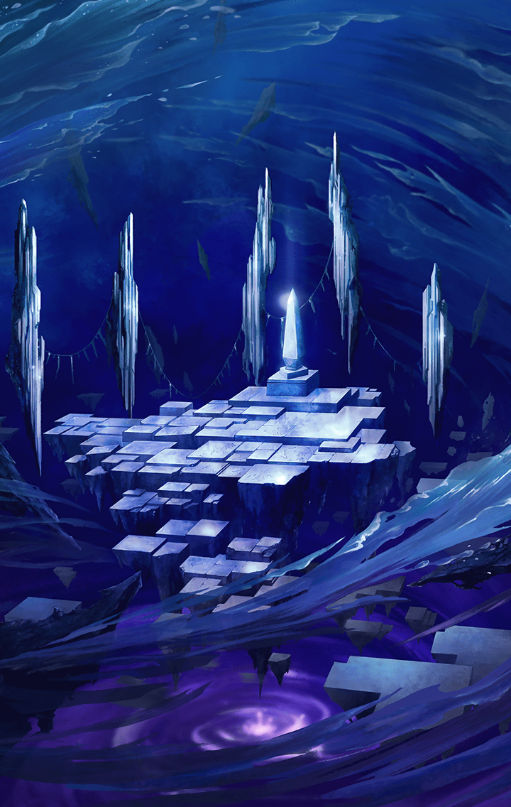

[View script in lisp](../scripts/2770050.txt)

[View source in markdown](2770050.md)

**【レーヴァテイン】**
…っ！

**【レーヴァテイン】**
はぁ…はぁ…
…勝ったよ…

**【レーヴァテイン】**
みんなのおかげで…ね

**【アマテラス】**
…レーヴァテイン！
よかった…心の闇に
打ち勝つことができたのね…！

**【レーヴァテイン】**
…リズベットとユリは？

まだ目は覚ましていないが、
二人もきっと
間もなく戻ってくるだろう

**【？？？】**
…それを待ってやるつもりはないがね

**【アマテラス】**
！？
…そんな、こんなところで
来るなんて…

アマテラスの反応から、
この声の主が“堕罪者”であることは
間違いなかった

**【？？？】**
チッ…計算外なことばかりだ…！
またしても、わしの邪魔をしおって…

**【レーヴァテイン】**
…その声、
私を悪夢へと誘った…！

**【？？？】**
がああああああああッ!!

**【アマテラス】**
…気をつけて！
彼女が “堕罪者”です！

**【レーヴァテイン】**
…あなたを倒して太陽を取り戻す
行くよ！

**【カヤコ】**
…我が名はカヤコ
最後の決着をつけようか…！
ここで死んでもらうぞ！
