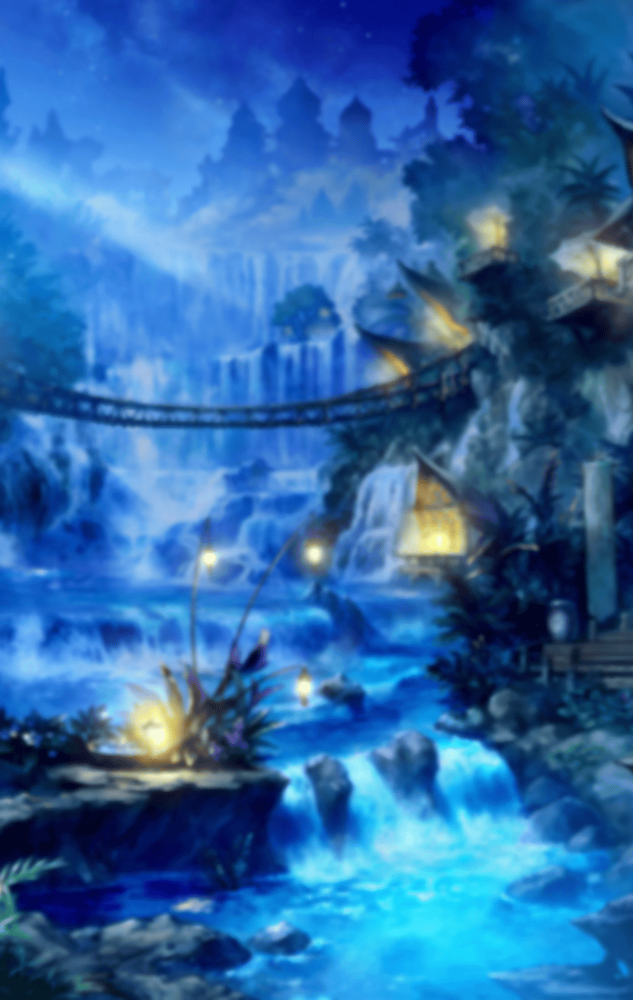

277006171

[View script in lisp](../scripts/277006171.txt)

異族との戦いを終えた後、
マスター達は翌朝同じ場所に
集合することを決めて解散した

マスターが集合場所に行くと
すでにティルフィング達が集まり
何やら盛り上がっている

【ティルフィング】
あ、マスター
おはようございます
昨日はよく眠れましたか？

【グランテピエ】
うん、顔色は良さそうだね
今日はがんばってね

マスターはグランテピエの
言葉に首をかしげる

【アルマス】
お姉ちゃんが線香花火の材料が
ありそうな場所を見つけたの

【グランテピエ】
すごい昔にね、
この島に伝説の花火職人が
住んでいたんだって

【グランテピエ】
その人が作った線香花火には
不思議な力があって、
願いが叶うって言われてたんだ

【グランテピエ】
その人が住んでいた家になら、
その材料が残っているかも、ね

【イージス】
あの山奥にあると言っていた家か…
あの山は気軽に登れる場所じゃない
断崖絶壁だらけで難所続きなんだ

【盤古】
…考えただけで、疲れそう、だな

【ティルフィング】
ですが、可能性があるなら
行くしかありません

【グランテピエ】
でね、ここから先は二人だけで
行った方がいいんじゃない、かな

【アルマス】
えー！？
ついていっちゃダメなの？

【イージス】
私には隊長を守るという役目が…

【グランテピエ】
私だってすごく心配、だよ
でも、これは二人の試練なんだから
私達はここで帰りを待とうよ

【ティルフィング】
グランテピエさん…
ありがとうございます

【ティルフィング】
アルマスさん、盤古さん、
イージスさんにも感謝しています

【ティルフィング】
ですから…
よかったらですけど…
みんなで一緒に行きませんか？

【グランテピエ】
ティルフィング…
それでいいの？

【ティルフィング】
はい…
私だけでは、絶対にここまで
たどり着けなかったと思います

【ティルフィング】
誓約をしたいという気持ちに
変わりはありませんが、
抜け駆けはしたくないんです

【ティルフィング】
私がマスターと結ばれる運命なら、
試練もきっとうまくいくはずです
私は、それを信じます

【アルマス】
逆に自信があるって感じね
いうじゃない、ティルフィング

【ティルフィング】
そ、そういうつもりでは…

【盤古】
我は、それでいいと思う…
そなたなら、うまくいくと思うぞ

【イージス】
私も今後の参考に、
最後まで見届けさせてもらおう！

【グランテピエ】
うん…
ティルフィングはえらいね
じゃあ、みんなで行こうか

【ティルフィング】
ありがとうございます！
みなさんが一緒なら心強いです

こうしてマスター達は
全員で山奥にある花火職人の家を
目指して出発した

【アルマス】
すごい絶壁ね…
ここを登っていくの？

【グランテピエ】
ムーがいれば
軽く飛んで行けたかも、ね

【アルマス】
またどっか行っちゃったの？
しょうがないわねぇ

【イージス】
ここは私に任せてくれ！

【アルマス】
ええっ
一番危なっかしいんだけど
本当に大丈夫？

【イージス】
ふんっ、心配いらない！
私の盾は絶対の盾！
これをこうして

【イージス】
はあっ！

イージスが盾の力を発動させると
散開した複数の盾により、空中に
足場が生まれるのだった

【イージス】
みなの足場も私が守ってやる！
さあ、私の後に続け！

【ティルフィング】
足場があるとはいえ、
ここは高い場所ですから
しっかり掴まってくださいね

ティルフィングはマスターの
手をとり、マスターに声をかける

【ティルフィング】
ここからの眺めは絶景ですね

ティルフィングの視線の先には
晴れ渡る空と碧い海、
そして木々が生い茂る島が見える

【ティルフィング】
ふふっ…
私、この景色をずっと忘れません
二人だけの想い出…ですよね

こんな景色、地上じゃ見れないね
と、マスターも思わず笑顔になった

一行はその後、何度も断崖を超え、
絶壁を下りながら山奥へと進む
気がつけば辺りは暗くなっていた

【ティルフィング】
夜に山を歩くのは危険ですね
今日はここで休みましょうか

【グランテピエ】
そうだね…
盤古、お願いできる？

【盤古】
うむ…

盤古が武器を軽く振り下ろすと
周辺の木々が根こそぎ倒れ、
キャンプに最適な空き地ができた

そして盤古は自分の空間から
次々にキャンプ道具を出していく

【イージス】
すごいな…
これだけそろっていれば、
完璧なキャンプができるぞ

【盤古】
あとは…頼んだ

【グランテピエ】
うん、任せてね
ありがとう、盤古

グランテピエはテキパキと
野営の準備を進めていく

マスター達も手伝って、
一行は夕食から焚き火まで
夏キャンプを満喫した

【グランテピエ】
異族が出るかもしれないから、
寝る時は二人で
火の番をした方がいいかも、ね

【アルマス】
組み合わせはくじで決めるわよ！
その方が公平でしょ？
うらみっこなしよ！

【ティルフィング】
夜は少し冷えますね…
マスター、もう少しこちらへ…
ちゃんと火に当たってください

ティルフィングとマスターは
並んで焚き火を見つめる
二人は同じ時間帯の担当だった

【ティルフィング】
マスター…
私の思いつきで大変なことに
巻き込んでしまってすみません

【ティルフィング】
誓約をしようって言ったこと、
後悔していませんか？

するわけないよ
と、マスターは首を横に振る

【ティルフィング】
マスターは優しいですね…
マスターのことを想ってるのは
きっと私だけじゃないと思いますよ

そうかなぁ…
と、マスターは照れながら
空に視線を上げる

ティルフィングもつられて
空を見上げる
そこには満天の星空が広がっていた

【ティルフィング】
わぁ、綺麗…
まるで宝石みたいです…

二人はしばらく黙って空を見上げる
山の夜はとても静かで
時が止まったように思えた

【ティルフィング】
マスター…
今の音、聞こえましたか？
異族が近くにいるのかも…

敵襲を警戒しながら
マスター達は音の方向へ移動する

【ティルフィング】
マスター…
あれ、見てください

暗くてよく見えないが、
そこには古い建物があった

さっき聞こえた音は、
この壊れかけた建物の
家鳴りだったらしい

【ティルフィング】
あれがもしかして、
花火職人さんの家でしょうか？

きっとそうだよ、
こんな近くにあったんだね
と、マスターはこたえる

【ティルフィング】
かろうじて屋根が残ってますね
火薬があるといいのですが…

家に近づこうとするマスターの手を
ティルフィングがつかむ

【異族】
グググギギッ…

【ティルフィング】
異族です…
しかも複数ですね
床下を気にしているようです

【ティルフィング】
放っておくと家が壊されて
しまうかもしれませんね…

よし、自分が囮になって
異族達をあの家から引き離すよ
と、マスターは提案した

ティルフィングは待ち伏せして
異族を一体ずつ片付けるんだ
と、マスターは作戦を立てる

【ティルフィング】
マスターにそんな危険なことは
させられません…

君と一緒ならきっとうまくいく
お互いを信じてやってみようよ
と、マスターは説得する

【ティルフィング】
マスター…

【ティルフィング】
わかりました…
あなたは必ず私が守ります
ですが、無理はしないでください

【ティルフィング】
花火よりも、マスターの方が
大切なんですからね

マスターはうなずき、
ティルフィングが隠れるのを待つ

彼女の合図を受けて、
マスターは異族の気を引くために
大きな声を出した

【異族】
グギギッ！

異族達はマスターを発見すると
予想通り一直線に向かってくる

マスターは全速力で走った
ティルフィングの待つ場所まで
あと少しだったのだが…

一体の異族が大きく飛び上がり、
マスターの頭上を越えて
目の前に立ちふさがる

【異族】
グギャギャギャッ！

思わず立ち止まったマスターは
異族に取り囲まれてしまう

マスターの眼前に異族の攻撃が迫る
その瞬間、ティルフィングが異族と
マスターの間に飛び出してきた

【ティルフィング】
あなた達の相手は…この私です！

Next: [277006181](277006181.md)

[Back to index](index.md)
