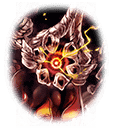

2770070

[View script in lisp](../scripts/2770070.txt)

【アマテラス】
…こんなところで戦うなんて…
やっぱりあなた達は
『宵の間』を乱す敵なんでしょ！？

【アマテラス】
私がひとりでなんとかしないと…
太陽と月の力を悪用されるわけには
いかないんだから！

【ユリ】
私達にはそんなつもりは
まったくありませんわ！
信じてください！！

【アマテラス】
そんな言葉に騙されるほど、
私はお人よしじゃないわ！

【アマテラス】
『太陽の鍵』を守れるのは
私しかいないんだから
私が気をつけなきゃ…

アマテラスの不信感が増している…
これは、もしかして
…闇の影響なのだろうか

【レーヴァテイン】
きっと、
さっきアマテラスが言ってた

【レーヴァテイン】
『宵の間』の太陽の力を
打ち消すほどの負のエネルギー
ってヤツのせいかも…

【カヤコ】
フッ…心の隙はできた…
さぁ、その隙を
もっと広げてやるとしようか…

【カヤコ】
わしの術が生み出すウズシオマルは、
心の隙に入り込み、
負のエネルギーを膨張させて支配する

【カヤコ】
そして、心の隙とは、
こうあってほしいという本心と、
目の前の現実との乖離が生み出す物！

【カヤコ】
…ああ！先は越されたが
お前達４人に
『太陽の鍵』を渡しはしないよ！

【リズベット】
えっ！？
いきなりなに言い出すの！？

【リズベット】
私達は別に
『太陽の鍵』を欲しがってなんか…

【カヤコ】
ハッ！
わしの目は誤魔化せはしないよ…

【カヤコ】
甘い言葉で取り入って
油断した隙に『鍵』を
奪い取ろうって腹なんだろ？

【カヤコ】
まったく、
ずる賢いったらありゃしない！

【カヤコ】
まぁ…騙されるヤツも
いないだろうけどね…

【アマテラス】
そ、その通りよ！
私が騙されるわけない…

【アマテラス】
だって、誰も
信じられるはずがないんだから！

カヤコは会話を巧みに使って
僕達の信用を落としにかかっている

…でも、これでは
カヤコもアマテラスに
敵と見られるだけのはず…

【リズベット】
アマテラスさん、話を聞いてよ！
私達、海賊船の仲間として
一緒に冒険だってしたのに…

【アマテラス】
…適当なこと、言わないで！
太陽の管理で忙しい私が
冒険なんてするわけないわ

【アマテラス】
そもそも、仲間だなんて、
私にできるわけがないんだから…

【カヤコ】
ああ…その通りだよ、アマテラス！
お前はいつも、いつまでたっても
ひとりぼっちの孤高の太陽…

【アマテラス】
…そう、ひとりぼっち
でも、だからなんだって言うのよ！
ひとりだって、別に構わないし…

【カヤコ】
そう、それでいい！
それでこそ、
わしがつけこめるというものよ！

【カヤコ】
本心とは真逆のことを
口にするからこそ
心がひずみ、隙間が広がるのだ…！

【カヤコ】
さぁ、ウズシオマルよ…
アマテラスの心の隙に入るがいい！！

【ウズシオマル】
ぉおおおおおおおおおお！！！！

【アマテラス】
いやっ…なにかが、私の心に…！
ああああああああ！？

【リズベット】
アマテラスさんっ！
気をしっかりもって！！

【ユリ】
これって、もしかして
私達が受けた…悪夢と同じ…

【ユリ】
心を責める
やり方じゃありませんか！？

【レーヴァテイン】
だとしたら…よくないよ
アマテラスには
信頼できる仲間がいない…

【カヤコ】
ははは、その通り！
そろそろ、ウズシオマルの呪いにより
その体を乗っ取られた頃合い…

【カヤコ】
さぁ、ウズシオマル…
否、アマテラスよ！

【カヤコ】
そこの目障りな連中をお前の力で
なぎ払って見せるがいい！！

【アマテラス】
あ…ああああああああああっ！！

【リズベット】
ああっ！？アマテラスさんから
黒い霧みたいなのが
あふれてくるよ！？

【ユリ】
アマテラスさんから
変な怪物が…！？
これも、カヤコの術のせいで…！？

このままではアマテラスが
ウズシオマルに取り込まれてしまう…

どうにか信用させることは
できないだろうか…？

【レーヴァテイン】
私達が時間をかせぐから
その方法を考えてよ
…船長ならできるでしょ？

【リズベット】
キャプテンさん、お願いします！！

【ユリ】
行きましょう！

彼女達は武器を持ち駆ける…
僕のやれることは“考えること”…

今、自分ができることで
おのおのの必死の戦いが始まった

Next: [2770080](2770080.md)

[Back to index](index.md)
