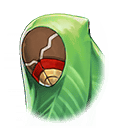

27900142 海上編 ストーリー9月 ジャングル震撼篇第1部 第4幕「密会のジャングル」 第4幕「密会のジャングル」 第4幕「密会のジャングル」戦闘後

[View script in lisp](../scripts/27900142.txt)

【アフロディーテ】
その醜怪な姿、許しません！

【異族】
グギャアアア…

【ムラマサ】
なんと見事な弓術…
あの方は一体、
何者なのでしょう…？

【エロース】
は～い！
あなた達、大丈夫だった？
あら、可愛い子ばかりねぇ

【ムラマサ】
ご助勢に感謝致します
拙者、ムラマサと申します
そなた達は？

【アフロディーテ】
わたしはアフロディーテ
愛と美の探求者でございます

【エロース】
エロースよ
それから、物陰に隠れてる
この子がミストルティンで～す

【ミストルティン】
ひゃあっ…
あの…私なんか気にしていただく
ほどの者ではないので…

【アフロディーテ】
あなたも十分に美しいですよ
そちらの皆さんも美しいので
加勢致しました

【雑賀】
なんか、独特な人っすね…

【アフロディーテ】
「愛」と「美」こそ絶対の
価値基準なのです
わたしはそれ以外に興味ありません

【シユウ】
「あい」と「び」ってなんなのだ！？
おいしいのかっ？

【ヴァナルガンド】
シユウちゃんには
まだ早いかしら～

【エロース】
そんなことないよ～
女の子は恋するために
生きてるんだからっ

【アフロディーテ】
そう。愛にはさまざまな形が
ありますけれど
その全てが尊いのです

【アフロディーテ】
あなたはまだ自覚していないだけ
もうすでにあなたの中にも愛の
萌芽があるんですよ

【シユウ】
？？？
まったくわからないけど、
すごいな！

【雑賀】
なに言ってんすか
この人達…？

【ムラマサ】
すごい…そなたこそ、
“理想を追う者”に違いありません！

【雑賀】
えーっ…
そうなっちゃうんすかー…

【ムラマサ】
アフロディーテ、七人の勇者として
ともにジャングル連合を
守っていただけませんか

【アフロディーテ】
あら？
…そうですね
では、少しお耳を拝借

【ムラマサ】
なんでしょう…？

【ムラマサ】
雑賀の目を盗んで
泉まで来たけれど…

【ムラマサ】
こんな夜中に二人きりで話したい
だなんて、アフロディーテは
拙者にどんな話を――

【ムラマサ】
！？
今、泉の方で物音がしたような…
誰かいるんですか…？

【ムラマサ】
きゃあっ…！？

【アフロディーテ】
あら…わたしが外すだなんて…
お肌に悪いのを我慢して起きていた
っていうのに

【ムラマサ】
アフロディーテ！？
これは…なんの真似ですかっ…

Next: [27900150](27900150.md)

[Back to index](index.md)
