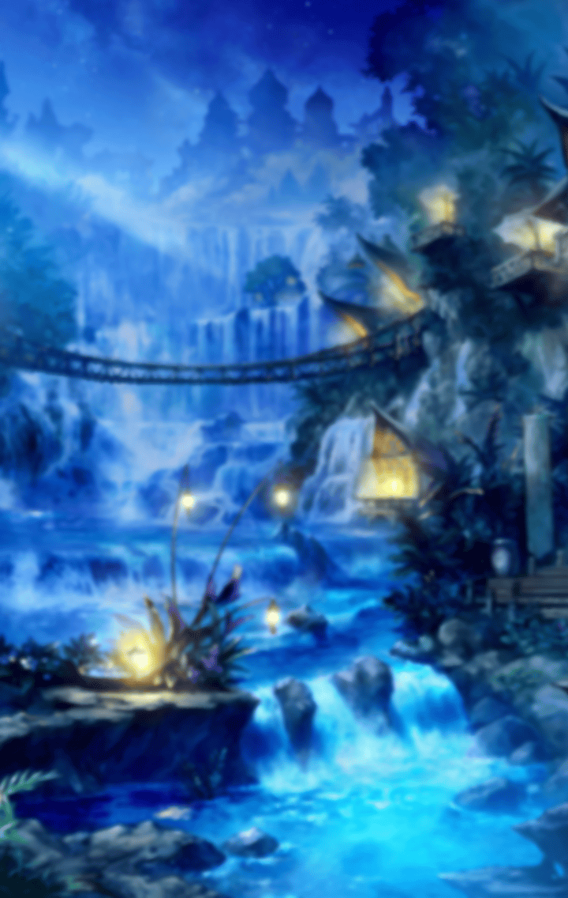

27900282

[View script in lisp](../scripts/27900282.txt)

【ムラマサ】
今度こそ遺跡について
聞かせていただきます
良いですね、プタハ

【プタハ】
…ムラマサ、
そなたの意志は固いのですね
では、全てお話ししましょう

【ブラフマーストラ】
聞いちゃったら最後、重たいもん
背負うことになっちゃうからね～
覚悟しといてよ

【ムラマサ】
…はい

【プタハ】
そなたも見た地下の遺跡
あれの奥には良からぬものが
眠っておるのだ

【プタハ】
マサムネ、レーヴァテイン、
フライクーゲル…
あの者達を暴走させた力が

【プタハ】
我らはそれを
“呪い”と呼称しておる
三人は呪いを受けたに相違ない

【マサムネ】
拙者が呪われただと？
…一体、いつ？

【プタハ】
そこまでは分からぬ
ただ、秘密を握っておると
思しき人物が一人…

【ブラフマーストラ】
ムラマサも会ったんだよね？
ティルフィングって子

【ムラマサ】
はい！でも、ティルフィングさんは
遺跡の奥には「バイブス」という
島を救う秘宝が眠っていると…

【プタハ】
それが真実である根拠は？
その者が本当のことを述べていると
なぜ、言い切れるのだ

【ムラマサ】
それは…

【プタハ】
我はその「バイブス」こそ
“呪い”そのものであると
考えておる

【ブラフマーストラ】
…昔、ここにアタシ達の親友がいたの
パラシュっていってね、
今は海浜ビーチ帝国にいるんだ

【プタハ】
彼女がここを出ていかざるを
得なかった理由…
それが、あの遺跡なのだ

【ムラマサ】
まさか、パラシュという方も
“呪い”にかかったのですか？

【ブラフマーストラ】
マサムネ達のように
はっきりしたものじゃ
なかったけどね…

【プタハ】
毎夜、うなされておった…
我の力ですら癒すことはあたわず
徐々に衰弱していったのだ

【プタハ】
それで…
ここから出て遠くで
養生するよう促した…

【ブラフマーストラ】
ずいぶんと前の話だよ…
それがきっかけでアタシと
プタハは“深奥結社”を作って

【ブラフマーストラ】
長いこと、
遺跡を監視してたの
ずっと変化はなかったんだけど…

【ブラフマーストラ】
あるとき急に遺跡の奥から
強い力を感じるようになったのよ
それもドンドン増大してる

【ムラマサ】
あるとき、
とはいつのことですか？

【プタハ】
海浜ビーチ帝国の皇帝が
三国統一の戦を始めると
宣言したときだ

【ムラマサ】
！？
それって…

【シャルウル】
マサムネ様が
失踪された日と重なります

【マサムネ】
…そうだ。拙者はあの日、
突然なにかを
思い出しそうになって…

【マサムネ】
それから先の記憶が
曖昧になっておる

【雑賀】
そのときマサムネ様は
“呪い”にかかった
ってことっすか？

【ブラフマーストラ】
というより、前にかけられてた
“呪い”が発動したって
考えた方がしっくりきそうね

【プタハ】
いずれにしても、
あの日から地下に
眠る力は増大する一方だ

【プタハ】
恐らくその「バイブス」は我らの
闘争心によって力を増していく

【プタハ】
そして近づいた者を呪う

【プタハ】
我は連合の民が
戦いの渦に飲まれるのを
見たくはなかった…

【ムラマサ】
拙者の邪魔をしたのは、
拙者が七人の勇者を集めて
他国と戦おうとしていたからですね

【プタハ】
ムラマサ…
我は王国とも帝国とも
戦ってはならぬと考えておる

【プタハ】
ティルフィングという娘も
言っておったのだろう？
“自分は過ちを犯した”と

【プタハ】
この島に迫る危機の真偽も
定かではないが、

【プタハ】
「三国統一の戦」そのものが
過ちなのではないか？

【プタハ】
我らは戦ってはならぬ
戦えば再び過ちを犯すことになる
そう思えてならぬのだ

【ブラフマーストラ】
アタシ達だってみんなと仲良く
楽しく暮らしたいのよ～
戦以外の道、あるんじゃない？

【プタハ】
我らの話はこれで全てだ
あとは、盟主である
ムラマサに委ねよう

【ムラマサ】
姉様、
起きていらっしゃいますか？

【マサムネ】
ああ
入りなさい

【ムラマサ】
失礼致します…

【マサムネ】
…ずいぶん、
思い詰めた顔をしているな

【ムラマサ】
姉様に隠しごとはできませんね

【ムラマサ】
此度の件を考えあぐねております…
やはり拙者よりも――

【マサムネ】
ムラマサ
そなたにだけ
本当のことを話そう

【マサムネ】
…実は拙者は、
あの呪いが完治しているとは思えぬ

【ムラマサ】
ええっ…！？

【マサムネ】
拙者だけではない
恐らくはレーヴァテインも
フライクーゲルも…

【マサムネ】
拙者達はいつまた
“呪い”の影響で
暴れ出すか分からぬのだ

【ムラマサ】
そんなっ…
どうすれば“呪い”を完全に
消し去ることができるのですか…？

【マサムネ】
…今一度、
７人が揃わねばならぬのではないか
と、考えておる

【ムラマサ】
７人とは…？

【マサムネ】
拙者とレーヴァテイン、
フライクーゲル、
先に名前の挙がったパラシュ

【マサムネ】
神聖プール王国の
ロンギヌスとアルテミス

【マサムネ】
…そしてティルフィング

【マサムネ】
…はっきりとなにかを
思い出したわけではないが
拙者達は以前、なにかをやっていた

【マサムネ】
その結果、
“呪い”を受けたのかもしれぬ…

【マサムネ】
いずれにせよ、拙者にはもはや
連合の盟主は務まらぬ
ここから先は、そなたが決めるのだ

【ムラマサ】
しかし…
私では力不足です…

【マサムネ】
その力を補うために、
七人の勇者を捜していたのだろう？
見出した者の名を教えてくれ

【ムラマサ】
はい…
“常に前を向く者”シユウ
“優しさを知る者”ヴァナルガンド

【ムラマサ】
“理想を追う者”アフロディーテ
“危機に強き者”タスラム
“信念を貫く者”ヴォータン

【ムラマサ】
そして“秩序を重んじる者”に
アロンダイト…
この六人を見出しました

【ムラマサ】
最後の一人…
“皆を導く者”は
姉様をおいて他にありません！

【マサムネ】
なるほど…
灯台もと暗しとはよく言ったものだ

【ムラマサ】
姉様、それはいかなる意味でしょう？

【マサムネ】
言葉通りの意味だ
七人目はもっと身近におる

【ムラマサ】
もっと身近にっ？
どなたでしょう…
まさか、トライデント…？

【マサムネ】
より具体的に言うと、
今、拙者の目の前におる

【ムラマサ】
！？

【マサムネ】
ムラマサ、
七人目はそなた自身だ

【ムラマサ】
姉様…
わた…、拙者などは…

【マサムネ】
此度の道中、
皆を導いてきたのは
拙者ではない

【マサムネ】
他でもないそなたが
皆を導いてきた

【マサムネ】
そうであろう？

【マサムネ】
もうそなたは拙者の背中を
追うことはない

【マサムネ】
そなたには
そなたの良さがある
拙者にはない強さがある

【マサムネ】
ジャングル連合盟主ムラマサ
“皆を導く者”として立て！
そなたにしかできぬやり方で

【ムラマサ】
姉…様っ…！
私にはっ…
勿体ないお言葉です…

【ムラマサ】
これからも…精進し…
必ずご期待にっ…

【ムラマサ】
ううっ、ううう…

【マサムネ】
やれやれ
泣き虫はまだ治らぬか…

【ムラマサ】
ジャングル連合の皆さん、
聞いて下さい

【ムラマサ】
連合の盟主として、
拙者は決断致しました

【ムラマサ】
連合は王国とも帝国とも
違う道を歩みます
三国統一の戦ではなく…

【ムラマサ】
三国が共存できる道を
模索していきます！

【ジャングル連合の民】
ワアアアアアアアアアアア！！

【ムラマサ】
戦わずに危機を乗り越えられる
道はきっとある
私がまず、それを信じよう

【ムラマサ】
この島の未来のために！

Next: [28000010](28000010.md)

[Back to index](index.md)
