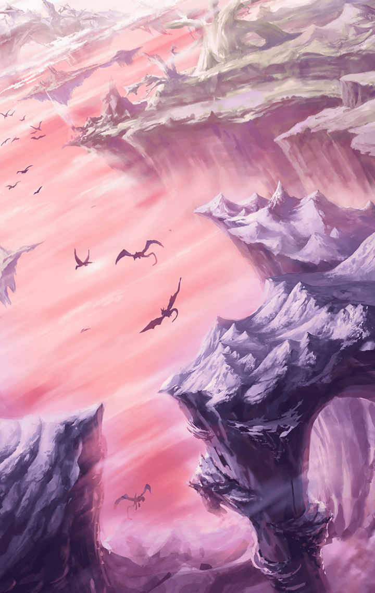

[View script in lisp](../scripts/290101023.txt)

**【異族】**
アアアアアアアアアア！

**【ラグナロク】**
ぐうっ…

**【アルマス】**
何してるのよっ？

**【ラグナロク】**
力が入らない…
何てこと…

**【アルマス】**
…まさか、戦えないの？

**【ラグナロク】**
さっきより動けなくなっている…
何で…？

**【アルマス】**
まさか、さっき言ってた
バイブスとかのせい？

**【アルマス】**
あなたの中にあったバイブスが
私に移ったとか何とか…

**【ラグナロク】**
断言はできないけど…
可能性はあるわね

**【アルマス】**
ちょっと…！
元に戻せないのっ？

**【ラグナロク】**
できるのなら、とっくにそうしてる
…しばらく付き合ってもらうしか
なさそうね

**【アルマス】**
あなたと一緒にいろってこと？
何でよ？

**【ラグナロク】**
気づいているでしょ？
私達は今、“繋がっている”

**【ラグナロク】**
この状態を解消する方法を探るなら
一緒にいる方が合理的よ

**【アルマス】**
…………そうかもしれないけど

**【ラグナロク】**
不満なのはお互い様
それでも一旦、手を組みましょう
私達は運命共同体よ

**【アルマス】**
…いいわ
でも、覚えててよね
あくまで一時的な協力関係だからっ

**【ラグナロク】**
分かってる
早速だけど…肩を貸して
行きたいところがあるの

**【アルマス】**
一人で歩くこともできないの？
仕方ないわね…
で、どこに行くの？

**【ラグナロク】**
やはり、そうなるのね…

**【アルマス】**
…何、これ！？
「海」が…

**【ラグナロク】**
「虚空の穴」が「海」を覆い尽くして
いる…誰も逃がさないってことね

**【ラグナロク】**
本来なら「海」に飛び込めば地上世界
まで降りていける

**【ラグナロク】**
ユグドラシルを使って降りた方が
安全だから、誰も使わなくなった
ルートだけれど

**【アルマス】**
ティルフィングはここも封鎖したって
こと…何のために？

**【ラグナロク】**
決まってるでしょ
天上世界から誰も逃がさないように

**【アルマス】**
…この分だと、地上からこっちに
上がることもできそうにないわね

**【アルマス】**
そっか
ティルフィングが教会を真っ先に
潰したのは…

**【ラグナロク】**
ユグドラシルを手中に収めるという
狙いがあったのよ

**【アルマス】**
今は彼女がユグドラシルの管理権を
有しているのね

**【ラグナロク】**
…やることは決まったわ

**【ラグナロク】**
ユグドラシルに向かい、
管理権を取り戻す

**【アルマス】**
ユグドラシルの管理権を取り戻せば
天上世界の崩壊も止められる
そういうことね？

**【ラグナロク】**
恐らく…

**【アルマス】**
確信してるんじゃないの？

**【ラグナロク】**
風が乱れてるのよ
私の中の風が…

**【ラグナロク】**
全ては神の掌の上だというの？
この邂逅も…

**【ガブリエル】**
ああ、愚かです…
実に愚か…貴女達はこの世界の
ことを何も理解していない…

**【ガブリエル】**
何のために世界が創られたのか…
何のためにあなた達が創られたのか…
何のために――

**【ガブリエル】**
異族が創られたのか

**【ガブリエル】**
じきに思い知ることとなるでしょう…
貴女達の愚かさが、いつか貴女達を
襲うことになります…

**【ラグナロク】**
…私達の知らない天上世界の秘密が
あるのかもしれない

**【ラグナロク】**
それを知るためにも
ユグドラシルを取り戻す！

**【アルマス】**
それなら私も同じよっ
どうしてインテグラルキラーズの
一員だったのか…

**【アルマス】**
何で記憶が曖昧になってるのか
知りたいことが幾つもあるわ

**【アルマス】**
ユグドラシルを取り戻して、
私は私の記憶を取り戻す！

**【アルマス】**
それまでは、
一緒に行動してもいいわ

**【ラグナロク】**
私達は運命共同体ね
改めて、よろしくアルマス

**【ラグナロク】**
参ったわね
こんなときに…

**【アルマス】**
ちょっと、そこに座ってて

**【異族】**
アアアアアアアアアア！

**【ラグナロク】**
さっきの数倍…いえ、十倍以上
いるわね…

**【異族】**
イイイイイイイイ！

**【アルマス】**
おまけに随分と気が立ってるみたい
さっきの仕返しに来たのかしら？

**【ラグナロク】**
異族にそんな感情があるの？

**【アルマス】**
とにかく、絶・最悪…
二人で相手するのも厳しそうなのに
あなたは戦えないなんて

**【ラグナロク】**
私も少しくらいはっ…！
うぐっ…

**【異族】**
アアアアアアアアアア！！

**【アルマス】**
無理しないで！
何とか一人で乗り切ってみせる！
絶・気合いよ！

**【異族】**
アアアアアアア…！？

**【アルマス】**
えっ？

**【ブリューナク】**
戦況は劣勢
ブリューナクは独断で
お前達を助勢する

**【ラグナロク】**
ブリューナク…！
近くに誰か奏官がいるのっ？

**【アルマス】**
そんなことより今は異族でしょ！

**【フラガラッハ】**
慌てなくてもいいのよ
わたしが来たのだから、
すべて解決するわ

**【フラガラッハ】**
異族達を確実に仕留めて
みせましょう

**【アルマス】**
わっ！？
どこから現れたのよっ

**【フラガラッハ】**
ふふふ…
そんなに驚いた顔をして
わたしの美しさに見惚れているのね

**【フラガラッハ】**
いいのよ
そのまま見つめていらして

**【フラガラッハ】**
そうしているうちに、
全て片付けるから

**【ブリューナク】**
形勢逆転
速やかに掃討する

Next: [290101033](290101033.md)

[Back to index](index.md)
