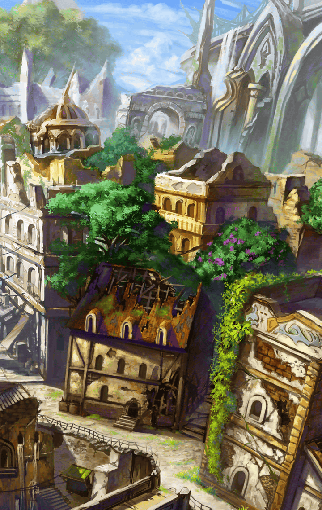

[View script in lisp](../scripts/290101140.txt)

**【アスクレピオス】**
これで、弾丸摘出完了
何なのよ、この弾丸…
また変なものを錬成したわね

**【ラグナロク】**
アスクレピオス、
パラケルススの容態は…？

**【アスクレピオス】**
ひとまず傷は塞がったわ
まだ様子を見ないといけないけど
山場は越えたわね

**【アスクレピオス】**
あとはパラケルスス自身の回復力
次第かしら
ま、キル姫は頑丈だから

**【ヘルマン】**
ありがとう！
ありがとう、お嬢さん！

**【アスクレピオス】**
か、勘違いしないでっ
これは貸しだからね！

**【ヘルマン】**
すまぬ…
本来なら、
儂がやらねばならぬのに…

**【アスクレピオス】**
ヘルマンさん
傷はまだ癒えていないようね…

**【ヘルマン】**
何故、そのことを…？

**【アスクレピオス】**
パラケルススから少しね
それより家まで運ぶわよっ

**【アスクレピオス】**
まったく…
「興味深いものを見せてやる」って
言われて来てみれば

**【アスクレピオス】**
本人は死にかけてるし、
見慣れないキル姫達がいるし
何がどうなってるの？

**【アスクレピオス】**
そういうことね…
教会が消滅したのは知っていた
けれど

**【アスクレピオス】**
ラグナロク、
これからどうするつもり？

**【ラグナロク】**
もちろん、ユグドラシルに向かう
世界樹の管理権を奪還して、
天上世界の秘密を解明するわ

**【アスクレピオス】**
ダメよ
あなた達だけで
何ができるっていうの

**【アスクレピオス】**
全く歯が立たなかったんでしょ？
もう一度、ティルフィングと戦っても
無駄死にするだけだわ

**【アルマス】**
だからって、諦められないわよ！
私も記憶を取り戻したいしっ…

**【アスクレピオス】**
はぁ…それが考えなしだって
言ってるの

**【アルマス】**
それでもっ――

**【ラグナロク】**
アルマス、アスクレピオスは
私達に助言がしたいのよ
今は口を閉ざして、耳を澄ませて

**【アルマス】**
えっ？
そうなの…？

**【アスクレピオス】**
べ、別にあなた達を心配してるんじゃ
ないんだからねっ
これは…貸しよ、貸し！

**【アスクレピオス】**
うちのマスターに会っていきなさい
きっと力になれるわ

**【アルマス】**
あなたのマスターって、
そんなに大物なの？

**【アスクレピオス】**
私のマスターは
デオン・デュカキス大奏官

**【アスクレピオス】**
この辺り一帯を治めているギルド
「オリュンポスの座」の
ギルドマスターよ

**【ラグナロク】**
ギルドマスター…！
それも大奏官となると、
かなりの影響力がありそうね

**【アスクレピオス】**
うちのマスターは
インテグラルキラーズと
徹底抗戦の構えだから

**【アルマス】**
いいわ！
早速、出発しましょう

**【アスクレピオス】**
待ちなさい！
パラケルススの容態が落ち着くのを
確認してからでないと――

**【パラケルスス】**
わたくしのことなら心配ない

**【一同】**
パラケルスス！

**【フライシュッツ】**
パラケルススちゃん、
はぐだよ、はぐ～♪

**【パラケルスス】**
何の脈絡もなく抱きつくなと
言っているだろう！
君も学ばないなっ

**【フライシュッツ】**
今のは快気祝いのはぐなのに～…

**【アスクレピオス】**
あなた、何て無茶したのよ！
本当に…不器用なんだから

**【パラケルスス】**
…すまない
フライクーゲルの実力を読み誤った
わたくしの落ち度だ

**【アスクレピオス】**
そんなことを
言っているんじゃないの！
…傷はもういいの？

**【パラケルスス】**
“魔弾”の呪いさえ無くなれば
この程度の傷、すぐに治る
それよりも…

**【パラケルスス】**
わたくしの錬成した魔弾は…
失敗作だったんだな

**【アスクレピオス】**
ええ…
あれでは、あなたの狙いは
達成されないわ

**【パラケルスス】**
くぅぁぁああ！
いつもこうだ…
また…ダメなのか…

**【アスクレピオス】**
ヘルマンさんの側には、
あなたがいればいいのよ

**【パラケルスス】**
でも、わたくしでは…

**【アスクレピオス】**
いてあげるだけでいいの
それだけで

**【アルマス】**
…ねえ、パラケルスス
あなたのマスターって
ひょっとして――

**【ヘルマン】**
気をつけてな、キル姫さん方
この老いぼれには全てを委ねる
ことしかできんが

**【ヘルマン】**
あんた達の旅路が順調であることを
願っておるよ

**【パラケルスス】**
今回の件は借りにしておく
…色々とすまなかった

**【パラケルスス】**
アルマス、
これはわたくしの仮説だが

**【パラケルスス】**
君は適合するキル姫が増えれば
増えるほどバイブスを上手に
制御できるようになる

**【アルマス】**
えっ？
それ、本当！？

**【パラケルスス】**
フライシュッツと君が共鳴したことで
ラグナロクの体調が
良くなったそうだな

**【パラケルスス】**
そのことから推測した
可能性は十分あるだろう

**【パラケルスス】**
ユグドラシルに急ぐのもいいが
ラグナロクを万全にしたいなら
仲間を集めることも意識しろ

**【パラケルスス】**
わたくしからは以上だ

**【アルマス】**
ありがとう、パラケルスス！
ちょっとだけだけど、
希望が見えてきた！

**【ラグナロク】**
ヘルマン少奏官
世話になったわ
また、いつか

**【ヘルマン】**
ほっほっほ
お気をつけて

**【アルマス】**
やっとコラールの村を出られた
それにしても…

**【アルマス】**
パラケルススのマスターが、
大工の娘さんを手術した
医者だったなんて

**【アスクレピオス】**
当時は名医として有名だったのよ
だから…成功の可能性が低くても
断れなかったんでしょうね

**【ラグナロク】**
手術が失敗して…それを悔やむあまり
メスを握れなくなったなんて…

**【ラグナロク】**
フライクーゲルは、
そんな過去を消そうとした…

**【アスクレピオス】**
忘却も治療の一環ではあるわ
その話だけ聞くと間違いとは
言い切れないわね

**【アルマス】**
でも、ヘルマンさんは拒否した
選択肢はいつだって自分自身に
あるべきよっ

**【ラグナロク】**
そうね
強引なやり方を認めるわけには
いかない

**【アルマス】**
他のインテグラルキラーズも
似たようなことをしてるのなら、
私は絶・許さないわ！

**【ラグナロク】**
彼女達の「選定」にも
気をつけていきましょう

**【アスクレピオス】**
あなた達、あまりのんびり歩いてると
今夜は野宿よ！

**【アスクレピオス】**
カレットの町まで三日はかかるん
だからね！

かくしてアルマスとラグナロクは
ユグドラシルを目指し旅を続ける

アスクレピオスのマスター
デオン・デュカキス大奏官は
彼女達の味方となり得るのか

そして旅路の果てに
何が待ち受けているのか、
まだ誰も知る由もない――