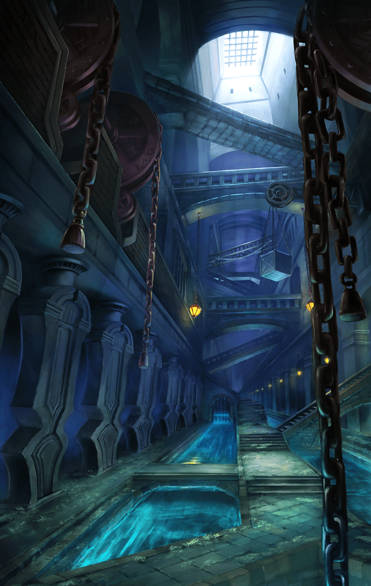

[View script in lisp](../scripts/290103130.txt)

**【プタハ】**
それ以上、そなたの手を汚しては
ならん
我が認めん

**【パラシュ】**
君は守りに
徹するんじゃなかったのかな？

**【パラシュ】**
こんなところにまで
出張ってくるなんて…

**【プタハ】**
今回ばかりは
我も出ざるを得なかったのだ

**【プタハ】**
全てはそなた達を思うてのことだぞ

**【パラシュ】**
そういう話は聞きたくないよ
…行こう、ティルフィング

**【プタハ】**
何故だ？
何故、そなた達はそれほどまでに
頑ななのだ？

**【プタハ】**
我にそなた達の抱えているものを
多少なりとも分けてはくれぬか？

**【プタハ】**
心の内を吐き出せば、ささやかなり
とも気持ちが軽くなろう

**【ティルフィング】**
…ここはじきに崩れますね
離脱を優先させましょう
その命、今は散らさずにおきます

**【ティルフィング】**
いずれ全ては摘み取られ、
再生へと至ります
そのときまで

**【プタハ】**
ああ…行ってしまった…

**【プタハ】**
我では、あの者達を救うことは
できぬのか…

**【プタハ】**
悲しみはひとまず胸にしまおう
今は先に為すべきことがある

**【住人達】**
助けてーっ…！
地面がっ…地面が崩れるぅっ…！

**【デオン】**
落ち着くのである！
誘導に従い、粛々と避難すれば
必ず助かるのである！

**【アスクレピオス】**
ほら、そこ押さない！
無理に通ろうとしても、
逆に遅くなるだけよっ

**【アルマス】**
ギルドの人達のお陰で、
パニックにならずに済んでは
いるけど…

**【ラグナロク】**
フェルカの町だけじゃなくて、
ここも崩れるだなんて…
かなり大規模な崩壊になりそう

**【ブリューナク】**
アルマス、ラグナロク、
全ての住人の退去を確認した

**【ラグナロク】**
ありがとう
私達もいきましょう、アルマス

**【アルマス】**
ええ…
あれっ？

**【アルマス】**
花びらが舞い落ちてきた…！
何なの、これっ？

**【ラグナロク】**
アルマス、あそこよ！

**【アルマス】**
ええっ？
庭園が…丸ごと宙に浮いてる…！

**【ラグナロク】**
あそこに咲いている花が風に散って
舞っているのよ

**【アルマス】**
他は全て崩れていくのに、
どうしてあそこだけ…

**【ラグナロク】**
理由は分からないけれど…
綺麗ね

**【アルマス】**
うん
まるで…
散りゆく者への手向けみたい

**【アルマス】**
フェルカの町だけじゃなく、
その周辺がごっそり失われた…

**【ラグナロク】**
全て反転世界に
持っていかれたようね…

**【アルマス】**
今回は…何もできなかった…！
パラシュの…彼女達の執念に…
負けてしまったわ…

**【プタハ】**
そこまで気を落とすこともないぞ

**【プタハ】**
人々は皆、無事逃げおおせたのだ
アルマス達も無事で我は嬉しい

**【ヴァジュラ】**
いや～！
今回ばかりは死んだと
思ったんだけどね～！

**【ブラフマーストラ】**
まぁさ、こういうこともあるよ！
気持ちアゲてこ～っ♪

**【アルマス】**
何であなた達まで助かってるの！？
そして、その軽さは何なのっ？

**【ヴァジュラ】**
はっはっは！
細かいことは気にすんなって

**【ブラフマーストラ】**
アタシ達、プタハに
助けられちゃった系なのよね～
これも縁ってやつ～？

**【アルマス】**
このっ…！

**【プタハ】**
アルマスよ
この子らを許しておくれ

**【プタハ】**
そなたは心根の優しい子だと
我は知っておるぞ

**【アルマス】**
母親感出してこないでよっ

**【プタハ】**
我らは魂の母娘ではないか

**【アルマス】**
ラグナロクが余計なこと言うから！

**【ラグナロク】**
魂の母娘…良い喩えだと思うわよ

**【アルマス】**
時々、あなたのセンスを疑いたく
なるんだけどっ

**【ケラウノス】**
はいはい
お取り込み中のところごめんね～

**【ケラウノス】**
マスターが呼んでるよ
二人と今後のことについて
話し合いたいんだってさ～

**【ラグナロク】**
今後のこと、ね…

**【デオン】**
余はしばらく動けぬのである！

**【アスクレピオス】**
フェルカ周辺の町や村に住んでた
人達が難民化したのよ
その対策に追われてるの

**【アスクレピオス】**
こっちも怪我人やら病人やらで
猫の手も借りたいくらいよ！

**【デオン】**
だが、ラグナロク殿は急ぎの旅である
ここに留め置くわけには
いかないのである

**【アルマス】**
つまり、ここで別れたいって
言いたいんでしょっ

**【デオン】**
で、ある

**【ラグナロク】**
仕方ないわ
幸い、ネスとも出会えて戦力的には
充実してきてる

**【ラグナロク】**
むしろ手伝えなくて
申し訳ないくらいよ

**【デオン】**
で、あるか
恩に着るのである

**【ケラウノス】**
ま～、色々片付いたら
すぐに追いかけるよ！
ユグドラシルを目指せばいいんでしょ

**【デオン】**
必ず再会するのである！
武運を！

**【アルマス】**
ありがと！
そっちも気をつけてねっ

**【ネス】**
早く出発しましょう！
善は急げですっ

**【フライシュッツ】**
ネスちゃん
どうしてそんなに焦ってるの～？

**【ネス】**
焦ってなどいません！
私はただ…

**【プタハ】**
もう行ってしまうのか、アルマスよ

**【アルマス】**
プタハ、ここの人達をお願いね

**【プタハ】**
無論だ
我はそなたらの帰る場所を
守っておるからな

**【ダモクレス】**
母の愛とは偉大なものだな！
クレスも母になってみようかなっ

**【アルマス】**
意味、分かって言ってる？

**【ダモクレス】**
うんうん
愛さえあれば問題ない！

**【プタハ】**
ネスよ
寝る前は歯磨きを忘れるでないぞ
添い寝してやれなくなるが…

**【ネス】**
大丈夫です！
私は子どもじゃありませんから！

**【ラグナロク】**
いいのよ、ネス
思い切り甘えても
しばらく会えないのだから

**【ネス】**
ラグナロクまで…イジワルは
規律違反です！

**【アルマス】**
そろそろ行くわよ
世界をかなり奪われて
しまったわ…

**【アルマス】**
必ず、取り戻してみせる！

**【プタハ】**
アルマスよ
お弁当を作っておいたのだ
冷めても美味しいぞ

**【アルマス】**
せっかくの気合いが抜けるわよ！
どうも、ありがとう！

**【ラグナロク】**
はぁ…やっぱり前途多難かも

パラシュの手によって天上世界の
一部が大きく崩壊した

加速する崩壊を止めるため、
アルマス達は旅路を急ぐ

その先に予想だにしない
困難が待ち構えていることを
二人はまだ知らない――

Next: [290104001](290104001.md)

[Back to index](index.md)
