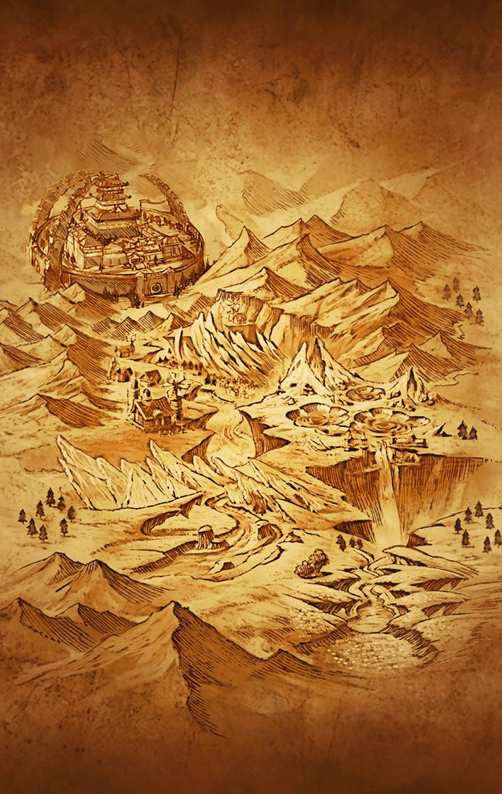

[View script in lisp](../scripts/290104001.txt)

[View source in markdown](290104001.md)

連合軍を壊滅させたパラシュと
戦うため、アルマス達はフェルカの
町を訪れる

そこは自身の理想を追求する者だけが
暮らす町へと変貌を遂げていた

パラシュの味方をするキル姫、
ブラフマーストラとヴァジュラに
遭遇したアルマス達は

彼女達の火力の前に撤退を余儀なく
された

逃げ込んだ森にはプタハが作り上げた
村があった

そこでフェルカの町が変貌した理由を
知ったアルマス達は改めてパラシュと
戦うことを決意する

デオン大奏官の加勢もあり、
パラシュとの戦いに勝利したかに
見えたが

彼女はすでにフェルカでの選定を
終えており、天上世界の一区画を
砕いて移送しようとしていた

パラシュを止めるため、
駆けつけたアルマス達だったが…

地盤は崩壊し、天上世界の一区画が
失われてしまう

天上世界の崩壊を止めるため、
アルマスとラグナロクは
ユグドラシルへの旅を続ける――

天上世界崩壊まで、
残り――

**【アルマス】**
ふう…
ようやく道半ばって感じね

**【ラグナロク】**
もうじきキトゥリスに着くはずよ
天上世界における中心部と外縁部を
繋ぐ中継都市…

**【ラグナロク】**
その先は教会の影響力が強かった
地域になるから旅も楽になるはず

**【ネス】**
教会が消滅した後も、皆さん、
規律を守って暮らしてくれていると
良いのですけれど

**【ラグナロク】**
まだ合流できていないスイハ達も
無事でいて欲しいわね…

**【アルマス】**
何にせよ、急ぎましょ！
町までもう一息なんでしょっ

**【ラグナロク】**
ええ
あの丘を越えればすぐよ

**【ブリューナク】**
緊急事態だ
不可解なものを発見した

**【アルマス】**
どうしたの、ブリューナク？

**【ブリューナク】**
ブリューナクは自主的に斥候を行った
この先に見慣れぬものを確認
留意して欲しい

**【アルマス】**
この先って、まさか…

**【ラグナロク】**
キトゥリスの町に異変がっ？

**【アルマス】**
くっ…
フェルカみたいな展開は、
二度とお断りよっ…！

**【ラグナロク】**
お願い…！
どうか無事で…

**【アルマス】**
えええええええええええええ！？

**【ラグナロク】**
そんなに叫んで
何があったのっ？

**【ラグナロク】**
な…何なの、これ！？

**【ラグナロク】**
城…ね

**【アルマス】**
城…よね
念のため、聞くけど…

**【アルマス】**
あんなの、前から建ってた？

**【ラグナロク】**
全く記憶にないわ…

**【フライシュッツ】**
わ～っ
大っきいね～♪
それに頑丈そう

**【ダモクレス】**
あんな大っきいものを建てるなんて
きっと愛の力だね！
クレスは気に入ったよ♪

**【ネス】**
何を言ってるんですか！
勝手にあんなものを建てて
規律違反ですっ

**【ダモクレス】**
アッハッハ！
愛さえあれば問題ない！
とってもきれいだよっ

**【フラガラッハ】**
あら？
きれいだなんて、私のことね♪

**【アルマス】**
いや…あなたのことじゃなくて、
あっちの城のことよ

**【フラガラッハ】**
城を背景に佇む私…
いいのよ
好きなだけ見惚れていらして

**【アルマス】**
フラガラッハ、
少し脇に寄って
城が見えないから

**【アルマス】**
とりあえず、回り道はできないの？
あんなのに関わりたくないんだけど…

**【ラグナロク】**
それが…
キトゥリスの町は関所も
兼ねているのよ

**【ブリューナク】**
堅牢な防壁が長く続いているのを
ブリューナクも確認した

**【ブリューナク】**
ユグドラシルに向かうためには
あの城を抜ける他ない

**【アルマス】**
何てこと…

**【ラグナロク】**
風がざわついているけれど、
行くしかないわね

**【ネス】**
城下町で情報を集めましょう
きっと規律正しく抜ける方法が
ありますっ

**【住人１】**
大会はいよいよ明日だ！
観覧席、まだ少し空きがあるよーっ

**【住人２】**
この大会で俺達の運命が決まると
いっても過言じゃないんだ！
見逃せないぞ！

**【住人３】**
よく見える双眼鏡だよ！
これなら遠くからでも臨場感
たっぷりに観戦できるよ！

**【アルマス】**
町に入ってみたけど、
何だか騒がしいわね
お祭りでもあるの？

**【ラグナロク】**
「大会」と言っているわ…

**【ネス】**
あの、つかぬことをお聞きします
明日は何の大会があるのですか？

**【住人４】**
おや、お嬢ちゃん
知らないのかい？

**【住人４】**
…って、キル姫じゃないか！？
あんた達は参加しないのか？

**【アルマス】**
だから、何の大会なのよっ？

**【住人４】**
決まってんだろ
マサムネ主催の
「天上一武闘大会」だよ！

**【住人５】**
天上世界一強い奴を決めるって
いう大会さ！

**【住人６】**
この大会の優勝者に、
この町の支配権が与えられる
重要な戦いなんだよ！

**【住人７】**
誰か…あのマサムネを倒してくれっ

**【アルマス】**
「天上一武闘大会」…？
しかも主催がマサムネ？

**【ラグナロク】**
何でそんなことになっているの？

**【ネス】**
あの…
マサムネは、やはり、あのお城に
住んでいるのでしょうか？

**【住人４】**
あん？
ああ、もちろん！
あれがマサムネの居城だ

**【住人４】**
俺達は、マサムネ城って
呼んでるよ

**【アルマス＆ラグナロク】**
マサムネ城！？

**【住人８】**
武闘大会の会場もあそこにある
明日、この町の命運が、
俺達の運命が決まるんだっ

**【ネス】**
あ…ありがとうございました…

**【アルマス】**
来て早々、混乱してるんだけど…

**【ラグナロク】**
私の胸もざわついているわ…

**【ネス】**
誰かに、これまでの経緯を説明して
いただきたいですっ

**【スイハ】**
あのー…