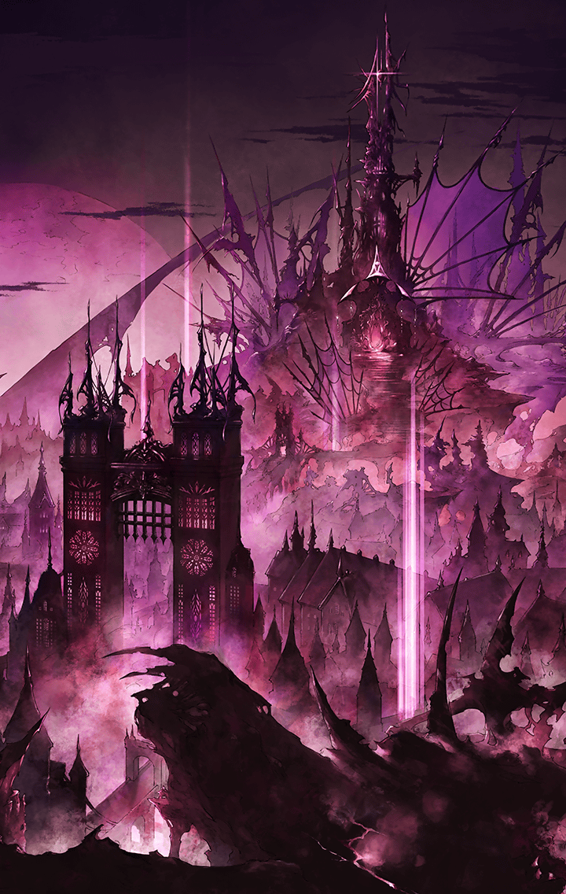

[View script in lisp](../scripts/290301030.txt)

**【カミト】**
遙か昔、この世界は悪魔に支配されて
いたそうだ

**【カミト】**
そこに天上から天使が舞い降りて
悪魔を倒し、世界を人々の手に
取り戻してくれたらしい

**【カミト】**
その天使達はキル姫と呼ばれた
そして彼女達を指揮して悪魔と
戦った人々のことを

**【カミト】**
みんなは奏官と呼んだんだ

**【カミト】**
舞うように戦う美しいキル姫達を
指揮する姿が、まるで音楽を奏でる
指揮者のようだったかららしいよ

**【カミト】**
奏官達の登場で、世界は一変した
彼らは英雄だったけれど

**【カミト】**
同時に強大な戦闘力を有する
新興勢力でもあったんだ

**【カミト】**
世界は奏官達の手によって
新しく切り分けられ、
統治されていった

**【カミト】**
やがて奏官同士で覇権を競うように
なり、一時は三つの国にまとまった
こともあったそうだけど…

**【カミト】**
結局、それも崩れて幾つもの
「国」に分かれてしまった

**【カミト】**
それが、今、僕達が生きている世界
この、地上世界なんだ

**【カミト】**
…………

**【ヴァング】**
どうした、カミト？
ボーッとして
お前も腹減ってんのかぁ？

**【カミト】**
あ、ごめん兄貴…
ここからユグドラシルが
よく見えるんだよ

**【ヴァング】**
どれどれ？
おお！
いいじゃねぇの！

**【ヴァング】**
いつ見てもでけぇなあ
カミト、オレ達はあそこに上るんだ
ワクワクすんだろ？

**【ヴァング】**
地上世界を統一して、
ユグドラシルから見下ろす景色は
きっと最高だぜ！

**【カミト】**
うん…
ヴァングが…じゃなかった
兄貴が言うんなら、きっと…

**【ヴァング】**
もっと自信を持てって！
オレとお前で地上世界を統一して
みせるんだ！

**【ヴァング】**
いつまで続くか分かんねぇ
紛争なんざまとめて解決して、
みんな楽しく暮らすんだよ！

**【カミト】**
うん！
僕は一生、兄貴についていくよ！

**【ヴァング】**
かははっ！
なぁ、カミト
オレについてくんのも――

**【シユウ】**
うがあああぁぁ！
ますた～、はらがへったぞ！
シユウはいえまでがまんできない！

**【ヴァング】**
やれやれだぜ
お！ちょうどいいや

**【ヴァング】**
おっさん
マーラーカオをくれ

**【屋台の主人】**
なんだ悪ガキども
今日もケンカ帰りか？
ちったぁ働け

**【ヴァング】**
働いてんだよ！
ジーベンを追っ払ってきたとこだ

**【屋台の主人】**
ジーベンってのは、あれだろ？
隣国の一匹狼っていう

**【ヴァング】**
ああ、そいつだ
スラーンドを連れてる
やたら上から目線の奴だよ

**【屋台の主人】**
ハッハッハ！
やっぱりガキのケンカじゃないか

**【ヴァング】**
おっさん…
キル姫同士の戦闘、
見たことねぇだろ

**【屋台の主人】**
あいにくと俺は奏官じゃないんでね
ほれ、マーラーカオだよ
シユウちゃん

**【シユウ】**
うがあああぁぁ♪
おまえのマーラーカオは
おいしいからだいすきだぞ！

**【屋台の主人】**
ありがとな
シユウちゃんも怪我をしないよう
ケンカはほどほどにな

**【シユウ】**
あんしんしろ！
シユウはさいきょうだから
ぜんいんぶっつぶす！

**【屋台の主人】**
はっはっは！
元気が良いねえ

**【屋台の主人】**
そっちのアスカロンちゃんも
どうだい？
おまけしとくよ

**【アスカロン】**
ありがとうございます
でも、あんまり食べると大きく
なってしまうので…

**【シユウ】**
うがあああぁぁ！
アスカロンがたべないなら
シユウがたべるぞ！

**【ヴァング】**
ははははっ！
食え食え、どんどん食え！

**【ヴァング】**
おっと…
また地震かよ

**【屋台の主人】**
最近、多いなぁ
少し前、どっかの火山が噴火した
そうじゃないか

**【屋台の主人】**
こりゃ、どこぞの教団が言ってる
世界の終わりが本当に来るのかも
しれないなっ

**【カミト】**
えっ…
そんな話があるの…？

**【ヴァング】**
バカ抜かせ！
カルトの妄言なんざ気にして
どうする

**【ヴァング】**
おっさんも、
地震で物理的に店が潰れねぇよう
気をつけるんだな

**【屋台の主人】**
うるさいぞ、悪ガキが！

**【ヴァング】**
やれやれだぜ
地震程度でビビってんじゃねぇぞ
カミト

**【カミト】**
ごめん…
でも、天災が多くなってるのは
事実だと思うよ…

**【カミト】**
屋台のおじさんが言ってた
火山の噴火とか、ひどい豪雨とか…

**【ヴァング】**
ちっ…
オレ達は天下統一を果たすんだぜ

**【ヴァング】**
どんな天災が起きようと、
オレ達が皆を守ってやりゃいいだけ
だろうが！

**【カミト】**
う、うん…
そうだねっ
さすが兄貴だっ

**【カミト】**
ねぇ、兄貴…
僕達は…どうして奏官なんだろう？

**【ヴァング】**
あん？
そりゃバイブスを持ってるからだろ

**【ヴァング】**
体内のバイブスがキル姫のキラーズと
適合した奴
そいつが、奏官になるんだ

**【カミト】**
そうなんだけど…
僕には、本当に奏官の資格が
あるのかな…

**【ヴァング】**
また余計なこと考えてやがんな？
やめとけ
腹が減るだけだぞ

**【カミト】**
う、うん…
兄貴がそう言うなら…

Next: [290301040](290301040.md)

[Back to index](index.md)
