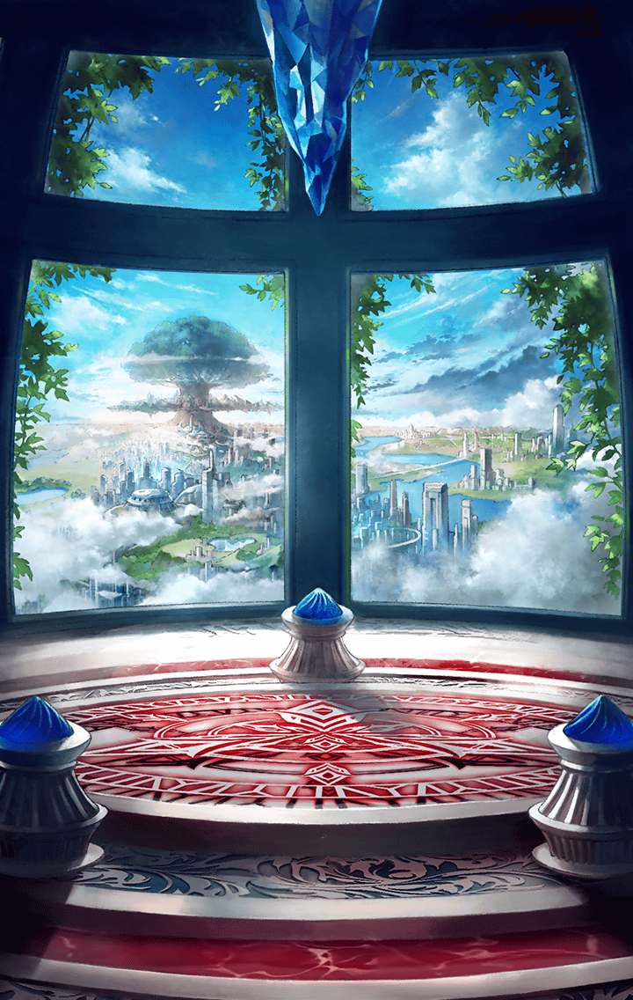

**【？？？】**
BYAAAAAAAAAAAAAA
AAAAAAAAAAAAAAAA
AAAAAAA…！！

**【カミト】**
すごい！
あんな巨大な化け物を下がらせる
なんてっ

**【カミト】**
君は本当に何者なんだ？

**【マサムネ】**
だからキラーメイルだって
言っただろ…
細かい説明は後だ

**【マサムネ】**
まだアレを倒せてない
さすがに一人だときついか…

**【マサムネ】**
お前、マスターなんだよな？
だったら、そこのキラープリンセスに
命令してくれ

**【マサムネ】**
俺と共闘して、あのデカブツを
倒せってな

**【カミト】**
キラープリンセス…
キル姫のこと、だよね？

**【マサムネ】**
今はそう言うのか？
キル姫…なるほど
そっちの方が呼びやすいな

**【グリモワール】**
ちょっとキミ！
さっきまで暴れまくってたくせに
急に仕切り出すんじゃないわよ！

**【アスカロン】**
あの剣筋…羨ましい
それに…なんでか懐かしい

**【マサムネ】**
うるさいな
どうするんだ？
組むのか？組まないのか？

**【カミト】**
…こういう状況に慣れてるんだね

**【マサムネ】**
まあな
本当に自慢じゃないが、
ろくでもない状況には慣れっこだ

**【カミト】**
…アスカロン、グリモワール
マサムネと共闘しよう

**【グリモワール】**
むぅ…
本気なの？

**【カミト】**
さっきの攻撃を見ただろ
三人で戦えばきっと勝てるよ！

**【アスカロン】**
はい！
マスターのご命令なら
喜んでっ

**【グリモワール】**
ふんっ！
分かったわよ、やってあげる

**【マサムネ】**
決まりだな
活路は俺が切り拓く
とどめは任せた

**【カミト】**
アスカロン、
グリモワール、
気をつけて！