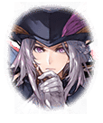

290401123 インテグラルノア編 第4章 世界樹の子-インベイジョン- 第１話 ユグドラシルへ‐12 戦闘後

[View script in lisp](../scripts/290401123.txt)

【ブリューナク】
待たせたな
ブリューナクも到着した
車に乗るといい

【カミト】
ブリューナク！？
えっ…この車、どうしたのっ？

【ブリューナク】
お前達を追って移動してきたところ
倉庫と思しき建物で発見したので
失敬してきた

【ブリューナク】
思いがけぬ財宝との出会いは
ロマンがあるな！

【カミト】
それって、勝手に乗ってきたって
ことだよね…

【グリモワール】
この際、何だって良いわよ！
さっさと乗りなさい！

【ブリューナク】
こんなこともあろうかと
八人乗りを選んできた
ゆったり座れるぞ

【ブリューナク】
ブリューナクの目に間違いはない！

【カミト】
アスカロン、大丈夫？

【アスカロン】
ごめんなさい…
マスターのご命令を果たせなくて…

【カミト】
そんなこといいから
早く乗って！

【ピサール】
やったぁ！
運転してくれるんだ～
じゃ、後よろしくね～

【ブリューナク】
全員乗ったな？
デュランダル、先に行くぞ！

【デュランダル】
はいですの
私は破壊的に楽しいお時間を
過ごしてますからっ♪

【？？？】
ガアアアアアアアアア！！

【カミト】
助かったよ、ブリューナク
でも、デュランダルを残してきて
良かったのかな…

【ブリューナク】
戦場で散るのであれば、
彼女も本望だろう
それがロマンというものだ

【ブリューナク】
それよりも、さて…

【マサムネ】
すまない…
予想以上に手こずった…

【カミト】
マサムネ！
あのキラーメイルは倒したのっ？

【マサムネ】
だったら良かったんだが…
あの腹黒メガネ、姿を消しやがった

【マサムネ】
またどこかから
襲ってくるかもしれないな

【カミト】
デュランダルは！？
途中、もう一人のキラーメイルと
戦ってたと思うんだけどっ

【マサムネ】
ああ、それなら…

【デュランダル】
失礼いたしますの

【カミト】
うわっ？
デュランダル、何で！？

【マサムネ】
戦ってる脇を通り抜けようとしたら
吹っ飛んできたから、ついでに
後ろに乗せて連れてきた

【デュランダル】
不愉快ですわ
大好きな楽園で散ることが
できたのなら本望でしたのに…

【カミト】
そんなこと言わないでよっ
助かって良かった…

【デュランダル】
仰る意味が分かりませんけれど…
わたくしのことを気に掛けて
下さったのなら感謝しますわ♪

【アスカロン】
このまま逃げ切れると
良いんですけど…

【グリモワール】
ちょっと！
そういうことを言ったら…

【ブリューナク】
ふっ…
旅に困難はつきものだな

【？？？】
グウウウウウウウウウ！

【マサムネ】
くそっ
やはり、また現れたか！
今度こそっ

【カミト】
待って、マサムネ！

【マサムネ】
何だ！？

【カミト】
僕に考えがあるんだ！

Next: [290402010](290402010.md)

[Back to index](index.md)
