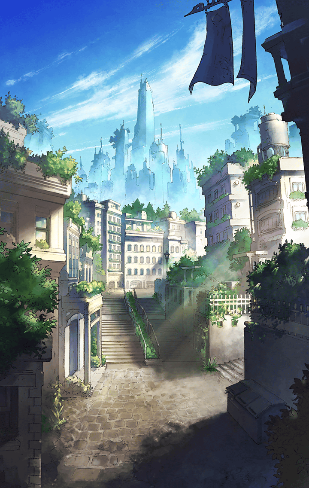

**【奏官】**
オルフェ・リファールの紹介状を
持ってきた奏官というのはお前か？

**【カミト】**
カミトといいます
今日はお願いがあってきました

**【奏官】**
異常事態が起きているというのに
呑気なことを言うガキだな

**【アスクレピオス】**
カミト、ここは僕に任せてくれ

**【アスクレピオス】**
不気味な霧がたちこめ、
異様な魔物が徘徊するようになって
いますね…恐ろしいことです

**【奏官】**
そうだ
俺はその対応で忙しい
お前達の頼みなど――

**【アスクレピオス】**
彼はキル姫を五人も連れています
奏官として、とても優秀なんですよ

**【カミト】**
えっ…？
それは…

**【アスクレピオス】**
話を合わせるんだ

**【奏官】**
ほほう…
後ろに控えている者達が皆、
お前のキル姫なのか？

**【カミト】**
は、はいっ
みんな僕のキル姫です！

**【デュランダル】**
あら？
わたくし、貴方のバイブスとは――

**【ブリューナク】**
おや、デュランダル？
あそこに戦い甲斐のある
魔物がいたような

**【デュランダル】**
まぁ！
どちらにいらっしゃいますのっ？

**【ピサール】**
あたしは違うって、
すぐバレると思うんだけど～

**【奏官】**
五人もキル姫を連れているとは！
お前、何者だっ？

**【ピサール】**
うそっ…！？

**【アスカロン】**
きっと他のピサールだと
思われたんですよっ

**【ピサール】**
フォロー、サンキュー
アスカロンって良い子ね～

**【アスクレピオス】**
僕達に、ここでの魔物討伐を
任せていただけませんか？
必ずお役に立ちますよ

**【奏官】**
…幾ら欲しい？

**【アスクレピオス】**
お金はいりません
ただ、封鎖されている中心部に
入りたいんです

**【アスクレピオス】**
やはり中心部の方が実入りが良い
ですからね

**【アスクレピオス】**
奏官様は中心部との太いパイプを
持っておられるとか
是非、お口添えを

**【奏官】**
なるほど
この異常事態を逆手に取って
上手く稼ごうという魂胆か

**【奏官】**
いいだろう
俺の領地から魔物を一掃してみせろ
そうすれば話を通してやる

**【アスクレピオス】**
ありがとうございます、
奏官様

**【カミト】**
あ、ありがとうございます…

**【カミト】**
ここから魔物を一掃するなんて…
そんなことできるのかな？

**【アスクレピオス】**
交渉は上手くいったね

**【グリモワール】**
ちょっと、どういうつもり？
あんな無茶な条件、あっさり飲んで

**【マサムネ】**
おまけに口約束だ
もし本当に魔物を一掃できたとしても
知らん振りされたら終わりだぞ

**【アスクレピオス】**
やれやれ…
まさか君達、本気で魔物を一掃する
気じゃないだろうね

**【カミト】**
だって、そう約束したよね？

**【アスクレピオス】**
そんな約束はどうでもいいんだよ
大切なのは、これで僕達は

**【アスクレピオス】**
この地で堂々と魔物退治ができる
ということさ

**【マサムネ】**
だから…
霧の中から現れる魔物を
一掃しないといけないんだろ？

**【アスクレピオス】**
はぁ～…
一から説明しないといけないのかな？

**【ミョルニル】**
うるせぇ！
勿体つけてねぇで、
さっさと説明しやがれ！

**【アスクレピオス】**
仕方ないね…
それじゃあ聞くけど、
魔物はどこに現れる？

**【カミト】**
どこって…
そんなの分からないよ
どこにだって急に現れるから

**【アスクレピオス】**
正解

**【マサムネ】**
ふざけるな

**【アスクレピオス】**
ふざけてなんかいないよ
魔物はどこにだって現れる
つまり、中心部にも

**【マサムネ】**
それは、そうだろうな

**【アスクレピオス】**
それなら中心部の奏官達も
戦力を欲しているはずだね

**【カミト】**
でも、それなら何でペルーン達が
道を封鎖してたのかな？

**【アスクレピオス】**
彼女達が受けていた命令は
「誰も通すな」だったと
聞いたよ

**【アスクレピオス】**
中心部の奏官達は異変に乗じて
他の奏官達に攻められることを
恐れた…だから封鎖した

**【アスクレピオス】**
反面、魔物はどこからでも現れる
これには苦慮しているだろうね

**【マサムネ】**
そこまではいいだろう
だが、それとさっきの無茶な約束が
どう繋がる？

**【アスクレピオス】**
簡単なことだよ
ここで僕達が魔物を倒しまくれば
必ず中心部にその情報がいく

**【アスクレピオス】**
なるべく戦力が欲しい中心部の
奏官達は僕達に興味を示し、
あの奏官に連絡を取る

**【マサムネ】**
そうか！
立場上、あいつは中心部からの
頼みは断りづらい

**【マサムネ】**
もし俺達を中心部に連れてこいと
言われたら約束など関係なく
連れていくしかないわけだ

**【カミト】**
でも…
もし知らない振りをしたら？

**【アスクレピオス】**
そのときは中心部の連中が直接、
僕達に接触してくるよ

**【マサムネ】**
知らない振りをしている以上、
あいつはそれを邪魔できない

**【アスクレピオス】**
もし妙な真似をしたら、
彼はさぞ立場を悪くすること
だろうね

**【マサムネ】**
どちらにしろ、俺達は中心部に
招かれるという寸法だ

**【ミョルニル】**
はっは～
あんたらしい汚ぇ作戦だぜ、
アスクレピオス

**【アスクレピオス】**
言っただろう？
腹黒メガネの真骨頂を見せてやるって

**【アスクレピオス】**
さあ、君達
あの奏官にただより高いものは
ないと教えてあげよう

**【アスクレピオス】**
思う存分、魔物を倒そうじゃないか