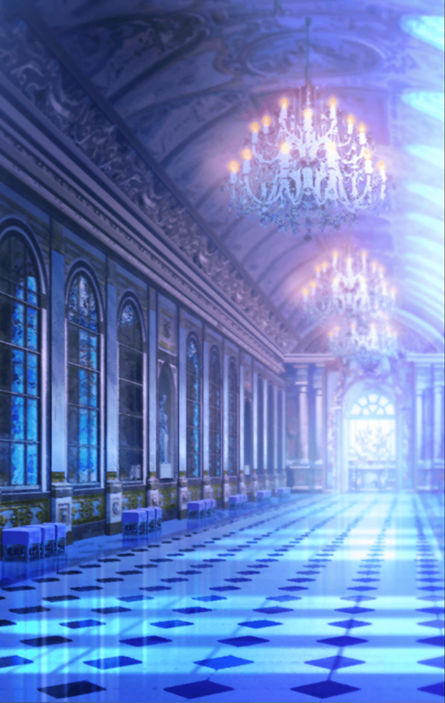

290501100 インテグラルノア編 第5章 マスターの信念―ブレイブ― 第１話 中心部防衛戦-10

[View script in lisp](../scripts/290501100.txt)

【ヴァング】
偉そうな連中だったが、
上手いこと手を組むことはできたな
これで思う存分やれるぜ！

【カミト】
…ねえ、兄貴

【ヴァング】
どうした？
しけた面しやがって

【カミト】
何で、ゴウバラさん達に
協力を求めたの？
兄貴らしくないっていうか…

【カミト】
ヒョウハのこともあっさり話して…
いつもの兄貴なら、俺達だけで
戦うって言うところなのに…

【カミト】
何だか…兄貴が変わってしまった
みたいで…

【ヴァング】
やれやれだぜ…
カミト、今はもっと大事なことが
あるだろうが

【カミト】
それは…
世界の危機かもしれないけど…

【ヴァング】
そっちじゃねえよ
お前のことだ

【カミト】
えっ？
僕…？

【ヴァング】
ユグドラシルにいるフォルカスと
もう一度会って、話をするんだろ？
今はそれが最優先だ

【ヴァング】
お前がユグドラシルに辿り着けるよう
俺がチャンスを作ってやる
そのための共闘だからな！

【ヴァング】
安心しろ
俺は、これっぽっちも変わってねえよ

【カミト】
兄貴っ…
ごめん…
僕、何も分かってなくて…

【ヴァング】
気にすんな
それより気合い入れろよ！

【カミト】
うん！
任せてっ

【ヴァング】
ははっ！
良い返事するようになったじゃ
ねえかっ

【ヴァング】
…なら、もう一つ言っておくぜ

【カミト】
何？

【ヴァング】
いいか、カミト
まず何をするのか決めるんだ
自分の“目的地”をな

【ヴァング】
それから、目的地に辿り着くための
方法を考えるんだよ
必死こいてな

【ヴァング】
俺は天下を統一する
そこが俺の目的地だ
方法は、模索してる最中だがなっ

【ヴァング】
お前もそいつを決めろ
そして、成し遂げるために
必死こいて考えて、行動しろ

【ヴァング】
そこにお前の、お前だけの
“信念”が生まれるんだ

【ヴァング】
他の何を犠牲にしても良い
ただ、絶対に譲れないもの
それだけは押し通すべきもの

【ヴァング】
そんな“信念”を持て
それがきっと、お前をもっと
強くする

【ヴァング】
進み続けろよ、カミト
未来はいつだって“この先”に
あるんだ！

【カミト】
ありがとう、兄貴
僕自身の“目的地”…“信念”…
考えてみるよっ

【アスクレピオス】
楽しそうだね
話し合いは上手くいったのかな？

【カミト】
アスクレピオス
こんなところで何してるの？

【アスクレピオス】
部屋が手狭になってね
それに、あまり彼女達に僕達のことを
知られたくなかったから

【ヴァング】
何のことだ？

【マサムネ】
部屋にゴウバラ達のキル姫が来て
いるんだ
あの中にいるのは、ちょっとな…

【ミョルニル】
騒がしいのは苦手だ

【カミト】
ペルーン達がっ？
もめてないといいけどっ…

【ピナーカ】
うおおおおおおおお！！

【蜻蛉切】
はああああああああ！！

【カミト】
この声は、まさか…！？
キル姫同士で戦うのはダメだよ！

【ピナーカ】
あん？
うおおおっ？

【蜻蛉切】
はぁっ！
やったわ！

【ピナーカ】
くっそぉぉっ…
おい、邪魔すんじゃねえよ！
せっかくの名勝負だったのに…

【蜻蛉切】
ド派手に勝ちを決めてやったわ！
これで腕相撲勝負は私の優勝ね！

【アスカロン】
優勝…羨ましい
私も本気を出していれば…
だけど、巨大化してしまったら…

【ペルーン】
うんうん
今の勝負、不正はなかった

【シユウ】
うがあああぁぁ！
つぎは、はやぐいしょうぶにしろ！
それならシユウはまけないぞっ

【エロース】
もっと愛のある戦いにしましょうよ～
例えば～、恋バナ対決とか～

【グラム】
恋バナか…
バルムンク、君への愛の詩なら
いくらでも紡げるよ

【バルムンク】
まあ、グラムったら！
それなら、あなたの勝利は決まった
ようなものね

【ミトゥム】
それより歌合戦にしましょう
あなた達の祈りがどんな音を奏でる
のか聞かせて下さい

【シェキナー】
早食い、恋バナ、歌合戦
他に勝負方法の提案はありませんか？
この中から選びますよ

【シタ】
くれぐれも不正のないように
もし不正を行ったら…
叩き潰します

【ペルーン】
悪者は暗黒パワーでビシビシ指導
だからね♪

【蜻蛉切】
何だって構わない
全て私がド派手に勝つわ！

【ピナーカ】
さあ、熱く語り合おうぜ！

【カミト】
何、これ…？

【ヴァング】
ははっ！
楽しそうじゃねえか

【グリモワール】
…………

【カミト】
グリモワール、何が起きてるの？

【グリモワール】
知らないわよっ…
マスターが出ていった後、
彼女達が部屋に来たんだけど

【グリモワール】
いつの間にか勝負が始まったの
ふざけんじゃないわよ！

【アスカロン】
マスター
次こそは優勝してみせますから！

【カミト】
あ、うん…
ほどほどにね…

【カミト】
規律正しい勝負かぁ…
天使を霊装支配されてるキル姫が
多いからかな…

【カミト】
あれ？
そういえば、中心部のキル姫は全員、
天使を霊装支配されてる…

【カミト】
何か理由があるのかな？

【グリモワール】
ああ、もうっ
苛々するわね…！

【カミト】
そんなに怒らないでよ、
グリモワール
みんな楽しそうだし…

【グリモワール】
違うわよっ
さっきから変なの…
誰かに見られてるような…

【カミト】
えっ…？
誰から？どこからっ？

【グリモワール】
それが分からないから苛々してるの！
ワタシの魔術でも感知できないなんて
…魔術を無効化されてるの？

【グリモワール】
魔術を極めた、このグリモワールを
上回る存在なんて…いるはずない
のにっ…！

【カミト】
誰かが僕達を、監視してる…？

Next: [290501110](290501110.md)

[Back to index](index.md)
