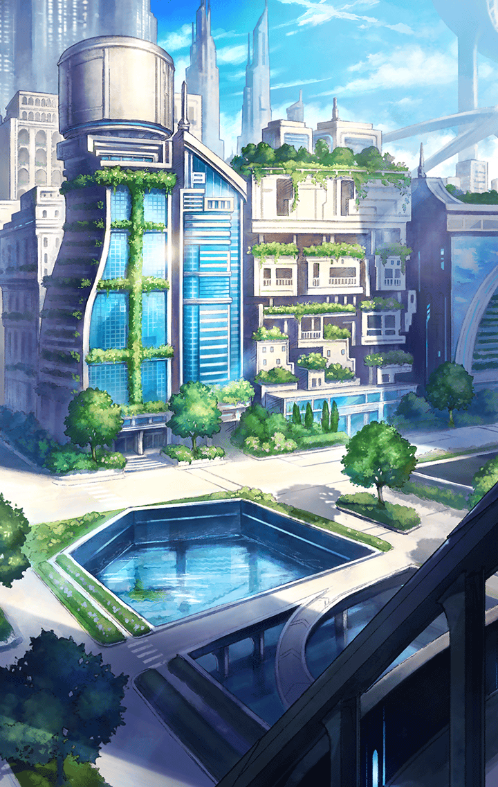
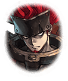

290501133 インテグラルノア編(擬彩されし不可逆世界編) 第5章 マスターの信念―ブレイブ― 第１話 中心部防衛戦-13 戦闘後

[View script in lisp](../scripts/290501133.txt)

【シタ】
ミトゥムちゃん、
準備はできてますか？

【ミトゥム】
はい、シタお姉様
これでフィナーレです！

【？？？】
ガアアアアアアアア！

【ミトゥム】
ほえぇぇ！？
ミトゥムの会心の一撃が
避けられただとぉぉぉ…！

【シタ】
あの化け物…
もう一方が攻撃を受けないよう
連れ去ったみたいでした…

【シタ】
あっ！？
ミトゥムちゃん、
避けて！

【？？？】
グウウウウウウ！

【ミトゥム】
くうっ！

【シタ】
やはり、あの二体は連携してますね
魔獣なのに…

【？？？】
ガアアアアアアアア！

【グラム】
そこだっ！

【バルムンク】
やぁっ！

【？？？】
グウウウウウウウウウ！

【グラム】
バルムンク、危ない！

【バルムンク】
ありがとう、グラム
私の王子様！

【グラム】
君のためなら、
このくらい何でもないよ

【シタ】
加勢には感謝しますけど、
節度を持って行動して下さいね

【グラム】
ああ、失礼
しかし不可解な魔獣達だね

【バルムンク】
私達、剣と斧だから距離を取られると
不利になるばかりよ…

【シタ】
あの魔獣もそのことを理解して
いるようです

【ミトゥム】
先程から間合いを外されてばかりで…
う～ん…

【カミト】
あそこだ！
キル姫達もいるよ！

【アスカロン】
マスター、伏せて下さい！

【？？？】
ガアアアアアアアア！

【マサムネ】
あれは…アポロン！

【アスクレピオス】
それと、もう一人…
アルテミスもいるね

【ミョルニル】
フン！
魔獣になっても二人一緒とは
大した兄弟愛だなっ

【カミト】
でも、魔獣化してるとき意識は
ないんじゃなかったの？

【マサムネ】
そのはずだが…
あの連携は本能なのかもしれない

【アスクレピオス】
やれやれ…
論理的じゃないけど、
そう考えるしかないかな

【グリモワール】
何よ、それっ
面倒な奴らね！

【カミト】
とにかく、接近しないと
弓相手じゃどうにもならないよっ

【マサムネ】
アポロンは馬に乗っている
まず足止めをして――

【ヒョウハ】
よっしゃあああああああ！！
良い感じに集まってるなあ

【カミト】
うわぁっ！
…ヒョウハ！？

【ヒョウハ】
飛んで火にいる夏の虫ってなぁ！
言葉通り、まとめてあたしに
焼き尽くされなぁぁぁ！！

Next: [290502011](290502011.md)

[Back to index](index.md)
