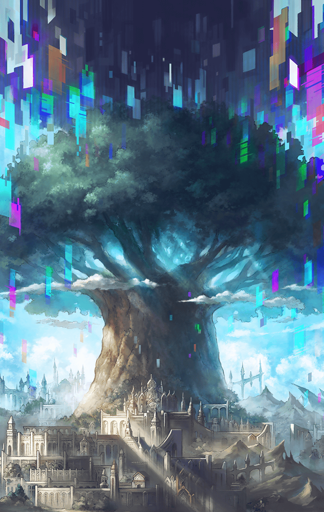

290601013 インテグラルノア編(擬彩されし不可逆世界編) 第6章 アナザー・コンフリクト―交錯― 第１話 地上からの来訪者-1 戦闘後

[View script in lisp](../scripts/290601013.txt)

【ダーインスレイヴ】
ガハッ…

【カミト】
ああっ…！？

【レーヴァテイン】
だから言ったでしょ…
あなたじゃ止められないって

【ダーインスレイヴ】
ふふっ…
それでも、わたしは…

【ラグナロク】
ありがとう、ダーインスレイヴ
お陰で間に合ったわ

【レーヴァテイン】
今度は何…？

【フライシュッツ】
やああ～～っ！

【レーヴァテイン】
くっ…

Next: [290601020](290601020.md)

[Back to index](index.md)
