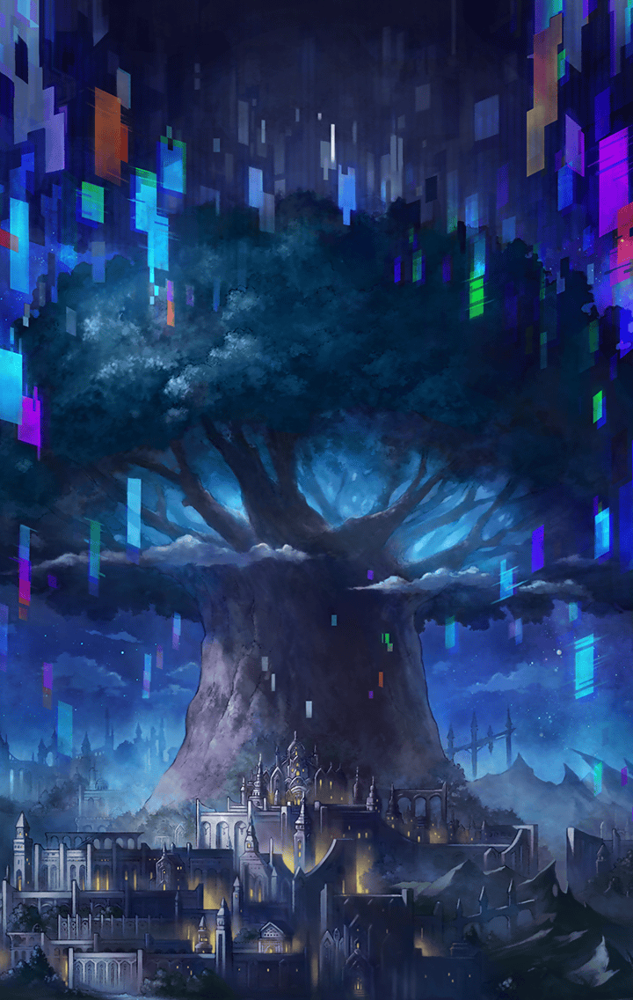

[View script in lisp](../scripts/290602040.txt)

[View source in markdown](290602040.md)

**【アルマス】**
ちょっと！
あなたがフォルカスを追っても…

**【カミト】**
昨日、話したよね
僕は…彼女から逃げるわけには
いかないんだ

**【カミト】**
インテグラルキラーズの動きも
気になるだろ？
僕が調べてくる！

**【ダーインスレイヴ】**
ふむ
では、わたしも同行しよう

**【ダーインスレイヴ】**
安心してくれ
無茶はさせんよ

**【グラーシーザ】**
それはちょうじょう！
あたしもついていくぞ

**【ラグナロク】**
グラーシーザも？
どういう風の吹き回し？

**【グラーシーザ】**
うむ
あたしのせいぎをみつめなおす
たびにでようとおもうっ

**【グラーシーザ】**
たびはひとをひとまわりも
ふたまわりもせいちょうさせる
からな！

**【ラグナロク】**
そう…
分かったわ

**【ミネルヴァ】**
決まりですね
フォルカスの追跡はカミト達に
お願いします

**【ミネルヴァ】**
地上に向かうメンバーは
もう少し話し合って決めましょう

**【ダーインスレイヴ】**
了解だ
わたし達は出立しようか
準備は良いかな？

**【カミト】**
大丈夫だよ

**【グラーシーザ】**
あたしはいつでも
じゅんびばんたんだ！

**【ダーインスレイヴ】**
ラグナロク、アルマス、
良い報告を期待していてくれ

**【カミト】**
あの…アルマス
地上に降りたら、
ヴァングって奏官を捜してっ

**【アルマス】**
その人、カミトの知り合い？

**【カミト】**
うん！
僕の兄貴分なんだ
きっと君の助けになってくれるから

**【アルマス】**
ありがとっ
あなたが無事だってことも
伝えておくわね

**【カミト】**
助かるよ
必ず戻るって言っておいて
それじゃ！

**【デオン】**
で、あるか…

**【ケラウノス】**
急展開って感じだね～
私もクールビューティーな
フォルカスに会いたかったな～♪

**【アスクレピオス】**
バカなこと言ってないで
急いで各地に通達を出すわよ！
せっかく復興を進めてるのに…

**【デオン】**
アルマスとともに地上に向かうことの
できるキル姫であるか…
ならば――

**【ゲイボルグ】**
マスター、私を呼んだな？
今こそゲイボルグの出る幕だ

**【アルマス】**
うん…
出てくると思ってたわ
予想より遅かったくらいよ…

**【ブリューナク】**
ブリューナク達は復興の手伝いを
していて、マスターの危機に
間に合わなかった…

**【ブリューナク】**
故にプランＢに移ることを
推奨する

**【フラガラッハ】**
うふふ♪
慣れない地上世界でも、私の美貌が
あればマスターは安心ね

**【アルマス】**
不安しかないんだけど…

**【ラグナロク】**
彼女達を連れていけるのなら、
十分過ぎるくらいよ

**【デオン】**
である！
その者達の穴埋めはこちらで
請け負おう

**【ラグナロク】**
感謝するわ
これで決まりね

**【エルキュール】**
…………

**【ミネルヴァ】**
…………

**【アルマス】**
仕方ないわねっ
戦闘では頼りにしてるわ！

**【ゲイボルグ】**
切り札としての実力、
存分に見せてやろう

**【エルキュール】**
…………

**【ミネルヴァ】**
ここにいたんですね、エルキュール

**【エルキュール】**
…ミネルヴァ

**【ミネルヴァ】**
らしくありませんね
…いえ、あなたらしいのでしょうか

**【エルキュール】**
何のことですか…？
私のことは放っておいてください…

**【ミネルヴァ】**
そういうわけにもいきません
あなたは一度落ち込むと際限が
ありませんから

**【ミネルヴァ】**
地上に向かう件も、いつものあなた
なら真っ先に手を挙げていたはず
ですよ

**【ミネルヴァ】**
それなのに、躊躇していましたよね
何があったんですか？

**【エルキュール】**
落ち込んでなんて…いません…

**【ミネルヴァ】**
落ち込んでますよ
すっかり自信を無くして、自分に
なんか価値はないと思っています

**【エルキュール】**
…！？
ぐすっ…事実ですから…

**【エルキュール】**
私はみんなの希望になれませんでした
私の掲げる希望なんて、薄っぺらな
ものだったんです…

**【ミネルヴァ】**
また極端なことを
誰に言われたんですか？
フォルカスですか？

**【エルキュール】**
…違います

**【ミネルヴァ】**
そうですか
彼女に言われたのはきっかけに過ぎず
彼女に負けたのが原因ですね

**【ミネルヴァ】**
自分の“希望”が打ち砕かれたと
思い知らされた…
だから落ち込んでいるのでしょう？

**【エルキュール】**
うううっ…
それだけじゃありません…

**【エルキュール】**
たとえ打ち負かされても、
みんなは立ち上がれるんです…

**【エルキュール】**
ダモクレスは絶望の淵から
新しい力を手にして、
私を助けてくれました…

**【エルキュール】**
レーヴァテインを止められなかった
グラーシーザも自分を見つめ直すため
旅に出ました…

**【エルキュール】**
私だけが…立ち止まっています…
みんなの希望にならないと…
いけないのに…

**【エルキュール】**
私はきっと、もう…

**【ミネルヴァ】**
なるほど
良いことですね

**【エルキュール】**
えっ…
やっぱり私には、何の価値も…

**【ミネルヴァ】**
エルキュール
この子はニケといいます

**【エルキュール】**
…知ってます

**【ミネルヴァ】**
それでは、「ミネルヴァの梟は
迫り来る黄昏に飛び立つ」という
言葉はご存知ですか？

**【ミネルヴァ】**
学問が現実に遅れてしまうことを
指す言葉だと言われますけれど…

**【ミネルヴァ】**
ニケはとても賢い子ですよ

**【エルキュール】**
…………

**【ミネルヴァ】**
梟は黄昏に飛び立ち、
夜の王として羽ばたきます

**【ミネルヴァ】**
夜は現実を見つめ直し、
自分自身を知って考えを深める
ときなのです

**【ミネルヴァ】**
昼という現実に打ちのめされて、
あなたは夜に留まっています

**【ミネルヴァ】**
でも、だからこそ、
考え続けることができるのです

**【ミネルヴァ】**
見上げて下さい、エルキュール
きっとあなたの頭上にも、
梟が飛んでいます

**【ミネルヴァ】**
その梟が、胸に舞い降りたとき、
夜明けはやってきます

**【ミネルヴァ】**
それまで、夜に立ち止まるのも
良いことですよ

**【エルキュール】**
…………

**【エルキュール】**
…私の、梟