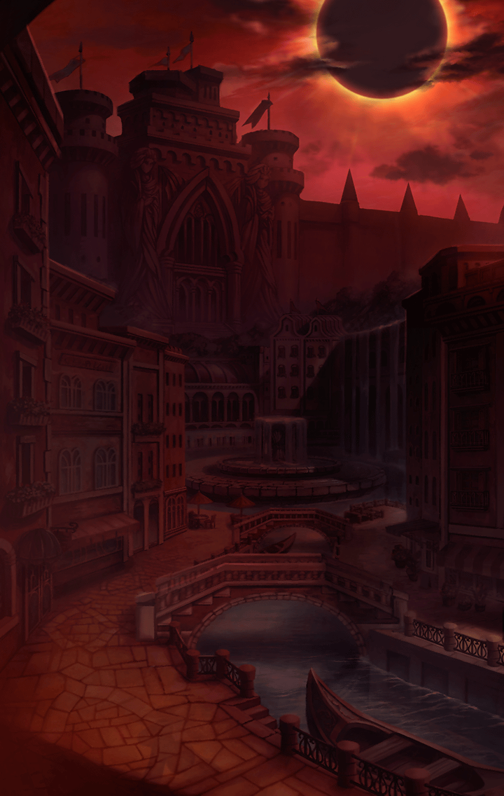

[View script in lisp](../scripts/2910011.txt)

[View source in markdown](2910011.md)

ある日、
人々にとって凶事である
“蝕”が起きた

人々はそれを
“終わりなき夜”と言い、
絶望を覚えたが、

蝕が起きても
特に変わったことはなく
人々は普段の暮らしに戻った

それとは対照的に
キラープリンセス達は
イライラしたり胸騒ぎがしたりと

不調を訴え始める者が
増えていった

それは普段、
感情を表に出さない
レーヴァテインも例外ではなかった

普段のように飄々としておらず、
どこか不安げな
レーヴァテイン

**【レーヴァテイン】**
はぁ…

**【レーヴァテイン】**
なんだろ、
このモヤモヤ…

と、その時、
急にマスターに声をかけられた

**【マスター】**
どうしたの？
大丈夫？

**【レーヴァテイン】**
きゃあっ！

弱っている自分を見られた
恥ずかしさを誤魔化すため、
咄嗟にマスターを睨む

**【マスター】**
ご、ごめん…
なんか見るからに
落ち込んでたから…

**【レーヴァテイン】**
あー、
もう鬱陶しいなぁ

**【マスター】**
そう言われても…
なにか心当たりとかあるの？

**【レーヴァテイン】**
…まったく、なにも

**【レーヴァテイン】**
強いて言うならば
クシャミが出そうで出ないとか

**【レーヴァテイン】**
喉元まで来てるのに
出てこないとか

**【レーヴァテイン】**
あと１歩でうまくいきそうなのに
うまくいかない…
そんな感じ

**【マスター】**
よくわからないけど、
なるほど…？

**【レーヴァテイン】**
…伝わってないじゃない

**【マスター】**
あぁ、ごめん…

**【レーヴァテイン】**
だんだん気もたってきたし…

**【レーヴァテイン】**
なんかこう、
スカッとできないかな…

**【レーヴァテイン】**
…お

**【異族】**
グギャギャギャ…

レーヴァテインの視線の先に
異族が現れた

**【レーヴァテイン】**
…………

**【レーヴァテイン】**
らっきぃ
ちょうどいいや
スカッとしたかったんだよね

マスターをおいて、
レーヴァテインが異族へと
かけ出した
