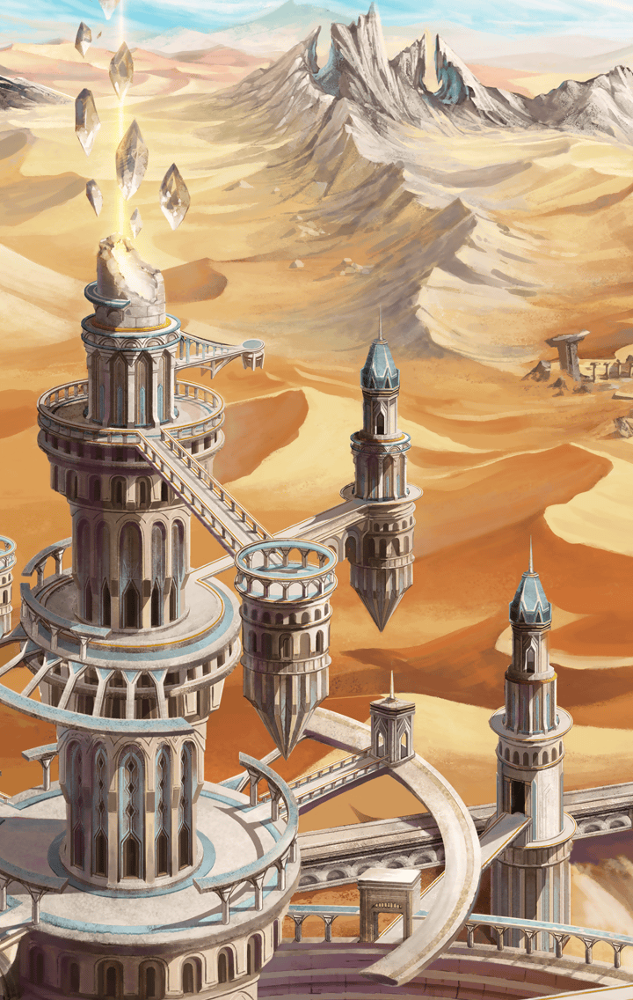

[View script in lisp](../scripts/2910014.txt)

謎の記憶の真相を探るため
天文台を目指して出発した、
レーヴァテイン

天文台は町の南にある砂漠を超え、
さらにその先にある森の
またさらに奥にある

【レーヴァテイン】
熱い…
なんでこんなこと…

【レーヴァテイン】
あぁ、もうわかってるよ！
この気持ち悪い記憶の真相を
知りたいんだもんね

【レーヴァテイン】
この身に覚えのない
気持ち悪さ、
早くなんとかしないと…

【レーヴァテイン】
って、なに大きな声で
独り言してるんだろ

【レーヴァテイン】
絶対に熱さのせいだ…
さっさと抜けよっと

しばらく歩いていると
オアシスにたどり着く

【レーヴァテイン】
はぁ、
ようやくひとやすみできる

【レーヴァテイン】
私の使命…
使命ってなんだろ…

【レーヴァテイン】
キラーズ“レーヴァテイン”が
やり遂げられなかったこと…

【レーヴァテイン】
この前、図書館に行って
調べてみたら、

【レーヴァテイン】
世界を９つ沈めたって書いてたけど
まだ足りないってこと？
どうなのよ、それ

自嘲するレーヴァテイン

そのレーヴァテインを
物陰から
じっと見ている者がいた

【レーヴァテイン】
…しばらくないと思ったら
立て続けにあるものなんだね

【イミテーション】
そんだけはっきりと
気配をさせといてよくもまぁ

【レーヴァテイン】
気配…？
あんたが敏感なんじゃない？
まぁ、いいや

【レーヴァテイン】
…あ！

イミテーションは
昨日見つけた欠片を持っていた

【レーヴァテイン】
それ…

【イミテーション】
これを知ってるの？
なら、目的が増えたわ

【イミテーション】
淘汰をして、
それもいただく！

Next: [2910015](2910015.md)

[Back to index](index.md)
