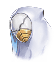

2910019

[View script in lisp](../scripts/2910019.txt)

【レーヴァテイン】
逃がさない…！

再びイミテーションを
追い詰めたレーヴァテインだったが、

別方向から襲ってきた異族に
気を取られている間に
再び逃げられてしまった

【レーヴァテイン】
どいて…！

【異族】
ギャギャ…ギャ…

襲いかかる異族を倒しつつ、
イミテーションを追走する

そして…

【レーヴァテイン】
はぁ…はぁ…

【イミテーション】
グゥ…
ハァハァ…

【レーヴァテイン】
あんた…
そのネックレス
どこで手に入れたの？

【イミテーション】
グググ…
そっちこそ…

【イミテーション】
てことはあんたも
あの光景が見えたの？

【レーヴァテイン】
えぇ、
赤い空とかでしょ？

【イミテーション】
赤い空…？

【イミテーション】
それ、知らない！！！

【レーヴァテイン】
やっぱり、
ネックレスによって
違うのか…

【イミテーション】
そのネックレスが手に入れば
またなにかわかるかもしれない…

【イミテーション】
ねぇ、あんたの記憶を
私にちょうだい！！！

Next: [2910020](2910020.md)

[Back to index](index.md)
