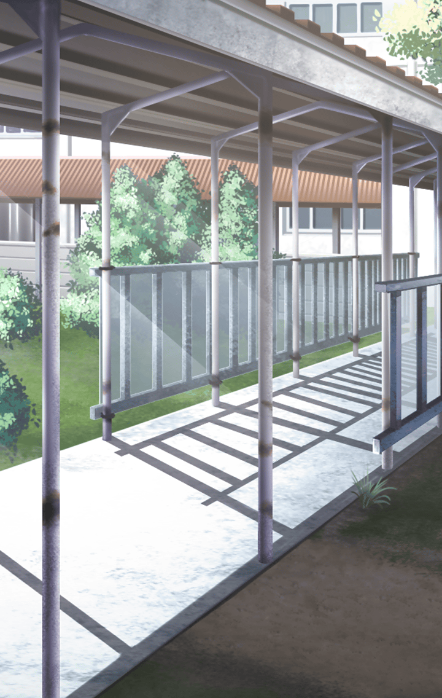

30019202 ロンギヌス 『雪花の舞槍』

[View script in lisp](../scripts/30019202.txt)

【ロンギヌス】
はぁ…はぁ…

消えたマスターのお弁当を
探すため、学園の中を
駆け回るロンギヌス

だが…

【ロンギヌス】
ダメ…見つからない…
どこにも見当たらない…

校舎の中、屋上、体育館…
色んな場所に行ってみるが、
手掛かり一つ掴めないでいた

【ロンギヌス】
はぁ…はぁ…はぁ…！

【ロンギヌス】
こんなとき、さくらちゃんだったら…
さくらちゃんなら、
どんな風に振る舞うんだろう…

【ロンギヌス】
やっぱり私は…

【ロンギヌス】
さくらちゃんみたいには
できないんだ…

【ロンギヌス】
いつも明るくて元気な…
さくらちゃんのようには…

その目から、
悔し涙がこぼれ落ちた…

…と、そこに

手がかりは見つかった？
こっちは見つかりそうにないよ

【ロンギヌス】
あ、マスター！

【ロンギヌス】
……うぅ
ごめんなさい……

【ロンギヌス】
やっぱり私じゃ…
無理なんです…

【ロンギヌス】
新しい力に目覚めて、
ほんの少し自信をつけた
つもりだったけど…

【ロンギヌス】
変わったのは…
格好だけでした…

【ロンギヌス】
中身は…前となにも変わらない…
なにもできないままの私……

と、落ち込む彼女に
マスターが声をかけた

選択肢:
- さくらの言葉を思い出して → [select_label_01](#select_label_01)へ
- こんな時、さくらなら何て言うかな？ → [select_label_02](#select_label_02)へ
- きみも聞いてたでしょ？さくらの言葉 → [select_label_03](#select_label_03)へ

と、落ち込む彼女に
マスターが声をかけた

#### select_label_01:
 → [select_label_end](#select_label_end)へ

【ロンギヌス】
…え？さくらちゃんの…？

#### select_label_02:
 → [select_label_end](#select_label_end)へ

【ロンギヌス】
…え？さくらちゃんだったら…？

#### select_label_03:
 → [select_label_end](#select_label_end)へ

【ロンギヌス】
さくらちゃんの…言葉…？

#### select_label_end:

【ロンギヌス】
………

しばらく考え込むロンギヌス

次の瞬間…

【ロンギヌス】
あっ！

【ロンギヌス】
思い出しました…
さくらちゃんの言葉…
それは……

【ロンギヌス】
『絶対だいじょうぶだよ！』

そう、逆境にぶつかった時、
さくらが言ってたよね

【ロンギヌス】
………はい

【ロンギヌス】
マスター、私…
目が覚めました

【ロンギヌス】
やっぱり…諦めません！
どんな逆境に立たされても…

【ロンギヌス】
いつも元気で明るかった
さくらさんのように！！

涙を拭った彼女の瞳の奥に、
再び光が戻って来た

【ロンギヌス】
絶対に…諦めません！
さくらさんのように！！

精神を集中させ、
何かを感じ取ろうとする
ロンギヌス

確かにさくらには
なにかを感じ取れる力があった

ロンギヌスはそれを試そうと
している様子

さくらでも感じ取れるのは
対象に不思議な力が宿っていた場合
けれど今回はただの弁当箱だ

感じ取れるはずはないのだが…

【ロンギヌス】
………あ！

【ロンギヌス】
今…聞こえました

【ロンギヌス】
マスターのお弁当は…
あの場所にあります！！

そこを目指して
駆けて行く彼女とマスター

そして、ロンギヌスは
いよいよ事の真相に迫る

【ロンギヌス】
マスターのお弁当を
持っていたのは…
あなたですね！！

【ロンギヌス】
ウサギさん！！

校庭の端に掘られた
小さな穴をのぞき込む彼女

それは、
小さなウサギの親子の
巣穴だった

【ロンギヌス】
子どもに食べさせようと、
お弁当を持って行ったんだね
ウサギさん

ウサギに語り掛けた後、
マスターに向き直る彼女

【ロンギヌス】
あの、マスター

【ロンギヌス】
ウサギさん…
許してあげて下さい

【ロンギヌス】
ウサギさんは子どもに
食べさせてあげたくて
必死だったんだと思います

【ロンギヌス】
お願いです！
マスターのお弁当は…
私が作り直しますから！

【ロンギヌス】
だから…このお弁当は…
ウサギさんにあげてください！

必死にマスターに懇願する彼女

すると、マスターは彼女にこう言った

やっぱり、きみはすごいな

【ロンギヌス】
…え？ど、どうしてですか…？

きみのそういう
慈悲深い優しさこそが…

“君だけの力”なんだよ

【ロンギヌス】
！！

【ロンギヌス】
私の…優しさが……

さくらと比べる必要なんてないよ
だって、きみには
きみの素晴らしさがあるから

【ロンギヌス】
……あ…

【ロンギヌス】
ありがとうございます！

マスターの言葉により、
少し自信を取り戻した彼女

それにより
マスターとの絆が深まり
新たなるスキルに目覚めるのだった

【ロンギヌス】
誕生しました！
私の新しい力…
『雪花の舞槍』です！！

その瞳は、キラキラと
大きな輝きに満ちていた

そして─

【ロンギヌス】
ありがとうございました、
マスター

夕焼けを背に、
屋上に並んで立つ二人

こっちこそ一生懸命
探してくれてありがとう

そう答えるマスターに対し、

【ロンギヌス】
うぅん、私に
さくらちゃんの言葉を
思い出させてくれて…

【ロンギヌス】
自信を取り戻させてくれて…

【ロンギヌス】
本当にありがとうございます！

【ロンギヌス】
私…マスターの言う通り、
もうさくらちゃんと
比べるのは止めます

【ロンギヌス】
私には…
私にできることがある

【ロンギヌス】
そう信じて、
これからもがんばります！

選択肢:
- もう大丈夫みたいだね → [2select_label_01](#2select_label_01)へ
- 完全復活だね → [2select_label_02](#2select_label_02)へ
- 前よりパワーアップしたんじゃない？ → [2select_label_03](#2select_label_03)へ

そう信じて、
これからもがんばります！

#### 2select_label_01:
 → [2select_label_end](#2select_label_end)へ

【ロンギヌス】
はい！あ…でも…！

#### 2select_label_02:
 → [2select_label_end](#2select_label_end)へ

【ロンギヌス】
はい！あ…でも…！

#### 2select_label_03:
 → [2select_label_end](#2select_label_end)へ

【ロンギヌス】
そんなことは…あ…でも…！

#### 2select_label_end:

どうしたの？
マスターが尋ねる

【ロンギヌス】
少しだけ自信を取り戻しましたけど…

【ロンギヌス】
側にいて、
助言をしてくれる人がいないと、
まだまだ不安です…

【ロンギヌス】
マスターみたいに…

顔を赤くしながら、
マスターの手を掴む彼女

【ロンギヌス】
だから、これからも側にいて…
私を見守ってくれますか？

潤んだ瞳で見上げてくる彼女に対し、
マスターは…

きみにとって僕は、
さくらにとっての
ケロちゃんって事かな？

と言って、微笑む

【ロンギヌス】
うふ…はい

照れながらも嬉しそうに
うなずくロンギヌスだった

Next: [30019203](30019203.md)

[Back to index](index.md)
