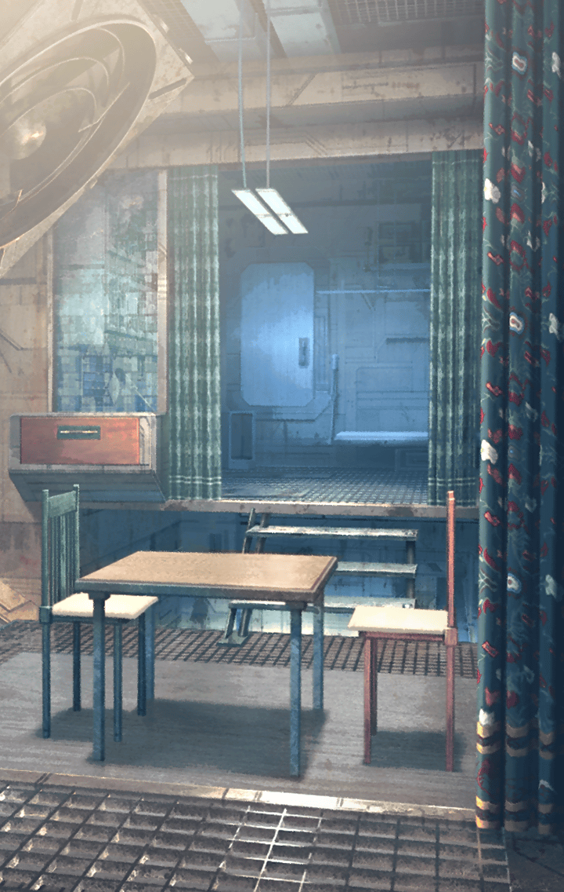

301010023 限定クエスト  キズナアイ×ファントム オブ キル コラボイベント トラベルクエスト キズナアイ×ファントム オブ キル コラボイベント トラベルクエスト 3 - 地上編 地上編 地上編 ステージクリア時

[View script in lisp](../scripts/301010023.txt)

【キズナアイ】
す、すごかったね…
プレイしてて、
すごくやりごたえがあって…

【キズナアイ】
キル姫の正体とか
キラーメイルの関係性とか
いろいろ分かったけど…

【キズナアイ】
やっぱり一番印象に残ったのは
ゼロとアマネのやり取りかな

【キズナアイ】
ちょっとネタバレっぽいけど、
とても感動しちゃった…

【キズナアイ】
だから、今、私がいるのも
ゼロのお部屋にしちゃいました！

【キズナアイ】
たしかショートアニメにも
なってるみたいだし
よかったら、見てみてね

【キズナアイ】
それじゃあ、
次のお話に行ってみよう！

Next: [301010031](301010031.md)

[Back to index](index.md)
