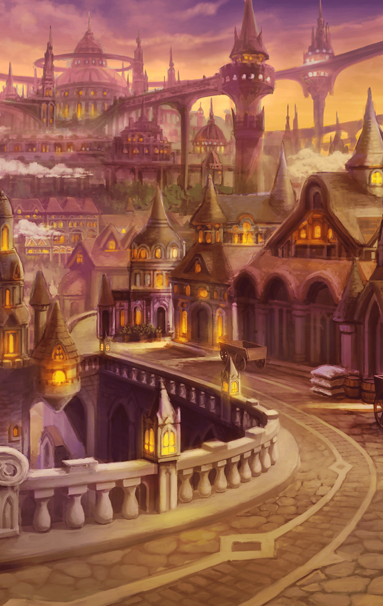

[View script in lisp](../scripts/30141204.txt)

[View source in markdown](30141204.md)

あれから数日後

また街でイシューリエルを
見かけるマスター

**【イシューリエル】**
えぇ、そうですわ
今日も人間観察です

**【イシューリエル】**
人間の真実の心…
覗きたいですから

**【イシューリエル】**
…あ、そうだ

**【イシューリエル】**
そういえばマスター

**【イシューリエル】**
先日のハロウィンパーティーで
わたくしを驚かせた
子ども達のドッキリ…

**【イシューリエル】**
あれって…
マスターの発案ですよね？

**【イシューリエル】**
てっきり子ども達が考えた
イタズラかと思ってましたけど

選択肢:
- ど、どうしてそう思うの…？ → [select_label_01](#select_label_01)へ
- そ、そんな事ないよ…？ → [select_label_02](#select_label_02)へ
- あ、あれは子ども達が… → [select_label_03](#select_label_03)へ

てっきり子ども達が考えた
イタズラかと思ってましたけど

#### select_label_01:
 → [select_label_end](#select_label_end)へ

**【イシューリエル】**
あら、しらばっくれるのですか？

#### select_label_02:
 → [select_label_end](#select_label_end)へ

**【イシューリエル】**
あら、ウソつくおつもり？

#### select_label_03:
 → [select_label_end](#select_label_end)へ

**【イシューリエル】**
あら、責任転嫁なさるおつもり？

#### select_label_end:

**【イシューリエル】**
もう、わたくしの目は
誤魔化せませんわよ

**【イシューリエル】**
あのイタズラがマスターの
発案だと思うのには、
理由があります

**【イシューリエル】**
まず、マスターって
子ども以上に
子どもっぽいところがあるし

**【イシューリエル】**
それに…

**【イシューリエル】**
優しいから

**【イシューリエル】**
強盗事件が多発して、
街全体が暗い雰囲気になってたから…

**【イシューリエル】**
マスターは、子ども達を
笑顔にしてあげたかったんでしょ？

**【イシューリエル】**
そんな優しいことを思いつけるのは…
マスターしかいません！

**【イシューリエル】**
これぞ、トゥルース！

**【イシューリエル】**
いかがかしら？
今回のわたくしの観察眼は？

お見事、その通りです
…と観念して、答えるマスター

**【イシューリエル】**
ふふ…やっぱり♪

そして観察眼が目覚めたことで、
彼女は新たなるスキル

『ジャスティスアイ』
にも目覚めていた

**【イシューリエル】**
わたくしったら…
とんだ遠回りをしていた
みたいですわね

**【イシューリエル】**
近くに、
こんな優しい心を
持った人がいるのに

**【イシューリエル】**
これからは…
その美しい心を
見続けて頂きます

**【イシューリエル】**
それが…わたくし自身の心を
美しく光り輝かせることにも
なりますから！

**【イシューリエル】**
これぞトゥルース☆

自信満々で言い放つ彼女の瞳は、
とても輝いて見えた
