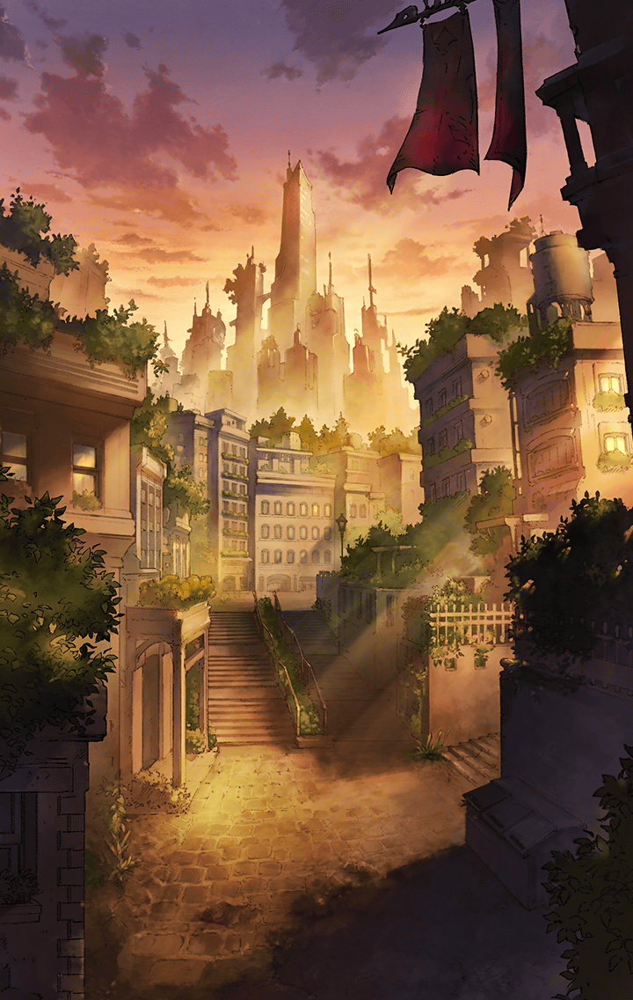

310010050 シークレットリーエバーアフター(SecretlyEverAfter)(SEA編)  プロローグ 第１話 プロローグ-5

[View script in lisp](../scripts/310010050.txt)

【住民１】
いらっしゃいませ！
いらっしゃいませ！
本日、特売――

【住民２】
…だからねぇ、奥さん
最近は本当に――

【住民３】
そうよねえ
この前だって――

【住民４】
こっち！こっち！
すっごい面白いもの――

【住民５】
明日の数学ってさ
確か――

【ユーザー名】
…………

【ユーザー名】
この町も賑やかだ

【ユーザー名】
行き交う人々の喧噪が耳に心地よい

【ユーザー名】
風に乗って流れてくる
美味しそうな食べ物の匂いに
つい足を向けそうになる

【ユーザー名】
今夜はこの町に泊まろう

【ユーザー名】
ティルフィングと再会してから、
また長い年月が過ぎた

【ユーザー名】
あのとき、ずっと一緒にいるという
約束を交わしたことで

【ユーザー名】
人の身でありながら、
今もこうして生きている

【ユーザー名】
ティルフィングは基本
ユグドラシルの中で
世界を見守っている

【ユーザー名】
だから自分は、
たまに住む場所を変えながら
人々の暮らしを見て回ることにした

【ユーザー名】
世界はすっかり落ち着いて、
キル姫達も楽しそうに
暮らしているようだ

【ユーザー名】
こんな時間がずっと続けば良い
本当に、そう思う

【ティルフィング】
…マスター

【ユーザー名】
…？

【ティルフィング】
マスター
突然、ごめんなさい
折り入ってお話があるんです

【ティルフィング】
私のところまで
来ていただけませんか？

選択肢:
- いいよ → [select_label_01](#select_label_01)へ
- すぐ行く → [select_label_01](#select_label_01)へ

私のところまで
来ていただけませんか？

#### select_label_01:
 → [select_label_end01](#select_label_end01)へ

【ティルフィング】
ありがとうございます！
では、ユグドラシルで

#### select_label_end01:

【ティルフィング】
急にお呼び立てして、すみません
マスターにしか
頼めないことでしたので…

【ティルフィング】
実は、世界に「揺らぎ」が
発生しつつあるようなんです

【ティルフィング】
この「揺らぎ」そのものは
現象の一つに過ぎません

【ティルフィング】
心が惑うように、
世界も惑うことがあるんです

【ティルフィング】
ただ、キル姫は世界のマナを
キラーズという形で宿しています

【ティルフィング】
彼女達の感情は世界の揺らぎに
大きく影響を受けてしまう
その逆も…

【ティルフィング】
ですから、彼女達の下を訪れて、
感情を制御する術を
与えて欲しいんです

【ティルフィング】
もちろん、お一人でとは言いません
補佐役をおつけします

【ティルフィング】
ミーミル、こちらへ

【ミーミル】
はじめまして
マスター様の専属補佐官、
ミーミルでございます

選択肢:
- よろしく → [select_label_02](#select_label_02)へ
- はじめまして → [select_label_02](#select_label_02)へ

はじめまして
マスター様の専属補佐官、
ミーミルでございます

#### select_label_02:
 → [select_label_end02](#select_label_end02)へ

【ミーミル】
はい
よろしくお願い申し上げます

#### select_label_end02:

【ティルフィング】
この子がマスターの旅を
サポートします

【ティルフィング】
ミーミルは私と繋がっていますから
ちょっとした「揺らぎ」なら
修復することもできるんですよ

【ミーミル】
マスター様のために
誠心誠意
尽くさせていただく所存です

選択肢:
- 固いな… → [select_label_03](#select_label_03)へ
- 大丈夫かな？ → [select_label_04](#select_label_04)へ
- 子守りは慣れてる → [select_label_05](#select_label_05)へ

マスター様のために
誠心誠意
尽くさせていただく所存です

#### select_label_03:
 → [select_label_end03](#select_label_end03)へ

【ミーミル】
動きがぎこちなかったでしょうか…
後で念入りに
柔軟体操をしておきます

#### select_label_04:
 → [select_label_end03](#select_label_end03)へ

【ミーミル】
ミーミルは立派な大人の女性なので
何も心配することはありません

#### select_label_05:
 → [select_label_end03](#select_label_end03)へ

【ティルフィング】
あの…
どなたの子どもを…
いえ、何でもありませんっ

#### select_label_end03:

【ミーミル】
マスター様のことは
ティルフィング様から
聞き及んでおります

【ミーミル】
とても立派な方だと

【ミーミル】
足手まといにならないよう、
努めさせていただきます

【ミーミル】
では、参りましょう
マスター様
キル姫の皆さんを巡る旅へ

【ティルフィング】
待って
ミーミル、これを渡しておきます

【ミーミル】
これは…日記帳でしょうか？

【ティルフィング】
ここに旅の中でアナタが思ったこと、
感じたことを記して下さい

【ミーミル】
記録の保存ですね
でも、それならユグドラシルで
閲覧した方が正確です

【ミーミル】
私とマスター様だけの視点では、
把握しきれない事実も
あるかもしれません

【ティルフィング】
それでいいんです
これは正確な記録を残すための
ものではありません

【ティルフィング】
ミーミル
アナタが世界をどう見たのか
どう感じたのか

【ティルフィング】
それを記録するためのものです

【ミーミル】
私が感じた、記録…

【ティルフィング】
アナタはすでに
多くのことを知っています
知りすぎているくらいに…

【ティルフィング】
一つの事柄についても、
複数の側面があることを理解して
それらを比較することができる

【ティルフィング】
一つの言葉に関しても、
複数の意味があることを知っています
でも、だからこそ…

【ティルフィング】
アナタはアナタにとっての言葉を、
事実を…世界を識らない

【ティルフィング】
ミーミル
アナタはマスターとの旅で…

【ティルフィング】
アナタにとっての世界を
定義して下さい

【ティルフィング】
それが出来たとき
きっとアナタは
「美しい」を識るでしょう

【ミーミル】
私にとっての世界を、定義する…

【ミーミル】
そうすれば、「美しい」を…

【ティルフィング】
ミーミル

【ティルフィング】
旅に出れば、見たくないものも
見るでしょうし、感じたくないものも
感じるかもしれません

【ティルフィング】
でも、大丈夫ですよ

【ティルフィング】
それでもきっと、
世界は美しいから

Next: [310010060](310010060.md)

[Back to index](index.md)
