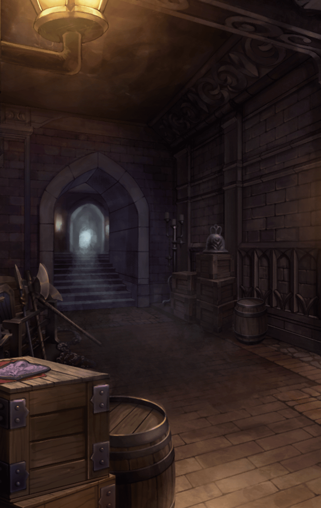

[View script in lisp](../scripts/310021140.txt)

[View source in markdown](310021140.md)

**【ゼロ】**
どうなってやがる！？
この門、ビクともしねぇぞ…！

**【ミーミル】**
今までの八つの門と
何か違うのでしょうか？

選択肢:
- 最後の門だから → [select_label_01](#select_label_01)へ
- 門を観察しよう → [select_label_02](#select_label_02)へ

今までの八つの門と
何か違うのでしょうか？

#### select_label_01:
 → [select_label_end](#select_label_end)へ

**【ミーミル】**
そうです
何か違いがあってしかるべきです

#### select_label_02:
 → [select_label_end](#select_label_end)へ

**【ミーミル】**
確かに、観察することは大切ですね

#### select_label_end:

**【ミーミル】**
あ！マスター様
門の中央に窪みがあります
これは…

**【ゼロ】**
妙な形の窪みだな？
この輪郭…鶏か？

**【ミーミル】**
鶏の形をした何かを嵌め込めば
良いのでしょうか？

**【与一】**
えっ…

**【？？？】**
持っているだけで…いいから
絶対に…使わないで

**【ミーミル】**
与一さん？
あ、そのブローチは…

**【レーヴァテイン】**
…………

**【ゼロ】**
与一、それだ！
それを貸せ！

**【与一】**
…ダメです
これは、ダメなんですっ

**【ゼロ】**
何、言ってんだ！？
形も大きさもピッタリだぞ
それに間違いない！

**【ゼロ】**
もう時間がないんだ！
さっさと渡してくれっ

**【与一】**
あ…あの…でも…
ごめんなさい…！

**【与一】**
これはダメなんです…！
絶対に、使っちゃいけないって…
約束なんです…！

**【ゼロ】**
待ちやがれ！

**【与一】**
ううっ…
来ないで下さい…
来たら…射抜きます…！

**【ゼロ】**
やってみろ！
その代わり、殺す気で射ろよ

**【ゼロ】**
アマネの命がかかってるんだ
俺は死ぬまで止まらねぇ
いや、死んでも止まらねぇぞ！

**【与一】**
ひぃっ…やあ…！

**【ゼロ】**
どうした、与一！？
こんな近距離で外してんじゃねぇ！

**【与一】**
あうっ…

**【ゼロ】**
しばらく寝てろ
…ブローチ、借りるぞ

**【与一】**
それは…ダメなんで、す…

**【レーヴァテイン】**
ううぅ…兄さん…

**【ミーミル】**
ゼロさん、
レーヴァテインさんが…！

**【ゼロ】**
くそっ…！
頼む、間に合ってくれ！

**【ゼロ】**
よし、ブローチが嵌ったぞ！
開けえええええええええええ！！

**【ミーミル】**
門が開いていきます！

**【レーヴァテイン】**
ううっ…あ…

**【ミーミル】**
レーヴァテインさんのお姿がっ

**【レーヴァテイン】**
…………

**【ゼロ】**
アマネ！
大丈夫かっ？
もう苦しくないかっ？

**【レーヴァテイン】**
うん…
ありがとう、兄さん
みんなも…

**【ゼロ】**
ああ、良かった
ったく、世話焼かせやがって

**【レーヴァテイン】**
ごめんなさい…
もっと早く…相談しておけば
良かった

**【ゼロ】**
アマネ？

**【レーヴァテイン】**
…思い出したの
全て…思い出した…
ごめんなさい…

**【ゼロ】**
どうした、アマネ？
…おい！？

**【ミーミル】**
マスター様！
レーヴァテインさんから
離れて下さい

**【ミーミル】**
何か…とてつもなく強い
マナの奔流を感じます

**【レーヴァテイン】**
ああ、やっぱり…
そうなるんだ

**【ゼロ】**
なっ…！？

**【ミーミル】**
レーヴァテインさんの体から
炎が…？

**【レーヴァテイン】**
ううっ…
うああああああああああ！
