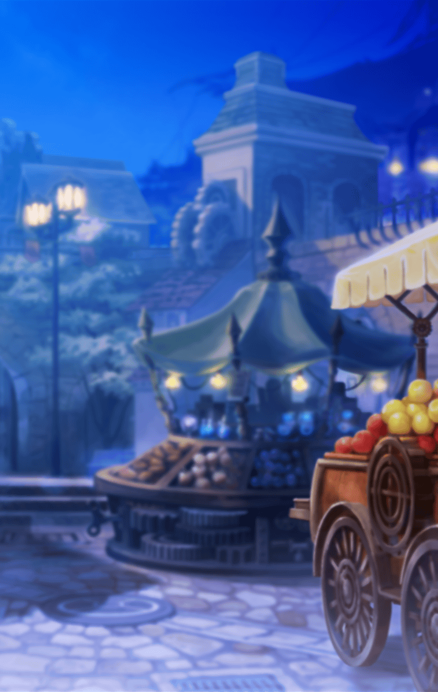

310021160 シークレットリーエバーアフター(SecretlyEverAfter)(SEA編) 第1章 閉ざされた箱にて、キミを射抜く 第１話 閉ざされた箱にて、キミを射抜く-16

[View script in lisp](../scripts/310021160.txt)

【レーヴァテイン】
はぁ…
めんどくさいなぁ

【？？？】
ガアアアアアアアアア！！

【レーヴァテイン】
あなたは…とっとと、消えて…

【？？？】
ガアアアアアアアアアア…

【レーヴァテイン】
うっ…？

【レーヴァテイン】
はぁ…
参ったな
このままだと…

【グングニル】
レーヴァテイン！

【レーヴァテイン】
…何？

【グングニル】
そなた、どういうつもりだ…！？
何故…

【グングニル】
何故、あの巨人を滅さなかった！？
何故、そなたの中に取り込んだ！？
答えよ！

【レーヴァテイン】
はぁ…見られてたんだ
めんどくさい…

【グングニル】
何だと…？

【レーヴァテイン】
話してもいいけど…
聞いたら、あなたにも…
手伝ってもらうからね

【グングニル】
いいだろう
聞かせてもらおうではないか

【レーヴァテイン】
先に言っておくけど
私が取り込んだんじゃなくて
あっちが勝手に…入ってきたの

【レーヴァテイン】
でも…それで分かった
あの巨人は…スルトだよ

【グングニル】
スルトだと！？
それは…そなたの伝承にある
巨人の名ではないかっ

【レーヴァテイン】
スルトそのものだとは…思えないけど
何ていうか…
似たような別の力…とかね

【グングニル】
言っている意味がよく分からぬな…

【レーヴァテイン】
はぁ…私だって分からない
そんなことより…この力、
封じておかないとヤバイから

【レーヴァテイン】
私と馴染んでる…みたいだし
このまま封印するよ

【グングニル】
封印か…
しかし、あれだけのマナを封じるには
相応の儀式が必要であろうな

【レーヴァテイン】
そう…だから、あれを使う
「レーギャルンの箱」を

【グングニル】
何だ、それは？

【レーヴァテイン】
説明…めんどくさいなぁ
ざっくり言うと、私の力を
封じておく結界…みたいなものだよ

【グングニル】
それは…そなたの力も
封じられるということにならぬか？

【レーヴァテイン】
まあね…
でも、不完全な状態にしておけば
特に問題ないし

【レーヴァテイン】
肝心なところだけ…鍵を掛けておけば
大丈夫…と思う

【グングニル】
そのような曖昧なことで良いのか？
そなた自身に、もし
万が一のことがあれば――

【レーヴァテイン】
はぁ…何でグングニルが
私の心配してるの？

【レーヴァテイン】
何とかなるって
それとも…巨人の力を解放して、
この町を火の海に…したい？

【グングニル】
…覚悟はできていると言うのだな

【レーヴァテイン】
…まあね

【グングニル】
ふむ
これが九つ目の門となるわけだな

【レーヴァテイン】
他の門はともかく…
これは絶対に開けないで…
「箱」の中心だから

【グングニル】
良かろう
では、我がこの門の門番となろう
さしずめ「最後の門番」だな

【グングニル】
この門の鍵はどこだ？
預かっておくぞ

【レーヴァテイン】
そっちはいいから
他に…あてがあるし

【グングニル】
そうか…

【グングニル】
レーヴァテインよ
本当に良いのだな？
もし「箱」が全て閉ざされたなら…

【レーヴァテイン】
はぁ…心配し過ぎ
もし全部の門を
閉じないといけないことになったら…

【レーヴァテイン】
それは私が…抱いちゃいけない思いを
強く抱いてしまったときだから…

【グングニル】
抱いてはならぬ思い、だと？

【レーヴァテイン】
覚悟はできてるよ
それで…私が消えることに
なったとしてもね

【グングニル】
レーヴァテイン、そなた…！

【レーヴァテイン】
大丈夫だって
じゃ、よろしく

Next: [310021170](310021170.md)

[Back to index](index.md)
