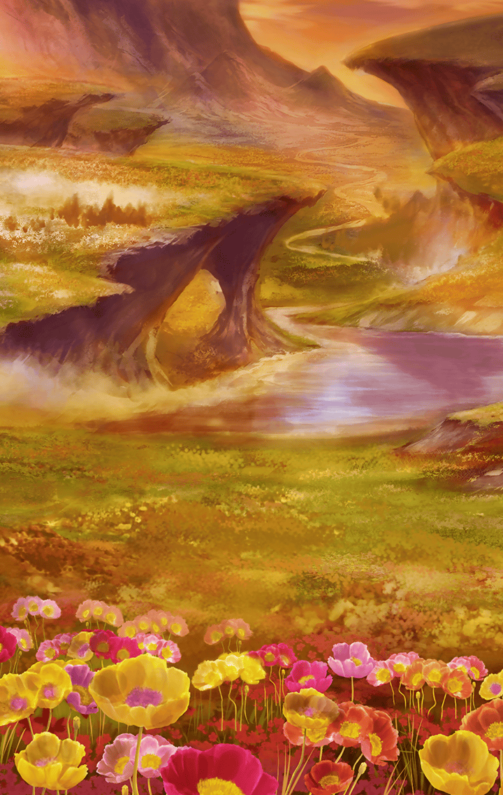

[View script in lisp](../scripts/3100213.txt)

**【ギルガメッシュ】**
…なるほど
人形どもとは違うというわけか

**【ギルガメッシュ】**
その切れ味、どこまで磨かれるものか
興味は湧くが…
ふっ、まあ良い——

**【ティルフィング】**
…終わっ、た？

**【セイバー】**
はい。
英雄王の消滅を確認しました

**【セイバー】**
しかし、彼の王を退けたのは
私ひとりの力ではない
……我々の、勝利です

**【デュリン】**
それで、セイバーはどうするの？
元の世界に帰る方法を探す？

**【セイバー】**
いえ、キル姫という存在は
この世界に根差したものです

**【セイバー】**
少なくとも
ここにいる私の居場所は、
この世界にしかない

**【ティルフィング】**
セイバーさん…

**【セイバー】**
貴方達と共に戦えることは
騎士の誇りに適うものだ

**【セイバー】**
それに…
この聖剣がこの世界に現界したのには
何か意味があるはず

**【セイバー】**
私はその理由が知りたい

**【セイバー】**
どうか貴方達の旅に
同道させてはもらえないだろうか？

**【ティルフィング】**
もちろんです！
ですよね、マスター？

**【セイバー】**
ではサーヴァント…
ではなく“キル姫”セイバー、
貴方がたにこの剣を預けよう

**【セイバー】**
これからもよろしくお願いします
マスター