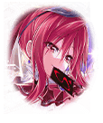

[View script in lisp](../scripts/310022051.txt)

**【カドケウス】**
闇夜を照らす満月よりも

**【ケーリュケイオン】**
夜空に瞬く星々よりも

**【？？？】**
美しく輝き舞い踊る、
真紅の高貴なる蝶
“エレガントバタフライ”！

**【シェキナー】**
怪盗シェキナー
参上しました

**【シェキナー】**
今宵、貴方の大切なもの
いただきます

**【カドケウス】**
いぇーい！

**【ケーリュケイオン】**
やんや、やんや！

**【リットゥ】**
…………

**【ミーミル】**
…………

選択肢:
- ………… → [select_label_01](#select_label_01)へ
- 派手な登場！ → [select_label_02](#select_label_02)へ

怪盗シェキナー
参上しました

#### select_label_01:
 → [select_label_end](#select_label_end)へ

**【シェキナー】**
ふふっ
私の登場が完璧過ぎて、
声も出ないようですね

#### select_label_02:
 → [select_label_end](#select_label_end)へ

**【シェキナー】**
そうでしょう
私に相応しい演出を施してみました

#### select_label_end:

**【ミーミル】**
…マスター様
まだ信じられないのですが、
あちらのキル姫は

**【リットゥ】**
シェキナーに間違いないな

**【シェキナー】**
貴方達、お間違えなきよう
私は怪盗シェキナーです

**【シェキナー】**
こちらのお屋敷から「特別な宝石」を
華麗に奪い去ってみせます

**【カドケウス】**
よっ！
大怪盗！

**【ケーリュケイオン】**
今夜も輝いてるね！

**【ミーミル】**
ええと…

**【リットゥ】**
…………お前達

**【リットゥ】**
いい加減にしろ！！

**【シェキナー】**
あら？

**【リットゥ】**
シェキナー…
何をしている

**【リットゥ】**
派手好きという一面はあったが、
お前は規律を重んじ
自分を厳しく戒める奴だった

**【リットゥ】**
私は、そんなお前に
敬意を抱いていたというのに…
見損なったぞ！

**【シェキナー】**
はぁ…
貴方がそれを言うのですか…

**【リットゥ】**
言い訳など不要だ
お前の性根はここで叩き直してやる

**【シェキナー】**
貴方にそれができますか？
ご自慢の剣も持たずに

**【ミーミル】**
そういえば…
リットゥさんはご自身の剣を
持っておりません

**【リットゥ】**
私が剣を持っていない？
シェキナー、お前の目は節穴か？
剣ならここにある

**【ミーミル】**
リットゥさんの右手から炎がっ

**【カドケウス】**
わぁお！
炎が剣の形になったよ

**【ケーリュケイオン】**
炎による剣の具現化か
興味深いねぇ

**【リットゥ】**
過ちを正してやるのも友人の努めだ
私の心の炎で、お前の悪心を
斬り払ってやろう！

**【シェキナー】**
貴方にそれができますか？

**【リットゥ】**
答えるまでもない！

Next: [90004](90004.md)

[Back to index](index.md)
