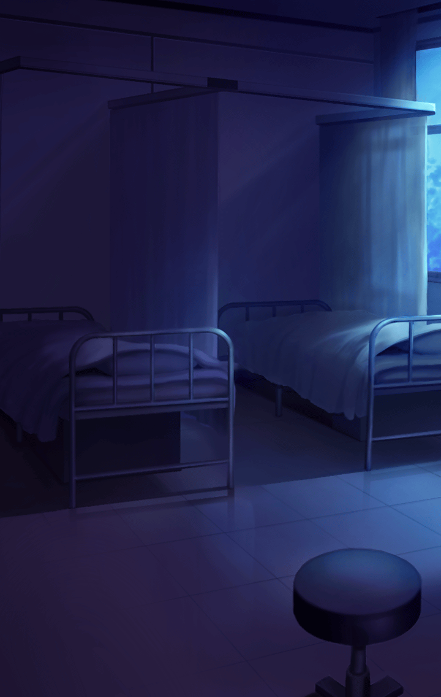

310023110

[View script in lisp](../scripts/310023110.txt)

【イシューリエル】
暴けば暴くほど深くなる廃病院の闇
…恐ろしいですわね

【パラシュ】
ボクはどちらかというと、
君のその勢いの方が怖いよ

【七支刀】
で、でも…
イシューリエル様の言うことにも
一理ありますからっ

【パラシュ】
君は本当に八方美人だね

【七支刀】
わたくし、
誰にだって良いところはあると
信じているんです

【パラシュ】
フン
そういうところが…

【パラシュ】
今、何か…
気のせいかな？

【イシューリエル】
シッ！
パラシュ、お静かに

【イシューリエル】
あちらの部屋から
話し声が聞こえてきますわ

【パラシュ】
部屋？
…確かに話し声がする
本当に誰かいるみたいだね

【イシューリエル】
なるほど
恐らく、証拠を隠滅しようと
やって来た病院関係者ですわ

【イシューリエル】
捕まえて、洗いざらい吐かせますわよ
ついていらっしゃいませ！

【人体模型】
ああ…！
ま、待った

【骨格標本】
いやいや、待ったなしやろ
王手や、王手

【人体模型】
ぐぬぬぬぬ…

【イシューリエル】
御用ですわ！

【骨格標本】
ひやあああっ…！

【人体模型】
何だ、何だっ？

【七支刀】
きゃああああ…！
人体模型と骨格標本が将棋を
指しています…

【骨格標本】
ちょっと、お嬢ちゃん達
驚かせんといて
心臓止まるかと思ったで

【人体模型】
お前、心臓ないやろ

【骨格標本】
あ、そやった
ちょっとお前の貸して

【人体模型】
仕方ないなー
…って、やれるかボケェ！

【パラシュ】
今度は随分と陽気な幽霊が出たね

【七支刀】
幽霊といいますか、
怪異といいますか…

【イシューリエル】
あなた達、ここで何をしてましたの？

【ミーミル】
すごいです、イシューリエル様
躊躇なく話しかけました

【人体模型】
何って、将棋やけど…

【骨格標本】
お嬢ちゃん達こそ、
こんなところに何の用や？

【イシューリエル】
正直に答えた方が身のためですわよ
あなた達、この病院の関係者
ですわね！

【骨格標本】
まあ、関係者いうたら
関係者になるわな

【人体模型】
病院、潰れたときに捨て置かれた
哀れな人形やけど

【イシューリエル】
なるほど
つまり、
罪を認めるということですわねっ

【人体模型＆骨格標本】
何やて！？

【イシューリエル】
あなた達が
病院の不祥事を隠蔽するため

【イシューリエル】
夜な夜な画策していたことは
全てお見通しですわ！

【イシューリエル】
さあ、大人しく縛につきなさい

【骨格標本】
おいおい…
このお嬢ちゃん、頭大丈夫か？

【人体模型】
美少女に縛られる…
悪くないやん

【骨格標本】
お嬢ちゃん、こいつの首、
きつーく縛ったって

【人体模型】
そんなことされたら心臓止まるわ！
…あ、初めから止まっとった

【パラシュ】
君達、ちょっといいかな

【人体模型】
あれ？
今の面白くなかった？
渾身の人体模型ジョークなんやけど

【骨格標本】
心臓ネタを二回やってもうたのが
良うなかったんやないか？

【パラシュ】
そんなことより、この廃病院には
君達のような心霊現象が
数多く集まっているよね？

【骨格標本】
ああ、近頃増えたな～
前は俺ら二人だけやったのに

【パラシュ】
最近になって増えた？
それって、二週間前――

【イシューリエル】
パラシュ！
そのような質問はナンセンスですわ

【イシューリエル】
何故なら、この二体は
遠隔操作されている
ドローンに過ぎませんから

【イシューリエル】
この二体を縛り上げて、
操作している者達のところに
案内させます！

【骨格標本】
おいおい、この嬢ちゃん
目がマジやぞ

【人体模型】
そうだな
興奮するなっ

【骨格標本】
アホ！
お前の嗜好につきおうてられるかっ
俺は逃げる！…いや

【骨格標本】
ドロンさせてもらいます
ドローンだけに

【人体模型】
上手くないわ！
俺らドローンちゃうやろ
とにかく逃げるで！

【イシューリエル】
あ！
お待ちなさいっ

【パラシュ】
待つんだ、イシューリエル！

Next: [310023121](310023121.md)

[Back to index](index.md)
