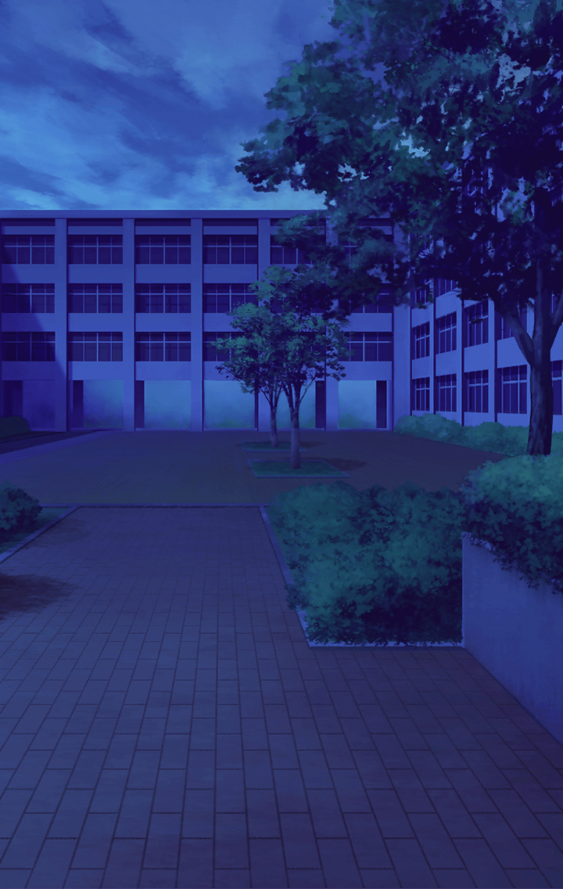

[View script in lisp](../scripts/310023191.txt)

**【医者】**
残念ですが、余命は…

**【とある患者１】**
そうですか…
私は、何のために生まれて
きたんでしょう…？

**【見舞い人】**
元気になったら、またバリバリ
仕事すれば良いんだよ

**【とある患者２】**
ああ…治ったらな…
まだ、やりたいことが
たくさんあるんだ…

**【とある患者３】**
もう一度、旅行に行きたかったな…

**【友人】**
行けるよ！
絶対、元気になるって…

**【とある患者４】**
何もできないまま、
僕は死ぬのかな…

**【とある患者４】**
どうして、生まれてきたんだろう…？

**【七支刀】**
…………

**【七支刀】**
感じます
たくさんの思いを…
この病院で亡くなった方々の…

**【七支刀】**
未練…無念…疑問…悲嘆…苦悩…
そして…諦め…

**【七支刀】**
ここにわだかまっていたのは、
呪術の痕跡ではなくて、
もっと混沌とした…

**【七支刀】**
願い、だったんですね

**【幽霊】**
ああ、あいつ
元気にしてるんだなあ
手伝えることはないかな？

**【町人１】**
うわあっ！？
今、何か通り過ぎたような…

**【幽霊】**
おいおい
いつまで化粧してるんだ
早く家を出ないと遅刻するぞ

**【町人２】**
きゃっ…！
鏡に…何か映ってた…

**【幽霊】**
ふぅ…
井戸の掃除って手間がかかるから
誰もやらないよね

**【町人３】**
ぎゃああああ…！？
井戸から髪の長い女が…

**【幽霊達】**
なあ、何かやらせてくれよ

**【幽霊達】**
もう死んじゃったけど、
自分がここにいたって証を、
残していきたいんだっ

**【町の人々】**
うわぁっ！？
何だ、何だっ？

**【町の人々】**
物が勝手に…動き出したぞ！？

**【町の人々】**
きゃああああ…！
また、心霊現象よっ

**【幽霊達】**
うぅっ、また失敗した…
物を運ぼうとしても上手くいかない

**【幽霊達】**
死んだ後も役立たずか…
自分はどうして生まれて…
何で死んだんだろう…？

**【幽霊達】**
僕の人生には…
何の価値もなかったのかな…

**【七支刀】**
そんなことは、ありません！

**【七支刀】**
あなたが生まれてきたことには
価値があります
大切な意味があります

**【七支刀】**
誰も認めなくても、
わたくしが断言致しますっ

**【七支刀】**
たとえ短い間でも
何もできなかったとしても
志半ばでも…

**【七支刀】**
あなたが生きていた
それだけでかけがえのない
価値があったんです

**【七支刀】**
だから、大丈夫ですよ
安心して下さい

**【七支刀】**
あなたのやってきたこと
やれなかったこと
その人生全てを…

**【七支刀】**
わたくしは、大切に思います

**【？？？】**
…………

**【？？？】**
モウ、イイノ…？

**【？？？】**
モウ、何モシナクテイイノ？
休ンデイイノ？

**【？？？】**
僕達ノ私達ノ人生ニ…
価値ハアッタノ？

**【七支刀】**
はい
もちろんです

**【？？？】**
ソウカ…
ソレナラ、良カッタ

**【？？？】**
アア…良カッタ…

**【パラシュ】**
…………信じられない

**【ミーミル】**
巨大幽霊が
消えてしまいましたっ

**【七支刀】**
…………

**【七支刀】**
ゆっくり休んで下さい
そして、また新たな生を

**【イシューリエルたち】**
ぎゃふん！

**【七支刀】**
ああっ
イシューリエル様、大丈夫ですかっ？

**【パラシュ】**
巨大幽霊からは解放されたようだけど
まだ二人に分かれたままなのかい？

**【イシューリエルたち】**
心配には及びませんわ

**【イシューリエルたち】**
決着は、わたくし自身で
つけてみせます！

**【七支刀】**
お二人とも、仲良く…

**【パラシュ】**
下がるんだ、七支刀
これはケジメだよ
イシューリエルなりのね

**【イシューリエルたち】**
わたくし、
ようやく理解できました
ですから…これで終わりです！

Next: [310023200](310023200.md)

[Back to index](index.md)
