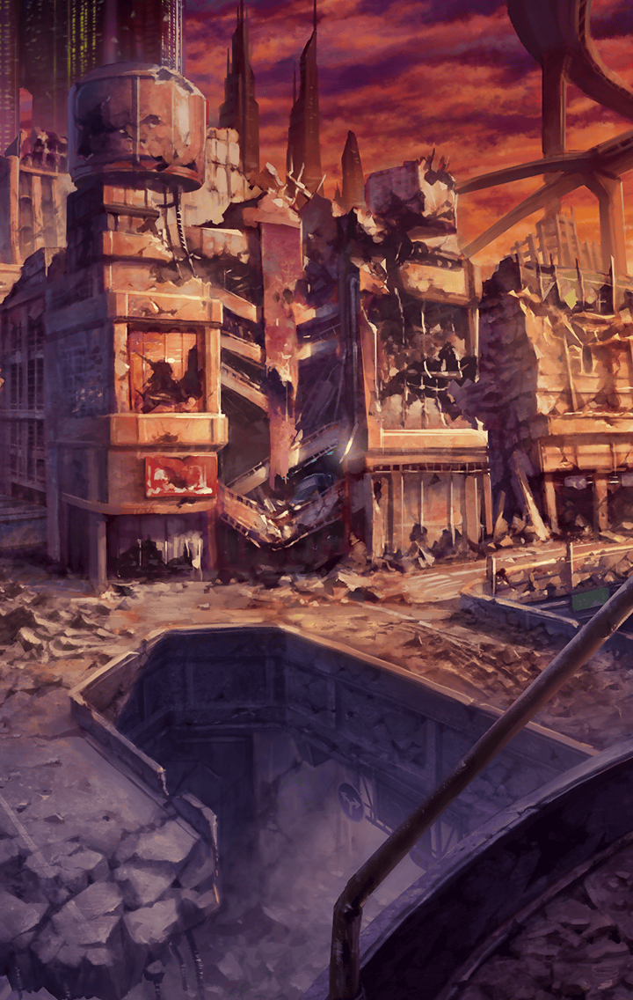

310142212 ティルフィング・リンク・エイレーネ 決意の向こう側

[View script in lisp](../scripts/310142212.txt)

【ティルフィング】
もうこの辺りに魔獣の姿はありません

【ゼロ】
なんとか撒いたようだが
これが続くのは正直厳しいな

戦って逃げての繰り返しは
だたすり減っていくだけ…
とマスターはティルフィングを見る

ティルフィングの力をもってしても
この状況は好ましくないよ
とマスターは話す

【ティルフィング】
…マスターにはお見通しですね
魔獣の多さの前には多勢に無勢

【ティルフィング】
悪魔の力は、天使のそれと同等…
私の力にも限界があると感じました

【ゼロ】
ちっ、なさけねえ
俺にもっと力があれば……

【ティルフィング】
そんなことありません
ゼロがいなければ、今だって
どうなっていたか

【デュリン】
……悔しいわ

【ティルフィング】
デュリン？

【デュリン】
アタシに力があれば
アタシも戦えれば……

僕だって戦ってないよ
とマスターが言うが

【デュリン】
マスターはティルフィングの
力になってる
役に立ってないのはアタシだけよ

【ティルフィング】
そんなことありません！
デュリンが一緒にいてくれるだけで
私は頑張れます！

【ティルフィング】
デュリンだって私と一緒に
ずっと戦ってきてくれた
仲間じゃないですか！

【デュリン】
……ティルフィング

【ゼロ】
とにかく、早いとこ移動しちまおう
こんな場所じゃ、奴らに囲まれたら
終わりだ

【ティルフィング】
そうですね

【魔物】
グルルル……

【ティルフィング】
魔物です
どうしましょう、マスター？

まだ見つかっていないようだし
避けていこう
と提案するマスター

【ゼロ】
そうだな
よし、遠回りになるが行こう

【魔物】
グルルル……

遠くに魔獣の姿が見える

【ゼロ】
……ティルフィング

【ティルフィング】
はい、どうやら敵の策に
嵌ったようですね
完全に囲まれました

【ゼロ】
かなりの数の気配を感じる

【デュリン】
…………

【ティルフィング】
私は諦めません
たとえ希望になるには
力が足りなかったとしても…

【ゼロ】
ああ、可能性がゼロでも
最後まであがき続けて
やろうじゃねーか

最後まで一緒だよ、ティルフィング
マスターがティルフィングの
手を握る

【ティルフィング】
はい！

【デュリン】
アタシが囮になるわ
その間にティルフィング達は
逃げて

【ティルフィング】
そんなの、いけません！

【デュリン】
じゃあ、どうするのよ！

【ティルフィング】
……私が道を切り開きます

【ゼロ】
いや、待て
もしかしたら、
なんとかなるかもしれないぞ

【ティルフィング】
どういうことですか？

【ゼロ】
忘れたのか？
この近くには機関がある
ヴァリンが眠る研究所が

【ゼロ】
あいつがいれば
この状況も打破できるはずだ

【ティルフィング】
ですが、ヴァリンは
眠りについているのでは……

【ゼロ】
ああ、だから今までは
どうしようもなかった
だが今は違う

【ゼロ】
そうだろ？

【ティルフィング】
…………

何か知っているの？
マスターがティルフィングに問う

【ティルフィング】
あ、いえ、その…
知っている…と、思います

【ティルフィング】
でも、それは…

ティルフィングの視線が
デュリンに注がれる

【デュリン】
ヴァリン
その響きは、
アタシの記憶に繋がってる

【ティルフィング】
それは…っ！
その、響きが似ているからで…

【デュリン】
いいのよ、ティルフィング
さすがの私にもわかるから

【デュリン】
アタシが…
『鍵』なのよね？
ヴァリンを目覚めさせるための

【ティルフィング】
私は……反対です
研究所に行くのは

【デュリン】
嫌なのよ

【ティルフィング】
……デュリン？

【デュリン】
アタシだけ何もできない
役に立たないのはもう嫌なの…

【デュリン】
お願い、ティルフィング
私を連れて行って

【ティルフィング】
……

【デュリン】
アタシ、やっと役に立てるのよ
そんな悲しそうな顔しないの
もっと喜びなさいよ

【ティルフィング】
そんな…デュリンは
ずっと私の力になってくれて…

【デュリン】
ありがとう、
ティルフィング

【ゼロ】
俺達は奴らを…悪魔を
滅ぼすために戦ってきた
多くの犠牲を払ってな

【ゼロ】
ティルフィング
今はヴァリンの頭脳が必要だ

【ティルフィング】
……

デュリンの意志は固い
それを尊重してあげよう
とマスターはティルフィングに話す

【ティルフィング】
……わかりました
行きましょう
ヴァリンの元へ

【ゼロ】
見えたぞ

【デュリン】
あそこが…

【ティルフィング】
ラグナロク本部のみんなが
守った研究所

確かに形を保った施設
だが、激しく消耗しているようだ
そして……

【魔獣の群れ】
グオアアアア！

【アスモデウス】
みーつけた♪
今度こそ、死んでもらうんだからぁ

【ゼロ】
くっ、ここに来て
こいつが現れるとはな

【ティルフィング】
私が血路を開きます

【デュリン】
大丈夫よ
みんなが通る必要はないわ
アタシだけで十分

【ティルフィング】
待ってください、
デュリン

【デュリン】
なによ？
今さら止めるなんて
なしだからね

【ティルフィング】
……また、会えますよね？

【デュリン】
もちろんよ
元に戻るだけなんだから

【デュリン】
それじゃ、またね

デュリンが研究所に向かって
飛んでいく

こちらで魔獣を引き寄せるんだ！
とティルフィングへ
指示を出すマスター

【ティルフィング】
デュリン……
私にもっと力があったなら…

デュリンには考えがあるはず
じゃないとあんな無茶はしない
とマスター

ずっと一緒に戦ってきた
仲間を信じてあげよう
マスターはティルフィングを諭す

【ティルフィング】
はい…マスター！

【アスモデウス】
なぁんか感動的なとこ悪いけどぉ
そういうのいらないのよね！
さっさと死んでくれるぅ？

【ティルフィング】
デュリンの為に…
私がデュリンの道を…
切り開きます！

Next: [310142213](310142213.md)

[Back to index](index.md)
