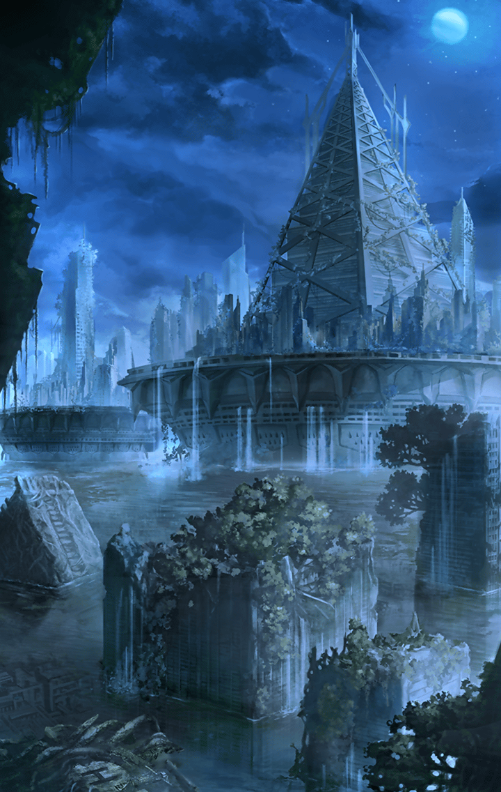

[View script in lisp](../scripts/310142213.txt)

【ティルフィング】
はあああ！

【アスモデウス】
なんで！？
なんで私がまたこんな目に！？

【ゼロ】
なんとかアスモデウスは倒したが……

【魔獣の群れ】
グオアアアア！

まだまだ
魔獣の数は多い
しかし、

【魔獣】
オ、グォォ…

【ティルフィング】
え、魔獣が…

【？？？】
なるほどね

【ティルフィング】
あなたは…

【？？？】
久しぶり、でいいのかしら？

【ティルフィング】
ヴァリン！

【ヴァリン】
ここはアタシがいなくなったあとも
みんながいろんな記録を残して
いってくれたみたいね…

【ヴァリン】
おかげでこの短時間でも
装置を作動させることができた

【ティルフィング】
ヴァリン…あの、その

【ヴァリン】
記憶のことね

【ヴァリン】
目覚めて間もないせいか
中途半端…っていうのが
実際のところかしら

【ヴァリン】
それもあってか
今のアタシにできるのは魔獣を
避けるための装置を使うくらい

【ヴァリン】
みんなの望むような成果は
見せてあげられないのが悲しいわね

【ゼロ】
十分だ
これでなんとか
今の状況は打破できる

【ゼロ】
で？
お前のことだ
次の一手も考えてあるんだろ？

【ヴァリン】
ええ
この不完全なシステムを改良して
希望の火としてここに狼煙を上げる

【ヴァリン】
そのためにも
手伝ってほしいことがあるの

【ヴァリン】
頼めるかしら、ティル？

【ティルフィング】
え？あ、はい
私にできることであれば

【ティルフィング】
……

【ヴァリン】
こんなところにいたのね

【ティルフィング】
あの、ヴァリン
その……

【ヴァリン】
さっきは誤魔化してごめんね
デュリンのことだけど…

【ティルフィング】
……

【ヴァリン】
正直に言うわね
私の中にデュリンはいない
あるのはデュリンの記憶だけ

【ティルフィング】
やっぱり、そうですか……

【ヴァリン】
私が言うのは勝手で卑怯かも
しれないけど……

【ヴァリン】
デュリンのためにも
私達は悪魔に勝たないといけないわ

【ティルフィング】
……はい

ヴァリンが去り際に
マスターとすれ違う

【ヴァリン】
マスター、後は任せたわよ
私じゃ、ティルの心は癒せないわ

マスターが頷き、
ティルフィングの横に寄り添う

【ティルフィング】
……マスター

我慢しなくていいんだよ、
そうマスターが言うと
ティルフィングが涙を浮かべる

【ティルフィング】
う、うう……

泣き始めるティルフィング
マスターは何も言わず、
寄り添い続けるのであった

【ゼロ】
花って、どんな花なんだ？

【ティルフィング】
クリスタルの花…
地上の皆さんはキラーズフラワーと
そう呼んでいたものです

【ティルフィング】
魔獣を寄せ付けぬ孤高の花と
重宝されてきたものです

【ゼロ】
その花なら何度か
見かけたような記憶がある…
だが、あれはもう

【ティルフィング】
研究所に回収されたものが
少し残っていただけであとはすべて
枯れてしまったと、記録に…

【ゼロ】
それで、その花がどうしたんだ？

【ヴァリン】
キラーズフラワーが
地上を救う一手になるわ

【ヴァリン】
研究所に残っていたデータから、
その花の力を増幅する装置を
起動してみたのよ

【ヴァリン】
だから私はひとりで
研究所に残っても問題ないの

【ティルフィング】
でも、先ほどの話の通り
それも残りわずかでしかなく
悪魔を倒しうるものではない、と

【ヴァリン】
続きを聞いて？
確かにキラーズフラワーは
もうほとんど存在しない

【ヴァリン】
でも、まだ一ヶ所だけ…
咲いている場所があるのよ
それもマナの濃い場所にね

【ヴァリン】
そこに咲いたものであれば
間違いなく、ティルに強大な力を
もたらすはずよ

以上が研究所でわかったこと
そして、これからの目的だ
とマスターが締める

そして、
ティルフィングの手を握るマスター

【ティルフィング】
マスター？

この世界を救えると
そう信じて降りてきたけれど…
とマスターは確かめるように話す

でも、その信じたものさえ
失ってしまいそうなほどの現実が
待っていた、とマスターは嘆く

【ティルフィング】
私の力では…足りませんでしたから

そう、ティルフィングの
力だけじゃ足りなかったんだ
とマスターは首を振る

皆で、希望を抱くことが
必要だったんだ

ティルフィングひとりで
背負う必要はないんだよ
とマスターはティルフィングに告げる

【ティルフィング】
…マスター！

世界を救うという使命じゃなく
未来のため、希望のために皆と戦う
それならできるよね、とマスター

【ティルフィング】
はい…はい！

【ティルフィング】
私にはゼロやヴァリンがいます

【ティルフィング】
お母さん達から託された使命も
たしかに私の力です
そして、デュリンの想いも…

【ティルフィング】
それにマスターが
隣にいてくれることが
私にとって、一番の力になるんですよ

そう言って微笑む
ティルフィングであった

Next: [310142214](310142214.md)

[Back to index](index.md)
