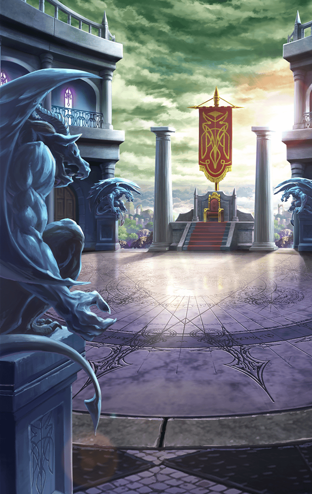

[View script in lisp](../scripts/3151203.txt)

【ティルフィング】
……っ！
異族っ！？

【デュリン】
あれ…？
アイツ動かない！？

【デュリン】
寝てんのかしら？

【ティルフィング】
デュリン！
危ないわよ！

【デュリン】
う〜ん？
…でも生きて…るわね？

【ティルフィング】
デュリン、念のため離れて！
でも…こんな風に固まっているなんて
どうしたんでしょうか？？

【デュリン】
さぁ？？
異族の生態なんて知らないわよ。

【デュリン】
しょーもない実験台にでも
されたんじゃない？？

【ティルフィング】
…体が痺れて動けないようですね

【ティルフィング】
もし私達が同じような症状に
なってしまった場合は
どうすればいいんでしょうか？

【デュリン】
そうね、確かここらの町では
気付薬が売っていたはずよ

【デュリン】
気付薬がなければ…
気合で乗り切るしかないわね！！

【ティルフィング】
…気合い、ですか

【デュリン】
ちょ、冗談よ！

【ティルフィング】
デュリン、危ないっ！！

【ティルフィング】
急に動き出すなんて、この異族
大丈夫、デュリン？

【デュリン】
…………

【ティルフィング】
デュリン？？

【デュリン】
…………

【ティルフィング】
デュリン！？
大変、デュリンが固まっちゃった！

【ティルフィング】
えっと、どうすれば…
き、気合い？
じゃ、じゃなくて…あ、気付薬！

【ティルフィング】
マスター！
この異族を倒して早くデュリンに
気付薬を買わないと！

【ティルフィング】
行きます！

Next: [3151204](3151204.md)

[Back to index](index.md)
