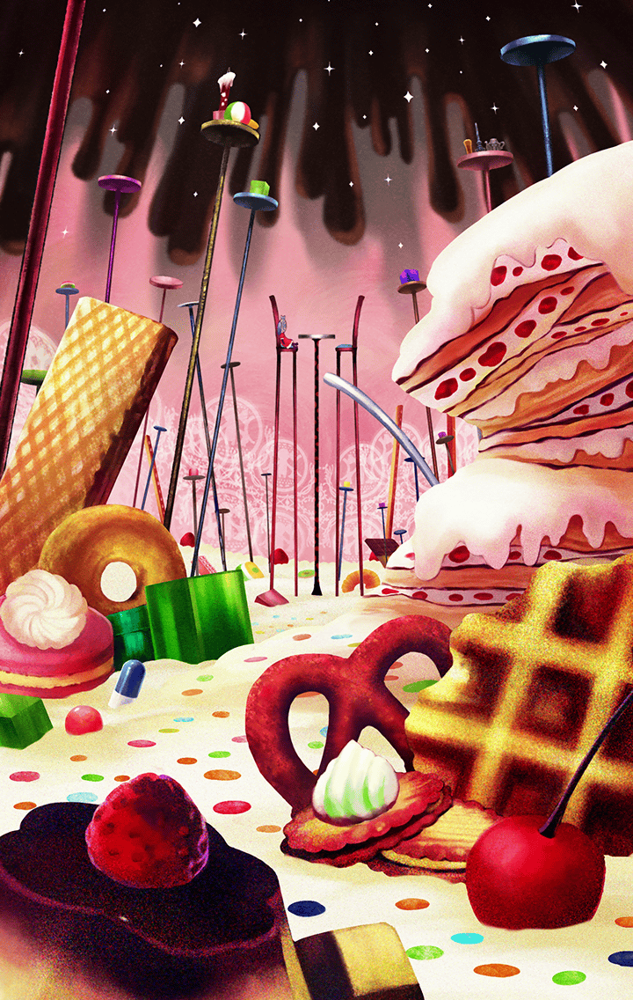

3190201

[View script in lisp](../scripts/3190201.txt)

【巴マミ】
この子が新人さん？

【デュリン】
そうよ

【巴マミ】
随分調子が悪いみたいだけど…
怪我でもしてるのかしら？

【ティルフィング】
さっきの戦いで、
記憶を失ったみたいなんです

【巴マミ】
そう
…私は、巴マミ

【巴マミ】
あなたやティルフィングさんと同じ、
ユグドラシル教会の
キラープリンセスよ

【暁美ほむら】
キラー…プリンセス？

【暁美ほむら】
…っ！！

【デュリン】
ほむら！

【巴マミ】
大丈夫？

【デュリン】
大丈夫？
ほむら…

【暁美ほむら】
魔法少女…

【巴マミ】
？

【暁美ほむら】
キラープリンセスってなに？
あなた…なんで…

【デュリン】
こりゃ重傷だ

【ティルフィング】
早く教会で休ませてあげましょう

【巴マミ】
その方がいいみたいね

【デュリン】
行こう、ほむら

【暁美ほむら】
それから私は、
自分が何者かすら分からないまま、
ただ異族との戦いに明け暮れた

【暁美ほむら】
教会のためキラープリンセスとしての
使命を全うすることだけが、
今の私にできる唯一の生き方だった

【暁美ほむら】
だけど、戦うたびに
大きくなる違和感が、
日々私を不安にさせた…

【巴マミ】
行くわよ！
暁美さん！

【暁美ほむら】
ええ！！

Next: [3190301](3190301.md)

[Back to index](index.md)
