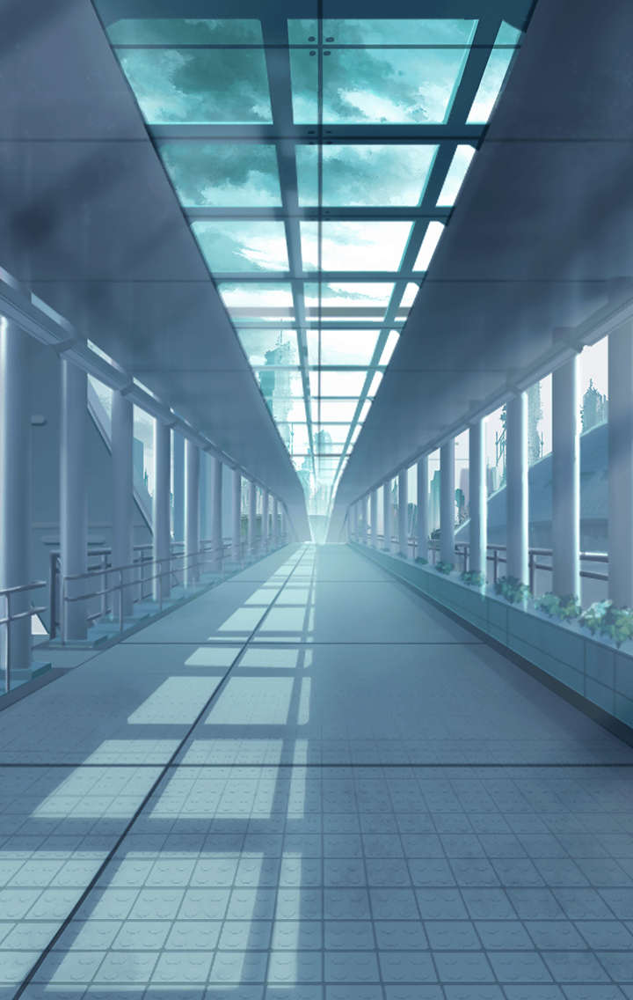

[View script in lisp](../scripts/320101212.txt)

[View source in markdown](320101212.md)

**【ウコンバサラ】**
マスター
みんなを呼んできて欲しいんだけど
頼めるかな？

拠点へと一度戻ったウコンバサラは
屈託のない笑顔でそう言った

**【ウコンバサラ】**
さっきちょっとだけ散歩しに行ったら
見つけたんだ
すっごく良い場所を！

**【ウコンバサラ】**
ふふふ、見せたらきっと驚いちゃうね
だからみんなを呼んできてほしいな？

かわいらしく上目遣いで
マスターをじっと見つめる

しかし、その瞳は
底知れず広がる深い闇のように
暗く、誰も映ってはいない

**【ウコンバサラ】**
みんな集合したらすぐ出発するから
忘れ物とかしないようにね？

**【ウコンバサラ】**
あ、ほら
見えてきたでしょ

ウコンバサラが指さす
方向には城のような
建物がある

何の建物かな？
とマスターが首を傾げる

**【ウコンバサラ】**
気になるから
早くみんなで調べに行こう

マスターの心配をよそに
キル姫達の背中を押して
建物へと誘導していく

いつもの彼女なら、
仲間達を心配するあまり
不用意に近寄らせないだろう

何か裏があるのかもしれない
いつものウコンバサラとは様子が違う
マスターは違和感を覚えていた

**【ウコンバサラ】**
大丈夫、私がついているから
だから早くみんなあそこに…

だがその違和感のことを
忘れさせる事態が
目の前に飛び込んでくる

**【ウコンバサラ】**
…なに、あれ

**【魔獣】**
グオオオオオオオオオッ！

魔獣の襲撃である
ウコンバサラの留守を狙い
箱庭を侵略しに来たのだろう

すぐさま戦闘態勢に移る面々
マスターも前線へと飛び出す仲間に
指示を出す

**【ウコンバサラ】**
ど、どうして…私の箱庭が…塔が…
確かにあの時はいなかったはずなのに
あそこは安全なはずなのに…

突然の強襲で連携が取れず
苦戦するマスターとキル姫達

**【ウコンバサラ】**
これじゃあまるで
わ、私がみんなを危険に晒して…

**【ウコンバサラ】**
ちがう、そんなつもりじゃない
そんなつもりじゃないんだ、みんな
ゆるして…ちがうんだよ…

みんなを護る
その信条を掲げる彼女にとって
この事実は受け入れ難いものだった

そして、魔獣を前に
上の空状態の彼女は
格好の的となっていた

**【魔獣】**
ガアァッ！

**【ウコンバサラ】**
…きゃっ！

危ない！
とマスターが飛びつく

間一髪で、
魔獣の攻撃からウコンバサラを
守ることに成功する

**【ウコンバサラ】**
あ…マスター、ごめ、ごめんなさい
私、みんなを…
こんなつもりじゃ…っ！

落ち込むウコンバサラに
マスターは慰めるのではなく
逆に発破をかける

ならここでみんなを助けてこそ
ウコンバサラなんじゃないのか
マスターは彼女に訴える

**【ウコンバサラ】**
えっ…

確かにこの状況は君が
招いたことなのかもしれない

でも、この状況を
打破できるのも
君しかいない

**【ウコンバサラ】**
でも、私は…みんなを…

守りたいんだろ！

**【ウコンバサラ】**
……っ！！

その瞬間、
ウコンバサラの頭の中に
あるひとつの光景が浮かぶ

大切なみんなとの
穏やかで笑い合う
日々

**【ウコンバサラ】**
私は、私はっ……！
みんなを…

**【ウコンバサラ】**
守りたいんだああ！

**【魔獣】**
グガアアアアア……！

超反応で魔獣を屠るウコンバサラ
むしろ事前に襲われることが
分かっていたような早さだった

**【ウコンバサラ】**
今見えたんだ
キミの背中から血が溢れる未来…

**【ウコンバサラ】**
ごめんね、マスター
迷惑かけちゃって
でももう安心していいよ…

**【ウコンバサラ】**
キミの言葉のおかげで
目が覚めたみたいだ

**【ウコンバサラ】**
もう、大丈夫
そんな不吉な未来…
全部私がぶっ潰してあげるから…っ！

ウコンバサラは気を取り直し
覚醒した闘将の如く
瞬く間に魔獣達を圧倒していく

そして、ものの数分で
全ての脅威を撃破し、
辺りは静まり返る

**【ウコンバサラ】**
はぁ…
これで全部、かな

町へ戻ったウコンバサラ達は
心配そうな顔をして
みんなのところへ駆け寄る

**【ウコンバサラ】**
みんな大丈夫？怪我してない？

先ほどまで圧巻の戦いをしていた
彼女とは変わり、今度はみんなの元へ
優しい笑顔で駆け回る

**【ウコンバサラ】**
ごめんね…私がいたのに、
こんなことになって…

**【ウコンバサラ】**
けど安心して？
これからは私がいるから

**【ウコンバサラ】**
絶対何があっても
みんなのことを護るよ
いつでも私が駆けつけてあげる…

鬼気迫る表情から一変
慈愛のこもった微笑みで
つぶやくウコンバサラ

しかし、ここは一体なんなのか
改めてウコンバサラに説明を求める
マスターとキル姫達

**【ウコンバサラ】**
あ…あぁ、ここは、その…
みんなが安全に暮らせるようにって
造った私の箱庭で…

**【ウコンバサラ】**
あの奥にある塔の中で
安心して暮らせたらって思って
私が建築したんだ…

**【ウコンバサラ】**
でもごめんね…
結果として、こんな目に合わせて…
それに私、元々あそこにみんなを…

何かを言いかけた途中
みんなから称賛と感嘆の声が上がる

**【ウコンバサラ】**
え…ど、どうしてみんな…
なんで褒めているの…

自身の予想に反して
周りの反応は暖かく
嬉しい大誤算だった

**【ウコンバサラ】**
でも、あの箱庭は
もう必要なくなっちゃったね

え？どうして？
と問いかけるマスター

**【ウコンバサラ】**
私は箱庭がなくたって
みんなを守るって
決めたから

**【ウコンバサラ】**
だから、もうこの箱庭は
必要ないんだよ

そっか、と
微笑むマスター

**【ウコンバサラ】**
私に足りなかったのは
みんなを守るって
決意だったんだ

**【ウコンバサラ】**
私は箱庭なんて
なくたって
みんなを守ってみせるよ！

そう言った
彼女の笑顔は
輝いていた
