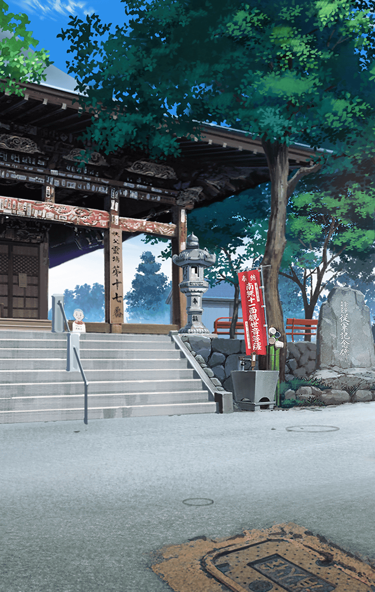

[View script in lisp](../scripts/3300102.txt)

[View source in markdown](3300102.md)

**【めんま】**
いやぁ?、危ないところだったねー

**【めんま】**
勇者めんまが来たからには
もう大丈夫だよ！

**【ティルフィング】**
えっ！？えぇ…ありがとう。
それで、あなたは一体…？

**【めんま】**
めんまだよ！
この街の平和を守る勇者！
それがめんまなの！

**【デュリン】**
ん…？あんたいま
街って言わなかった？

**【ティルフィング】**
この辺りに街はないはずですが…

**【めんま】**
え？めんまの街ならあっちだよ？

**【ティル＆デュリン】**
…っ！？

めんまが指し示す方向には、
ティルフィングたちが見たことのない
景色が広がっていた。
