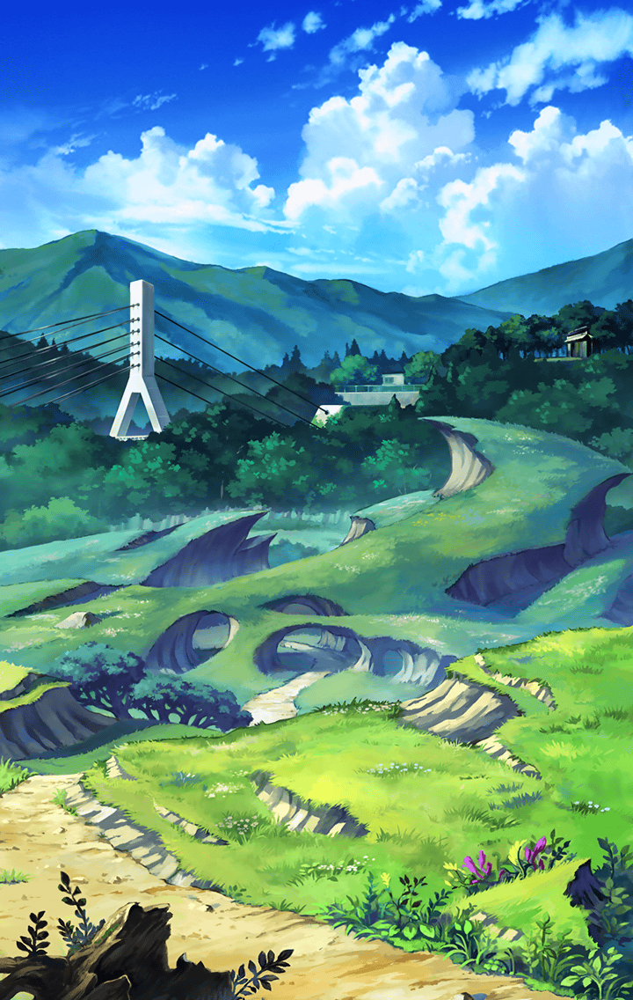

[View script in lisp](../scripts/3301802.txt)

**【なかよしきんぐ】**
※※※※※※※※※

**【デュリン】**
うん！
もう、ほとんど進行してないわ！

**【デュリン】**
ゲームとこの世界が連動して
いるのなら、なかよしきんぐは
あと1体ってところかしら

**【めんま】**
そ…っかー。じゃあ…
あとちょっとでこの街も…
平和になる…ね

**【あなる】**
めんまっ！どうしたの…

**【ティルフィング】**
デュリン！
めんまさんの様子がおかしいわ！
今回はただの疲労には思えない

**【デュリン】**
…ど、どういうこと！？
めんまから生気を感じない！？

**【つるこ】**
めんま！しっかりして！

**【デュリン】**
…これは一体…はっ！？

**【デュリン】**
ティルフィング！
以前アタシ話したわよね

**【デュリン】**
なかよしきんぐが
この世界に干渉する理由が
わからない、って

**【ティルフィング】**
ええ、なかよしきんぐとは
別のなにかが
この事態を引き起こしているって…

**【ティルフィング】**
…えっ、まさか！？

**【デュリン】**
そのまさかよ…めんまこそ、
この事態を引き起こした
中心だったんじゃないの？

**【ティルフィング】**
そ、そんな！？
まさかめんまさんが…！
