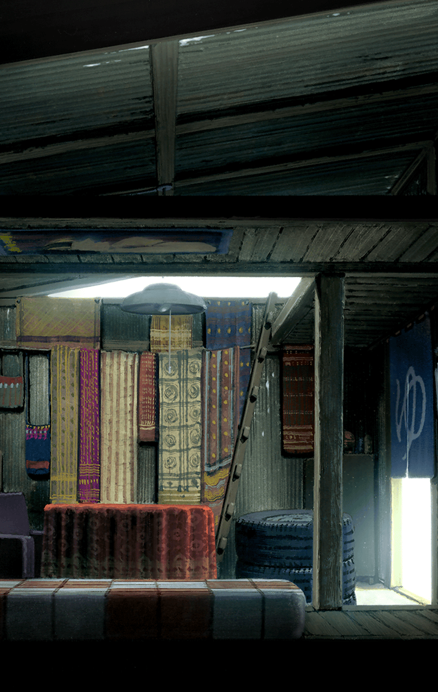

3302001 限定クエスト あの花コラボ あの花コラボ あの花コラボステ―ジ あの花コラボ20話 あの花　その9 あの花　20話

[View script in lisp](../scripts/3302001.txt)

【つるこ】
すごく言いにくいのだけれど…
元の世界でめんまは
既に亡くなっているの

【ティルフィング】
え…っ！？そんな…

【あなる】
子供の頃、ある事故で
めんまは死んじゃって、

【あなる】
それから、私達
超平和バスターズの6人は、
みんなバラバラになっていったわ…

【あなる】
でも、ある夏の日に、
めんまが私達のところへ
帰ってきたの！

【つるこ】
ある一人をのぞいて、
初めはめんまの姿は
誰にも見えなかったのだけど…

【つるこ】
それでも、めんまを成仏させるために
バラバラになった
超平和バスターズの私達は集まった

【つるこ】
私達はめんまのお願いを叶えたの。
そしてめんまは、私達に別れを告げ、
いなくなったの…

【あなる】
めんまのお願いを叶えるために、
花火打ち上げたり、

【あなる】
レアのけモンのなかよしきんぐを
ゲットしたりもしたわね…

【めんま】
あなる…つるこ…

【つるこ】
めんま…起きてたの？

【めんま】
めんまね…
ちょっとずつ記憶が戻ってきた…
かも…

【めんま】
あのね、めんまね。
みんなが頑張ってめんまのお願い
叶えてくれるのすっごく嬉しかったの

【めんま】
だからね、
めんままたお願いしちゃった…

【めんま】
勇者になって
超平和バスターズのみんなと
いっしょに街を守りたいって…

【めんま】
ずっと夢だったの…

【めんま】
えへへ、めんまの夢、
あなるとつるこのおかげで
また叶ったよ…

【めんま】
でもね…なかよしきんぐはね…、

【めんま】
大好きなじんたんがね…
めんまのために
ゲットしてくれたのけモンなの…

【めんま】
めんま…忘れちゃってたね…
大事なこと…

【ティルフィング】
めんまさんのお願いによって、
この世界は改変がはじまり…

【つるこ】
徐々に、めんまが主人公で
勇者のゲームにするべく、世界の
侵食が進んでいったというわけね

【あなる】
じゃあ、最後の
なかよしきんぐを倒せば、
ゲームクリア…

【デュリン】
お願いが叶って、
すべてが元に戻るってことね！

【つるこ】
元に…戻る…

【つるこ】
それって…

【ティルフィング】
ふたりはこの世界を離れ、
元の世界に戻れるはずです

【あなる】
めんまはどうなるのよ！

【あなる】
私達は２回も…
２回もめんまとお別れしたのに…
また…

【あなる】
また…別れなきゃいけないの！？

【あなる】
そんなことになるなら…
もう、いっそ、
倒さなければいいじゃない…

【デュリン】
あなる、ごめんなさい。
それは無理よ

【デュリン】
緩やかとはいえ、
ユグドラシルの侵食は
今も進んでいるわ

【デュリン】
どんな敵が新たに出現するかも
わからない…

【デュリン】
これ以上、
被害を大きくするわけには
いかないの…

【あなる】
そんな…

【デュリン】
それに、あなた達だって
一生ここにいることになるのよ！

【デュリン】
一生帰れない、
本当にそれでもいいの？

【あなる】
…そ、それは…。
それでも私はっ！！

【めんま】
いくない！

【つるこ】
めんま…

【ティルフィング】
めんまさん…

【めんま】
いくない！いくない！
いくない！

【めんま】
あなる、つるこ。
じんたんも、ゆきあつも、ぽっぽも
皆2人のこと待ってるよ

【あなる】
だけど、それじゃ…

【めんま】
めんまね…。
本当はなかよしきんぐを
倒したくないの…

【めんま】
大好きなじんたんとあなるが
一緒になってゲットしてくれた
のけモンだもん

【めんま】
だけどね、このままここにいたら
めんま生まれ変われない…

【めんま】
生まれ変わって、また、
一緒にみんなと遊びたいの！

【めんま】
あの橋で、あの階段で、あの神社で…
また遊びたいの！

【めんま】
夢はいつかは終わっちゃうね…。
だからね、

【めんま】
めんまこのゲームをクリアして…
夢を終わらせて生まれ変わりたいな

【あなる】
うぅ…うわあああああん…

【つるこ】
うっ……うぅ…

【めんま】
めんまはね、
この世界じゃ勇者だから。
最後までこの街の平和を守りぬくの！

【めんま】
あなる…つるこ…ティルフィング…
デュリン…そしてマスター

【めんま】
めんまの最後のお願い
叶えてほしいな？

【？？？】
※※※！※※※※※※！

【デュリン】
この声は…

【あなる】
…いやっ…やめて！

【ティルフィング】
最後の…なかよしきんぐ…

【めんま】
みんな！いくよ！

【めんま】
これが勇者めんま、最後の戦いだよ！

Next: [3302002](3302002.md)

[Back to index](index.md)
