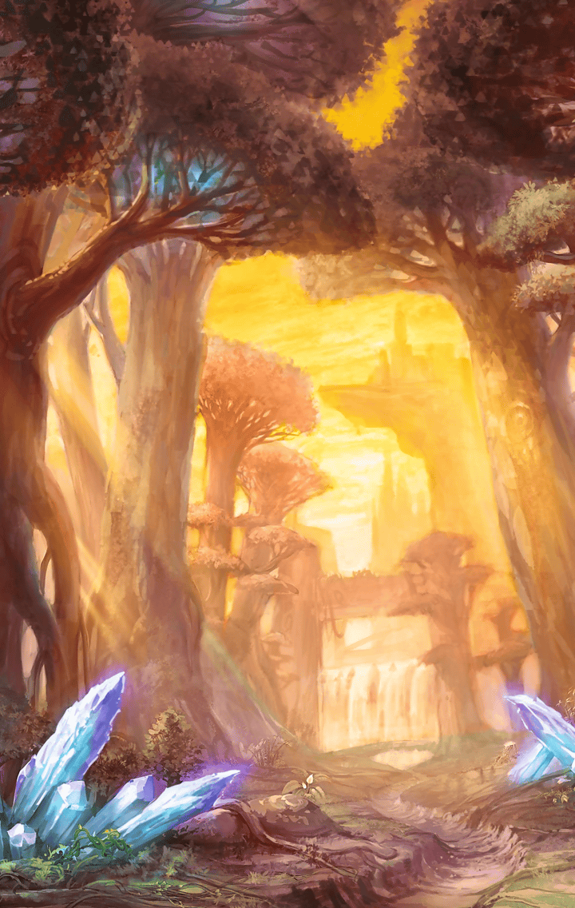

[View script in lisp](../scripts/33032122.txt)

ある日、マスターは
ガ・ジャルグを誘った

**【ガ・ジャルグ】**
どこに行くの？

ちょっと会わせたいって言うか、
見てもらいたいものがあって…
とマスター

**【ガ・ジャルグ】**
会わせたい…？

**【ガ・ジャルグ】**
まさか…妹が見つかったの？

その問いには答えず、
とにかく付いてきて…
とだけ言うマスター

**【ガ・ジャルグ】**
妹が…見つかった…
いよいよ……勝負の時が…

彼女は内心、そう思っていた

道中、ガ・ジャルグに尋ねるマスター
もし妹が向かってきたら、
本当に返り討ちにするの？…と

**【ガ・ジャルグ】**
当然

…と態度を崩さない彼女

そんな会話をしているうちに、
目的の場所に辿り着いた

**【ガ・ジャルグ】**
ここに…妹が…！

だが、いたのは彼女の妹ではなく、

**【ガ・ジャルグ】**
…え？

**【ガ・ジャルグ】**
おお…かみ…？

野生の狼の子供だった

**【ガ・ジャルグ】**
は？どういうこと？
意味わかんないんだけど？

偉そうに尋ねる彼女

しかしマスターは、
黙って見てて…
としか言わない

**【ガ・ジャルグ】**
見てろって、なにを…？

２人の視線の先、
子狼は狩りを開始した

しかし未熟ゆえに、
狩りを成功させられない

**【ガ・ジャルグ】**
………

熱い視線を送る彼女

**【ガ・ジャルグ】**
……がんばって

奮闘する子狼を見ていて、
彼女が叫んだ

**【ガ・ジャルグ】**
がんばって！

――と、マスターが
彼女に語り掛ける

本当は、妹にも
同じ感情を持ってるんじゃない？と

**【ガ・ジャルグ】**
…え？どういうこと？

君が時折見せる不安と悲しみが
入り混じった目は、
妹を心配している目だった…と

**【ガ・ジャルグ】**
…！

**【ガ・ジャルグ】**
そう…そこまでわかってたの

**【ガ・ジャルグ】**
どうやら、あなたは…
慧眼の持ち主のようね

言い当てられた彼女は、
マスターに本心を打ち明け始める

**【ガ・ジャルグ】**
わたしは…
彼女の心を追い詰めてしまった…

**【ガ・ジャルグ】**
それが申し訳なくて、
ずっと避けていたけど、
わたしを探していると聞いて…

**【ガ・ジャルグ】**
……救いたいと思った

**【ガ・ジャルグ】**
でも…本気で戦えば、
どちらかが死んでしまうことも
あるかも知れない…

**【ガ・ジャルグ】**
妹をそんな目に
遭わせてしまうかもと
思うと…

**【ガ・ジャルグ】**
不安と…悲しみが…
心を締め付けるの……

悲痛な表情で語る彼女

しかしマスターは、
大丈夫じゃないかな？
と、あっけらかんと言い放った

**【ガ・ジャルグ】**
なっ…！

**【ガ・ジャルグ】**
なによ、その言い方…！
他人事だと思って軽く……！

――と、その時、

**【ガ・ジャルグ】**
！！

遠くに敵軍を見つける彼女

**【ガ・ジャルグ】**
話は後…

そう言うと、
獲物を追う子狼に目をやり…

**【ガ・ジャルグ】**
あの子の邪魔は…
絶対にさせない！

敵を睨みつけ、
槍を取り出すのだった