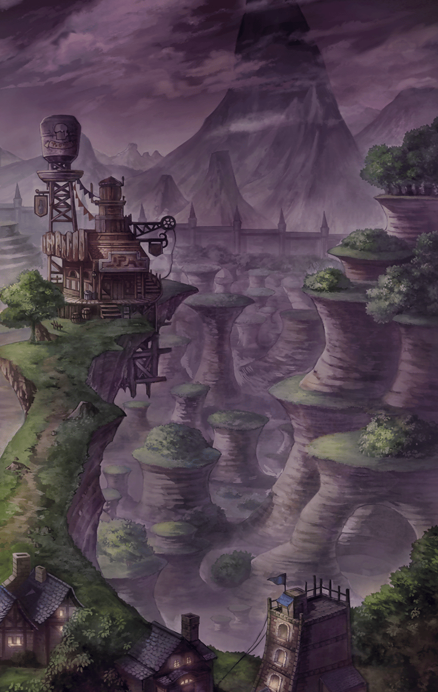

[View script in lisp](../scripts/3500101.txt)

**【もが】**
世界が、闇に包まれた…！　これが…

…《終わりなき夜》
…《蝕》と呼ばれる現象だよ…

**【もが】**
…！　誰…！？

…選ばれし者よ…
世が漆黒の闇に包まれし今こそ、
立ち上がる時…

**【えいたそ】**
た、立ち上がる…！？
えっと…立ちましたぁ！！

猶予はない…！集うのだ…
あまたの世を繋ぐ、
あの大樹の元へ…！

**【リサ】**
大樹…ユグドラシル…？

そこに、キミの求める答えはある…！
ずっと、捜し続けていたのだろう…？

**【ピンキー】**
わ、私が求めるもの…！？

そう…わかっているはずだよ？
…それは…

**【ねむ】**
それって…まさか！？

**【みりん】**
オリジナルのキラーズ！？

**【ピンキー】**
愛くるしいパンダ！？

**【もが】**
孤独の影を消すもの！？

**【リサ】**
封印されし黒魔術！？

**【えいたそ】**
最高にキラキラしたもの！？

**【ねむ】**
七色の肉まん！？

さぁ、急ぐのだ！
この終わりなき夜が明ける、
その前に…

これが最後のチャンスなのだ！
…《イカズチ》のしるしを持つ、
選ばれし者達…

キミ達の到来を、ワタシは待つ…！

**【みりん】**
《イカズチ》のしるし…！

**【スロウス】**
…始まったわね、
《蝕》が…

**【ラスト】**
淘汰を重ね、真理に近付いた者達が…
失われた記憶の最後のピースを求め、
ユグドラシルへとやってくる…

**【ラース】**
左様。とはいえ…
我らの任務に、なに一つ変わりはない

**【ラース】**
接触を試みる者は元より、
大樹を探るすべての者を滅する…

**【ラース】**
それが、
主君より与えられし絶対の使命だ

**【プライド】**
…《グリード》は？

**【ラスト】**
既に動いているわ…
妙な気配を察知したみたいね

**【プライド】**
やれやれ…まったく、
気ままなリーダーだね
ＯＫ、彼女のフォローは私が

**【スロウス】**
なら、北ってことね…私は東に

**【ラスト】**
私は西に

**【ラース】**
拙者は、南方を承る
主君は今、例の洗礼前の部隊に
接触しておられる

**【ラース】**
事が落ち着き次第、
拙者もそちらへと
合流することになろう

**【ラスト】**
案ずることはなにもないわ

**【ラスト】**
《魔》の《大罪》を背負う我々に、
太刀打ち出来る者なんて
いやしないもの

**【ラース】**
うむ
…くれぐれも、間違いのなきよう

Next: [3500102](3500102.md)

[Back to index](index.md)
