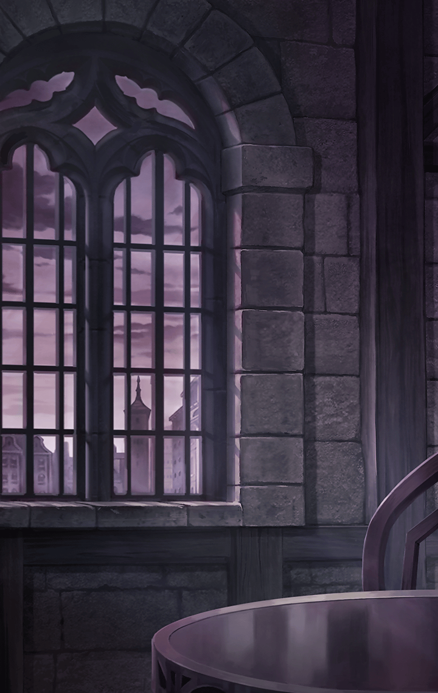

[View script in lisp](../scripts/3501001.txt)

**【リサ】**
…ついに、私は…
おかしくなってしまったんだと思う…

**【リサ】**
あんなにもハッキリと…
天からの啓示を耳にするなんて…

**【リサ】**
…いえ
…そうじゃないのかもしれない…

**【リサ】**
もしかすると、
あれは天の声などではなく…
深淵より来たりし、悪魔の囁きかも…

**【？？？】**
…ダ！…ンダ！！
…ウソみたい！！
…うはーっ！！

**【リサ】**
…そう…きっと、そうよ…！
神聖なる闇の儀式の果てに…
封印されし、魔を呼び起こして…

**【？？？】**
もう、最っ高～！！
こんなに嬉しいことはないわ！！
あ、みんな…おはんきーっ！！

**【リサ】**
…封印されし…魔を…

**【？？？】**
え…？もう一曲…？
しょうがないなぁ…！！

**【リサ】**
……
…魔を…

**【？？？】**
じゃあ！！
旅立ちを祝して…
もう一曲、踊っちゃうよーっ！！！

**【リサ】**
…魔…
…もう…静かにしてーっ！！

**【ピンキー】**
え…！？…え！？
ひ、人がいたの…！？

**【リサ】**
もう！！
なんなの、さっきから！！
うるさくて、考え事も…

**【リサ】**
…あれ？
もう、夜…？

**【ピンキー】**
ううん、《終わりなき夜》が
始まったんだって
急に、暗くなっちゃったの

**【リサ】**
《終わりなき夜》…！？
…《蝕》…！！

**【ピンキー】**
ショク…？

**【リサ】**
これって、まさか…
私の儀式が招いたことなの…！？

**【ピンキー】**
ね、ねぇ…大丈夫？

**【リサ】**
…ということは
…あの啓示は、真実…！？

**【リサ】**
ついに、待ち焦がれた時が
来たということ…！？

**【ピンキー】**
んー…ま、いっか
じゃあね、みんな！！

**【ピンキー】**
私、ユグドラシルに
行かなきゃいけないの…
またね！！

**【リサ】**
ユグドラシル…！？
…あ、あの…ちょっと待って！！

**【ピンキー】**
え？

**【リサ】**
これ…！
この…足首を見て…！

**【ピンキー】**
…！
イカズチのしるし…！？

**【リサ】**
あなたも、やっぱり…！？

**【ピンキー】**
わ、私は、ほら…ももの裏に…！

**【リサ】**
あった…！

**【ピンキー】**
ユグドラシルに集えって、声…
あなたも聞いたのね…！？

**【リサ】**
うん…！

**【リサ】**
…あの…わ…私も…

**【ピンキー】**
…え？

**【リサ】**
わ…私も、一緒に…その…
ユ、ユグドラシルに連れてって！！

**【ピンキー】**
…もちろんだよ！　一緒に行こうよ！

**【リサ】**
…！！
う、うん…！

Next: [3501002](3501002.md)

[Back to index](index.md)
