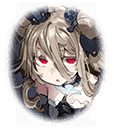

350201211 タスラム・獣刻・バンシー 不吉を呼ぶ者

[View script in lisp](../scripts/350201211.txt)

一人の姫が高らかに宣言した

【タスラム】
識別系統Ｇ・○四（じーまるよん）、
タスラム・獣刻・バンシーだ

【タスラム】
あ、言っておくが、
あたしは動かないぞ

【タスラム】
戦いと飯以外は、ぜ～ったいに
余計な行動はしないと決めている

【タスラム】
不幸になりたくないなら、
あたしに関わるな！
わかったな？

これが入隊時の挨拶

いきなりのサボリ宣言に、
反発的な姫もいるが、

中には興味を持ったり、
面白がったりする姫もいた

【タスラム】
おい、聞いてなかったのか？
あたしに関わるなと言ったろ

話しかけてくる姫に、
迷惑そうな態度を取るタスラム

【タスラム】
今から昼寝するから
絶対に邪魔すんじゃねぇぞ

【タスラム】
今の『絶対』は、
邪魔しろって意味の
絶対じゃねぇからな！

姫たちとあまり
話そうともしなければ、
仲良くしようともしない

一人さっさとどこかに行ってしまい、
結局みんなの反感を買ってしまった

次の日の朝
姫たちが、朝食の準備や掃除を
開始する

【タスラム】
ふわぁ～、ねみぃ

【タスラム】
朝っぱらからなんだよ…
うるさいなぁ…
まだこんな時間じゃねーか…

【タスラム】
あたしは絶対起きないぞぉ…

日常生活では、宣言通り、
朝は起きてこない、

【タスラム】
掃除当番…？…パス

仕事はサボるし、手伝わない

その態度は一貫しており、戦闘でも…

【タスラム】
え？攻めろって…？
あたしがいなくても、
まだ平気っしょ

ギリギリまで『動かない』、
『関わらない』を通している

そんなタスラムに、
姫たちの怒りは
頂点に達しつつあった

だが、そんな彼女を気に掛け、
声を掛けるマスター

【タスラム】
…ん？マスターか

【タスラム】
なにって…
別になにもしてないよ
ぼ～っとしてただけ

素っ気ない返事の彼女に、
話し続けるマスター

【タスラム】
んだよ…
用がないなら、
関わるなよなぁ～…

【タスラム】
見てわかるだろ？
あたしは今、なにもしないことに
忙しいんだよっ

【タスラム】
はぁ？腹なんか別に…

【タスラム】
減ってないこともないけど…

【タスラム】
え？あの店のパン？
マジで？

彼女にパンを差し入れするマスター

【タスラム】
ここのパン、うまいよな
わかってるな、マスター

【タスラム】
あの店の親父の
パンへのこだわりは
すげーからな～

はじめは素っ気なかったが、
パンをきっかけに
話し出すマスターとタスラム

そんな彼女に、
本当はおしゃべり好きなのかな？
と思うマスター

【タスラム】
でも、ケーキならあの店だな
毎日行列が出来てて

その後も、話し続ける２人
もう３０分は経過しているだろうか

そんな中で、マスターは
ずっと気に掛かっていたことを
尋ねてみた

【タスラム】
なんだ？あたしに聞きたいこと？

前に言ってた『不幸になりたく
ないなら、あたしに関わるな』って…
どういう意味？と、マスター

【タスラム】
…！

その瞬間、楽しそうだった
彼女の表情は一変

【タスラム】
別に…

【タスラム】
意味なんてねぇよ

そう言って、
サッとマスターの元を
去ってしまうのだった

そんな、ある日――

戦闘の準備をしている隊の姫たち
でも、そこにタスラムの姿はない

前のことが関係あるのだろうか？
と心配になり、探しに行くマスター

彼女はそう遠くない場所にいた

どうしたの？
だが、声を掛けたマスターは驚く

【タスラム】
…！マ、マスター…

慌てて、顔を隠す彼女

協調性がなく、
いつも気だるい雰囲気の
タスラム

そんな彼女が、
目の下を真っ赤にして
泣いていたのだ

ど…どうしたの？
尋ねるマスターに…

【タスラム】
そ、それは…

【タスラム】
私がいると…この隊は…

だが言葉にはせず、
マスターを睨みつけ…

【タスラム】
あ、あたしに関わるな…！

涙を拭い、
そう叫ぶのだった

Next: [350201212](350201212.md)

[Back to index](index.md)
