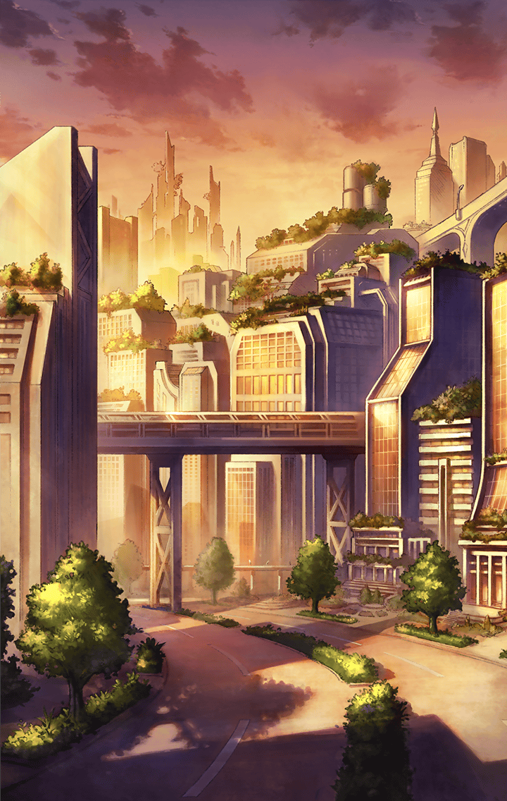

[View script in lisp](../scripts/360031213.txt)

【魔獣】
ギャンッ！

魔獣の数は減りつつあるが、
長時間の戦いになり、キル姫たちも
疲労の色が濃くなってきた

姫たちは、マスターだけでも
安全な場所に避難させようと考え、
その役をテュルソスに任せたいという

【テュルソス】
どうして、私に？

テュルソスなら信頼できるからだ、と
姫たちは口を揃える

【テュルソス】
みんな…

しかし、マスターは
その作戦に異議を申し立てた

自分だけが避難することはできない、
マスターと姫は一緒にいるべきだ
と、マスターは力説する

テュルソスなら、
その理由がわかるよね
と、マスターはテュルソスを見る

【テュルソス】
マスター…

マスターと姫たちは
テュルソスを見つめ、
その答えを待つ

【テュルソス】
…………

【テュルソス】
私にとって信頼を得ることは
相手を利用するためで…
それは、たやすいことだった

【テュルソス】
マスターたちの純粋な信頼関係は
眩しくて、うらやましくて…
私とは違うと思ってた

【テュルソス】
だけど、その信頼関係の中に、
私もいるなんて…
少し恥ずかしいけど、やっぱり嬉しい

【テュルソス】
ふふっ…なんだろうね
この懐かしい気持ち……

【テュルソス】
フォルネウスの力を得てから
何でも思い通りになって…

【テュルソス】
一番肝心なこと
忘れていたのかもね

【テュルソス】
今ならみんなの考えは
理解できるよ
もちろん、マスターの意見もね

【テュルソス】
だけど…
私はどちらの意見にも反対

マスターと姫たちは、
テュルソスの言葉に
顔を見合わせる

【テュルソス】
ここは私に任せてもらえない？
この戦況を覆してみせるから、
私を…信じてほしい

もちろんだよ！
と、マスターがこたえると
姫たちも同じようにうなずく

【テュルソス】
ありがとう…
必ずみんなで一緒に帰還して、
勝利の祝杯をあげようね！

マスターや仲間たちと
心から信頼を結んだテュルソスに、
新たな力が湧き上がる

【テュルソス】
マスター…
私の本気を見せてあげる…
『忍び寄る魔鮫の鋭牙』！

【魔獣】
グギャァアア！

テュルソスの活躍で無事帰還した
マスターたちは、テュルソスの
宣言通りに祝杯をあげていた

【テュルソス】
ねぇ、マスター…
ちょっといい？

テュルソスはマスターに近寄ると、
そのグラスを奪って一気に飲み干した

【テュルソス】
ふぅ…
やっぱりジュースじゃない
君はどうしてお酒を飲まないの？

酔ったみんなを助けようと思って…
と、その理由を話すマスター

【テュルソス】
へぇ～…
マスターっていうのも
大変だねぇ…ふふっ

少し酔った様子で楽しげに笑う
テュルソスを見て、
マスターも笑顔になる

今日のテュルソスはいつもと違うね
本当に楽しそうに笑っている気がする
と、マスターがいうと…

【テュルソス】
へぇ……
マスターってば、私のこと
そんなに見てくれてたんだ

その言葉に
たじろいでしまうマスターに
テュルソスはさらに詰め寄る

【テュルソス】
ねぇ、マスター
もっと違う顔もあると思うんだけど…
君の手で、新しい私を探してみない？

テュルソスはマスターに
妖艶な眼差しを向け、
誘うように微笑む

顔を赤くするマスターを見て、
テュルソスは上機嫌で笑った

【テュルソス】
なぁんてね…
ふふふっ、冗談だよ

【テュルソス】
その顔、最高だね♪
君はやっぱり面白いなぁ

Next: [360031214](360031214.md)

[Back to index](index.md)
