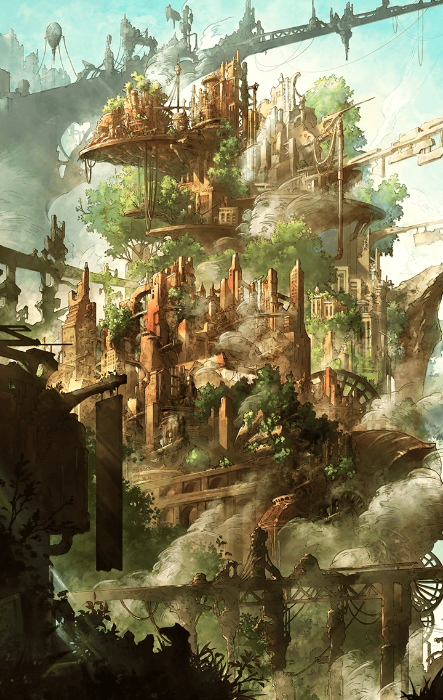

360051212 ケーリュケイオン・獣刻・フギン 辿り着いた答え

[View script in lisp](../scripts/360051212.txt)

消えたデザートの真相を求め、
捜査を開始するマスター

ケーリュケイオンもその傍らで、
マスターを見守る

【ケーリュケイオン】
これが証拠のひとつ、
食べ散らしたデザートの残骸よ

【ケーリュケイオン】
食器も使わず、かぶりつくなんて、
かなりの食いしん坊よね？

彼女の推理を聞きながら、
証拠をじっくり観察するマスター

よく見ると、残った歯型が
人の口にしては大きいと感じ、
ケーリュケイオンにそう伝える

【ケーリュケイオン】
…え？
ちょっと見せてみて？

【ケーリュケイオン】
…うん、なるほどね
マスターにしてはいい着眼点ね

あと、これが落ちていたよ
と、マスターは床に落ちていた
動物の毛のようなものを見せる

【ケーリュケイオン】
…ふぅん、新しい証拠だね
毛皮をまとった食いしん坊の斬ル姫、
マスターも心当たりあるんじゃない？

うーん…まだわからないかな
と、マスターは答える

【ケーリュケイオン】
そう？
じゃ、次は証言を聞きにいこっか？

【ケーリュケイオン】
彼女は、現場から逃げ出す足音を
聞いたんだって

【ケーリュケイオン】
やましい気持ちがあるから、
逃げたんでしょ？

しかし、マスターが話をよく聞くと、
その足音はひとつではなかったという

【ケーリュケイオン】
ん？
そんな話、聞いてないけど？

言おうとしたけど、
最後まで話を聞いてもらえなくて…
と、証言した斬ル姫が言う

【ケーリュケイオン】
だって、もう鍵は揃ったと
そう思ったから…

マスターは、不安そうな顔をする
ケーリュケイオンに、少し休もうか
と、声をかける

外に出て、並んで座るマスターたち

【ケーリュケイオン】
…ねぇ、マスターは、
どうして私の推理を信じなかったの？

そういうわけじゃないけど…
ただ、どれだけ時間をかけても
真実を突き止めたかった…

簡単に仲間を疑うなんてできないよ
と、マスターは真剣な顔で答える

【ケーリュケイオン】
でも、私は仲間を疑った…

マスターは慌てて、
君を責めているわけじゃないんだ
と、フォローする

だけど、今回は自分が納得するまで
調べたくて…ただの頑固者だね
と、苦笑いをする

【ケーリュケイオン】
はぁ…
私の推理が外れるなんて…

そう言って落ち込む彼女を慰めようと
早く問題を解決しようとして、
結論を焦りすぎたのかも、とマスター

新しい情報で推理すれば、
今度こそ真相にたどり着くはず…

君が本気を出せば、真犯人だって
すぐに見つかるって信じてるよ
と、彼女を励ます

【ケーリュケイオン】
…まぁ確かに、そうかもね
ちょっと待ってね、
推理をやり直してみる！

そう言って、推理を練り直す彼女
新たにわかった手がかりをヒントに
思考をめぐらせる。そして…

【ケーリュケイオン】
…うん、わかった！
これらの鍵が示す真相は…
ひとつしかない！

【ケーリュケイオン】
昼のデザートに味をしめた真犯人は、
おそらく夜も現れるはず…

【ケーリュケイオン】
マスター！
今度こそ、真相に至る扉を
開けてみせるよ！

【ケーリュケイオン】
だから…私と一緒に来てくれる？

マスターは、もちろんだよ
と、力強く答えるのだった

二人は夜のデザートを囮に、
真犯人を待ち伏せしていた

【ケーリュケイオン】
もうそろそろ、
現れるはずだけど…

その時、二人の背後から
荒い息遣いが聞こえてくる

マスターが振り向くと、
そこには野生の獣たちが集まっていた

【ケーリュケイオン】
やっぱり…
犯人はあなたたちだったのね

犯人は仲間じゃなかったね！
と、喜ぶマスターだが…

【ケーリュケイオン】
喜ぶのはまだ早いんじゃない？
私たちでデザートを守るわよ！

…と、その時、
獣たちが蜘蛛の子を
散らすように逃げ始める

【ケーリュケイオン】
…野生の獣よりも、
もっと面倒なのが現れたわね

獣たちが去ったあとには、
トレイセーマの兵隊が立っていた

【トレイセーマ兵隊長】
不自然に獣が集まっているから
不審に思って来てみたが…

【トレイセーマ兵隊長】
貴様ら、ここで何をしている？
トレイセーマの国民ではないな？

【ケーリュケイオン】
マスター！
ほら、やっちゃうわよ！

Next: [360051213](360051213.md)

[Back to index](index.md)
