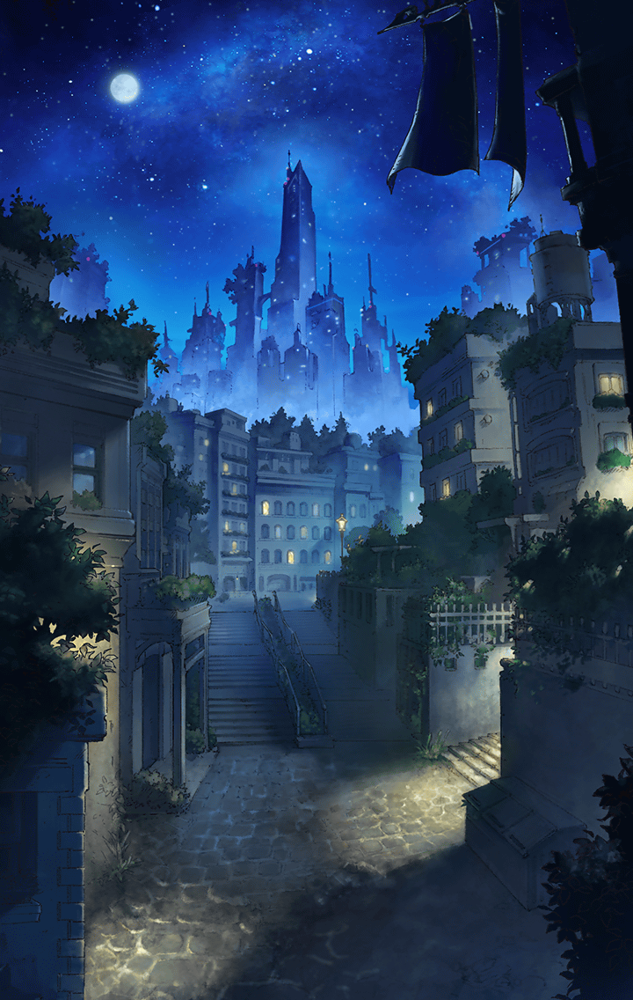

[View script in lisp](../scripts/360141211.txt)

魔獣に襲撃されている
街をどうか救って欲しい、
という依頼を受けたマスター

道中は魔獣によって荒らされたらしく
その所々に爪痕が残されていた

**【プタハ】**
道中からこの有様では…
今頃件の街は悲惨な状況であろう

**【プタハ】**
だが…全てはこの母に任せておけ
傷ついた住民も、我が治してやる

**【プタハ】**
ゆえに、そう急ぐ必要はない
どのような怪我も、
我にかかれば全て元通りなのだから

彼女の言葉はもっともだが
それはできないと
返答するマスター

自分たちが早く着くことで
たとえわずかでも苦しむ人が
減るなら、無理する価値はある

はやる気持ちを抑えきれず、
マスターは全速力で駆け抜ける

**【プタハ】**
これこれ、あまり無理をするでない
心がけは立派であるが、
限度というものが…

プタハの心配通り、
マスターの顔に疲れが
見え始めていた

**【プタハ】**
ほれ見ろ…
母の言うとおりであろう

母性が強いプタハは
マスターに対し、まるで
自分の子供のように接してくる

速度が落ちてきたマスターの姿に
仕方がないと言いながら
プタハは笑みを浮かべた

**【プタハ】**
今日はもう遅い
ここで休んで行かぬか？

**【プタハ】**
ほら、我が膝枕をしてやる
存分に甘えて良いのだぞ

大きく柔らかい身体で
抱きしめようとするプタハ

しかし、マスターは
プタハの誘惑をはね除ける

**【プタハ】**
そう強がる必要もないだろう？
そなたはこれまで良く頑張った
ここで少し休んでも罰は当たるまい

**【プタハ】**
……さあ、我の元へおいで
愛しき我が子よ

甘い言葉に足を止めそうになるが、
自分たちを待つ人々の姿を思い、
なおも立ち上がるマスター

**【プタハ】**
むう…そうか？
我が子の辛い顔を見るのは
母として忍びないのだが…

少々不満げな態度を見せつつ
プタハは再び走り出した
マスターの後を付いてくる

その時―
周囲に怪しげな
遠吠えが響き渡った！

**【プタハ】**
魔獣の声…！？
来るぞ！　マスター！

Next: [360141212](360141212.md)

[Back to index](index.md)
